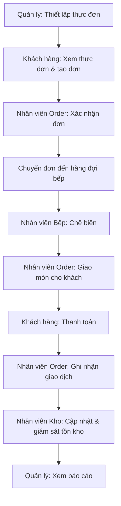

# ResMan

# Hệ Thống Quản Lý Nhà Hàng

> Nền tảng quản lý vận hành nhà hàng, kết nối Khách hàng, Nhân viên Order, Nhân viên Bếp, Nhân viên Kho và Quản lý trong một quy trình thống nhất.

## 📌 Giới thiệu

**ResMan** là dự án xây dựng hệ thống quản lý nhà hàng với mục tiêu số hóa và kết nối các hoạt động chính: quản lý thực đơn, đặt và xử lý đơn hàng, chế biến món ăn, quản lý tồn kho, thanh toán và báo cáo vận hành.

Dự án được phát triển theo hướng **AI-assisted development**, trong đó AI hỗ trợ phân tích yêu cầu, lập kế hoạch, tài liệu hóa và phát triển phần mềm. Các quyết định nghiệp vụ cuối cùng vẫn được con người xác định và kiểm tra.

## 👥 Actor trong hệ thống

| Actor | Vai trò chính |
|---|---|
| **Khách hàng** | Xem thực đơn, đặt món, theo dõi đơn hàng |
| **Nhân viên Order** | Tiếp nhận, xử lý đơn hàng và ghi nhận thanh toán |
| **Nhân viên Bếp** | Tiếp nhận hàng đợi và chế biến món ăn |
| **Nhân viên Kho** | Theo dõi, cập nhật và kiểm soát tồn kho |
| **Quản lý** | Quản lý thực đơn, nhân sự và theo dõi báo cáo vận hành |

## 🎯 Phạm vi dự án

### MVP

Vòng đời vận hành cốt lõi:

**Quản lý thực đơn → Đặt món → Xác nhận đơn → Chế biến → Giao món cho khách → Thanh toán → Tồn kho → Báo cáo**

Các tính năng MVP gồm **F-001 đến F-014**:
- Quản lý món ăn và thực đơn
- Tạo, kiểm tra và xử lý đơn hàng
- Điều phối đơn đến bếp và hoàn tất
- Theo dõi đơn hàng
- Quản lý hàng đợi và tiến độ chế biến
- Giám sát và cập nhật tồn kho
- Ghi nhận thanh toán
- Quản lý nhân viên
- Báo cáo vận hành

### Post-MVP
- **F-015:** Dashboard giám sát thời gian thực

### Future
- **F-016:** Gợi ý món ăn cá nhân hóa bằng AI

> F-016 hiện là định hướng tương lai và chưa thuộc phạm vi MVP.

### Ngoài phạm vi
- Đa nhà hàng / đa chi nhánh
- Logistics giao hàng và tích hợp bên giao hàng thứ ba
- Tích hợp cổng thanh toán nâng cao
- BI / phân tích nâng cao
- Chương trình khách hàng thân thiết
- Quản lý chuỗi cung ứng nâng cao

## 🔄 Hành trình sản phẩm cốt lõi



## 🤖 AI trong dự án

### AI hỗ trợ phát triển
AI được sử dụng trong quá trình xây dựng để hỗ trợ phân tích yêu cầu, actor, user flow, use case, mô hình hệ thống, phân rã tính năng, lập kế hoạch, PRD, phát triển và kiểm thử.

### AI trong sản phẩm
**F-016 — Gợi ý món ăn cá nhân hóa** là tính năng AI được định hướng trong tương lai, có thể sử dụng lịch sử đặt món để tạo gợi ý phù hợp. Tính năng này chưa được xác nhận triển khai.

## 📚 Tài liệu dự án

| Tài liệu | Nội dung |
|---|---|
| [`01-project-vision.md`](docs/01-project-vision.md) | Tầm nhìn, mục tiêu và phạm vi dự án |
| [`02-actor-analysis.md`](docs/02-actor-analysis.md) | Phân tích actor |
| [`03-user-flows.md`](docs/03-user-flows.md) | Luồng người dùng |
| [`04-use-cases.md`](docs/04-use-cases.md) | Use case |
| [`05-system-model.md`](docs/05-system-model.md) | Mô hình hệ thống |
| [`06-feature-breakdown.md`](docs/06-feature-breakdown.md) | Phân rã tính năng |
| [`07-project-plan.md`](docs/07-project-plan.md) | Kế hoạch và lộ trình |
| [`08-prd.md`](docs/08-prd.md) | Product Requirements Document |

### Tài liệu hỗ trợ
- [`docs/supporting/`](docs/supporting/) — Feature specs, requirements và user stories
- [`ai/prompts/`](ai/prompts/) — Prompt phục vụ phân tích và phát triển
- [`database/`](database/) — Tài liệu cơ sở dữ liệu
- [`references/`](references/) — Tài liệu tham khảo
- [`tests/`](tests/) — Tài liệu và tài nguyên kiểm thử

## 🗺️ Lộ trình phát triển

| Phase | Mục tiêu | Milestone |
|---|---|---|
| Phase 1 | Nền tảng dữ liệu và thực đơn | M1 |
| Phase 2 | Luồng đặt món cốt lõi | M2 |
| Phase 3 | Bếp và theo dõi đơn hàng | M3 |
| Phase 4 | Thanh toán và tồn kho | M4 |
| Phase 5 | Báo cáo và hoàn thiện MVP | **M5** |
| Phase 6 | Dashboard thời gian thực | M6 |
| Phase 7 | AI gợi ý món ăn | M7 |

## 🛠️ Công nghệ

> Công nghệ triển khai chi tiết sẽ được cập nhật khi kiến trúc kỹ thuật được chốt.

Hiện tại dự án ưu tiên hoàn thiện **phân tích yêu cầu → user flow → use case → system model → feature breakdown → project plan → PRD** trước khi bước vào triển khai kỹ thuật.

## 📊 Trạng thái dự án

**Giai đoạn hiện tại: Hoàn thiện phân tích và đặc tả yêu cầu**

```text
Project Vision
      ↓
Actor Analysis
      ↓
User Flows
      ↓
Use Cases
      ↓
System Model
      ↓
Feature Breakdown
      ↓
Project Plan
      ↓
PRD
      ↓
UI / Implementation
```

Khi xây dựng UI, **PRD là nguồn yêu cầu sản phẩm**. Các yêu cầu cụ thể về giao diện sẽ được cung cấp bổ sung theo từng màn hình hoặc chức năng, thay vì đưa chi tiết UI vào PRD.

## 📄 Quy tắc nghiệp vụ chính

- Món ăn hết hàng không được đặt hoặc xác nhận.
- Khách hàng có thể theo dõi trạng thái đơn hàng mới nhất.
- Đơn hàng chỉ được huỷ khi còn ở trạng thái cho phép huỷ.
- Đơn bị từ chối phải có lý do.
- Khách hàng thực hiện thanh toán; Nhân viên Order ghi nhận giao dịch trên hệ thống.
- Đơn hàng chỉ được đóng khi thanh toán đã được ghi nhận thành công.
- Tồn kho không được phép có số lượng âm.
- Khi tồn kho xuống dưới ngưỡng quy định, hệ thống phải phát cảnh báo.

> Chi tiết đầy đủ được quản lý trong [`docs/08-prd.md`](docs/08-prd.md).

## ⚠️ Các quyết định còn mở

- Phương thức thanh toán
- Ngưỡng tồn kho thấp
- Điều kiện hủy đơn
- Cơ chế chuyển đơn vào hàng đợi bếp
- Có yêu cầu tài khoản khách hàng hay không
- Xử lý món ăn đang có trong đơn khi bị xóa
- Nhu cầu thông báo ngoài ứng dụng
- Nguồn lực cho Post-MVP / Future

Những nội dung này được quản lý tập trung trong PRD và không được tự ý giả định khi triển khai.

---

ResMan là dự án học tập / capstone được xây dựng theo hướng **AI-assisted software development**.

**Tài liệu trung tâm của yêu cầu sản phẩm:** [`docs/08-prd.md`](docs/08-prd.md)