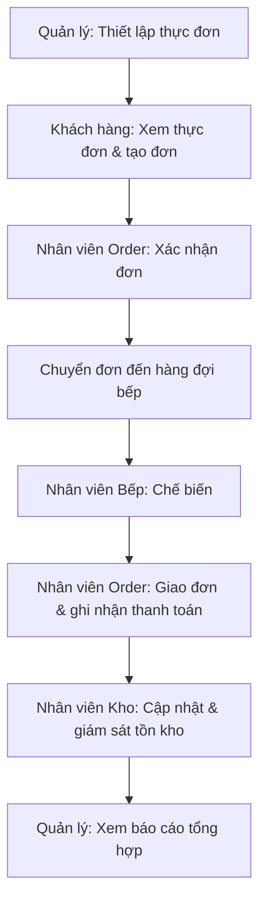

# ResMan
# Hệ Thống Quản Lý Nhà Hàng

> Nền tảng thống nhất kết nối Khách hàng, Nhân viên Order, Nhân viên Bếp, Nhân viên Kho và Quản lý xuyên suốt vòng đời vận hành nhà hàng — từ đặt món đến báo cáo.

## 📋 Mục Lục

- [Giới Thiệu](#giới-thiệu)
- [Vấn Đề & Tầm Nhìn](#vấn-đề--tầm-nhìn)
- [Actor Trong Hệ Thống](#actor-trong-hệ-thống)
- [Phạm Vi Dự Án](#phạm-vi-dự-án)
- [Hành Trình Sản Phẩm Cốt Lõi](#hành-trình-sản-phẩm-cốt-lõi)
- [Danh Sách Tính Năng](#danh-sách-tính-năng)
- [Kiến Trúc Năng Lực Hệ Thống](#kiến-trúc-năng-lực-hệ-thống)
- [Quy Tắc Kinh Doanh Chính](#quy-tắc-kinh-doanh-chính)
- [Kế Hoạch Triển Khai](#kế-hoạch-triển-khai)
- [Vai Trò Của AI Trong Dự Án](#vai-trò-của-ai-trong-dự-án)
- [Rủi Ro & Câu Hỏi Mở](#rủi-ro--câu-hỏi-mở)
- [Tài Liệu Liên Quan](#tài-liệu-liên-quan)

## Giới Thiệu

**Hệ Thống Quản Lý Nhà Hàng** là một dự án nhằm xây dựng nền tảng quản lý vận hành nhà hàng, kết nối năm vai trò cốt lõi vào một hệ thống thống nhất, giúp thông tin luân chuyển thông suốt giữa các giai đoạn vận hành thay vì phụ thuộc vào quy trình thủ công hoặc các công cụ rời rạc.

## Vấn Đề & Tầm Nhìn

**Vấn đề:** Các nhà hàng vận hành thủ công hoặc dùng nhiều công cụ rời rạc thường gặp phải:
- Đặt món chậm, dễ sai sót
- Đơn hàng bị thất lạc hoặc xử lý chậm
- Bếp không nhận đơn kịp thời, không rõ thứ tự ưu tiên
- Tồn kho thiếu minh bạch → thiếu hụt hoặc lãng phí
- Quản lý nhân sự và vận hành thiếu tập trung
- Báo cáo chậm, dễ sai sót
- Thông tin không đồng bộ giữa các bộ phận

**Tầm nhìn:** Trở thành hệ thống cốt lõi hỗ trợ trọn vẹn vòng đời vận hành nhà hàng — từ đặt món, xử lý đơn, chế biến, quản lý tồn kho đến báo cáo — với độ phức tạp khả thi cho một dự án sinh viên, đồng thời để ngỏ khả năng mở rộng bằng tính năng gợi ý món ăn cá nhân hoá (AI) trong tương lai.

### Mục Tiêu Chính

- Cải thiện hiệu quả, độ chính xác và sự phối hợp trong vận hành nhà hàng
- Hỗ trợ trọn vẹn vòng đời đơn hàng end-to-end: **đặt món → xác nhận → chế biến → giao hàng → thanh toán → cập nhật tồn kho → báo cáo**

## Actor Trong Hệ Thống

| Actor | Vai trò | Mục tiêu chính |
|---|---|---|
| 🧑‍🍳 **Khách hàng** | Đặt món và sử dụng dịch vụ | Đặt món dễ dàng, nhanh chóng, theo dõi được đơn hàng |
| 📋 **Nhân viên Order** | Tiếp nhận và xử lý đơn hàng | Xử lý đơn chính xác, kịp thời |
| 🍳 **Nhân viên Bếp** | Chế biến món ăn | Chế biến đúng nội dung, đúng thứ tự ưu tiên |
| 📦 **Nhân viên Kho** | Quản lý nguyên liệu, vật tư | Duy trì tồn kho chính xác, tránh thiếu hụt |
| 👔 **Quản lý** | Giám sát và điều hành | Ra quyết định dựa trên dữ liệu vận hành đầy đủ, kịp thời |

## Phạm Vi Dự Án

### ✅ Trong phạm vi
Quản lý thực đơn, quản lý đơn hàng (tạo/xác nhận/theo dõi/huỷ), vận hành bếp, quản lý tồn kho cơ bản, ghi nhận thanh toán, quản lý nhân sự cơ bản, báo cáo vận hành.

### ❌ Ngoài phạm vi
Đa nhà hàng/đa chi nhánh, logistics giao hàng bên thứ ba, tích hợp cổng thanh toán nâng cao, phân tích/BI nâng cao, chương trình khách hàng thân thiết, quản lý chuỗi cung ứng nâng cao.

### Phân loại theo giai đoạn

| Phạm vi | Nội dung |
|---|---|
| **MVP** | F-001 → F-014 (14 tính năng bắt buộc) |
| **Post-MVP** | F-015 — Dashboard giám sát thời gian thực |
| **Future** | F-016 — Gợi ý món ăn cá nhân hoá (AI), chưa xác nhận triển khai |

## Hành Trình Sản Phẩm Cốt Lõi

## Danh Sách Tính Năng

| ID | Tính năng | Actor chính | Ưu tiên | Trạng thái |
|---|---|---|---|---|
| F-001 | Quản Lý Món Ăn | Quản lý | Must Have | MVP |
| F-002 | Xem Thực Đơn | Khách hàng | Must Have | MVP |
| F-003 | Tạo Đơn Hàng | Khách hàng | Must Have | MVP |
| F-004 | Kiểm Tra Tính Hợp Lệ Đơn Hàng | *(nội bộ)* | Must Have | MVP |
| F-005 | Xử Lý Đơn Hàng Mới | Nhân viên Order | Must Have | MVP |
| F-006 | Điều Phối Đơn Đến Bếp & Hoàn Tất | Nhân viên Order | Must Have | MVP |
| F-007 | Theo Dõi Đơn Hàng | Khách hàng | Must Have | MVP |
| F-008 | Quản Lý Hàng Đợi Bếp | Nhân viên Bếp | Must Have | MVP |
| F-009 | Cập Nhật Tiến Độ Chế Biến | Nhân viên Bếp | Must Have | MVP |
| F-010 | Giám Sát Tồn Kho | Nhân viên Kho | Must Have | MVP |
| F-011 | Cập Nhật Tồn Kho | Nhân viên Kho | Must Have | MVP |
| F-012 | Ghi Nhận Thanh Toán | Nhân viên Order | Must Have | MVP |
| F-013 | Quản Lý Nhân Viên | Quản lý | Must Have | MVP |
| F-014 | Xem Báo Cáo Vận Hành | Quản lý | Must Have | MVP |
| F-015 | Dashboard Giám Sát Thời Gian Thực | Quản lý | Should Have | Post-MVP |
| F-016 | Gợi Ý Món Ăn Cá Nhân Hoá (AI) | Khách hàng | Could Have | Future |

## Kiến Trúc Năng Lực Hệ Thống

| Mã | Khu vực hệ thống | Năng lực chính |
|---|---|---|
| SA-001 | Menu Management | Duy trì và hiển thị thực đơn |
| SA-002 | Order Management | Quản lý toàn bộ vòng đời đơn hàng |
| SA-003 | Kitchen Operations | Điều phối việc chế biến món ăn |
| SA-004 | Inventory Management | Theo dõi và duy trì tồn kho nguyên liệu |
| SA-005 | Payment | Ghi nhận giao dịch và đóng đơn hàng |
| SA-006 | Employee Management | Quản lý thông tin và vai trò nhân viên |
| SA-007 | Reporting & Monitoring | Cung cấp báo cáo và giám sát vận hành |
| SA-008 | AI Recommendation *(Future)* | Gợi ý món ăn cá nhân hoá |

## Quy Tắc Kinh Doanh Chính

- Khách hàng không thể đặt/xác nhận món ăn đang hết hàng
- Trạng thái đơn hàng hiển thị cho khách hàng phải luôn phản ánh trạng thái mới nhất
- Đơn hàng chỉ có thể bị huỷ khi còn ở trạng thái "chờ xác nhận"
- Chỉ đơn hàng còn hợp lệ mới có thể được xác nhận
- Đơn hàng bị từ chối phải có lý do và phải thông báo cho khách hàng
- Đơn hàng chỉ được đóng khi thanh toán đã được ghi nhận thành công
- Nếu bếp thiếu nguyên liệu, trạng thái món phải phản ánh điều này và thông báo cho cả Nhân viên Kho lẫn Nhân viên Order
- Số lượng tồn kho không được phép là số âm
- Nếu tồn kho xuống dưới ngưỡng quy định, hệ thống phải cảnh báo Nhân viên Kho

*(Danh sách đầy đủ 10 quy tắc xem tại PRD, Mục 16.)*

## Kế Hoạch Triển Khai

| Phase | Mục tiêu | Tính năng | Milestone |
|---|---|---|---|
| Phase 1 | Nền tảng dữ liệu (thực đơn, nhân sự) | F-001, F-002, F-013 | M1 |
| Phase 2 | Luồng đặt món cốt lõi | F-003, F-004, F-005 | M2 |
| Phase 3 | Vận hành bếp & theo dõi đơn hàng | F-006, F-007, F-008, F-009 | M3 |
| Phase 4 | Thanh toán & quản lý tồn kho | F-010, F-011, F-012 | M4 |
| Phase 5 | Báo cáo vận hành & hoàn thiện MVP | F-014 | **M5 — MVP hoàn chỉnh** |
| Phase 6 | Nâng cao Post-MVP | F-015 | M6 |
| Phase 7 | Tính năng tương lai (AI gợi ý món) | F-016 | M7 *(tuỳ quyết định)* |

## Vai Trò Của AI Trong Dự Án

- **AI hỗ trợ phát triển:** AI được sử dụng xuyên suốt vòng đời dự án — phân tích yêu cầu, lập kế hoạch, tài liệu hoá, phân rã tính năng, hỗ trợ kiểm thử và rà soát. Đây là một phần của phương pháp luận phát triển, không phải tính năng sản phẩm. Mọi đầu ra AI đều cần con người rà soát trước khi chính thức hoá.
- **AI trong sản phẩm:** Duy nhất tính năng **Gợi Ý Món Ăn Cá Nhân Hoá (F-016)** — thuộc trạng thái *Suggested/Future*, chưa được xác nhận triển khai trong MVP.

## Rủi Ro & Câu Hỏi Mở

Một số quyết định vẫn cần được xác nhận trước khi triển khai các tính năng liên quan, bao gồm:

- Chỉ số đo lường thành công cụ thể (thời gian xử lý đơn, tỷ lệ lỗi...)
- Phương thức thanh toán cụ thể (tiền mặt/thẻ/ví điện tử)
- Ngưỡng "tồn kho thấp" được thiết lập như thế nào
- Điều kiện chính xác để huỷ đơn hàng
- Cơ chế chuyển đơn từ "đã xác nhận" sang hàng đợi bếp (tự động hay thủ công)
- Nhu cầu tài khoản khách hàng để hỗ trợ theo dõi đơn và gợi ý AI
- Xử lý khi Quản lý xoá món đang có trong đơn hàng chưa hoàn tất
- Nguồn lực cho Phase 6, Phase 7
- Nhu cầu thông báo ngoài ứng dụng (SMS/Email)

*(Danh sách đầy đủ 9 câu hỏi mở xem tại PRD, Mục 20.)*

## Tài Liệu Liên Quan

Dự án được xây dựng dựa trên bộ tài liệu phân tích sau, hợp nhất trong PRD trung tâm:

1. `01-project-vision.md` — Tầm nhìn dự án
2. `02-actor-analysis.md` — Phân tích actor
3. `03-user-flows.md` — Luồng người dùng
4. `04-use-cases.md` — Use case
5. `05-system-model.md` — Mô hình hệ thống
6. `06-feature-breakdown.md` — Phân rã tính năng
7. `07-project-plan.md` — Kế hoạch dự án
8. `PRD.md` — Tài liệu yêu cầu sản phẩm hợp nhất (nguồn của README này)

---

*README này được tạo dựa trên PRD hiện tại của dự án và sẽ được cập nhật khi PRD thay đổi.*