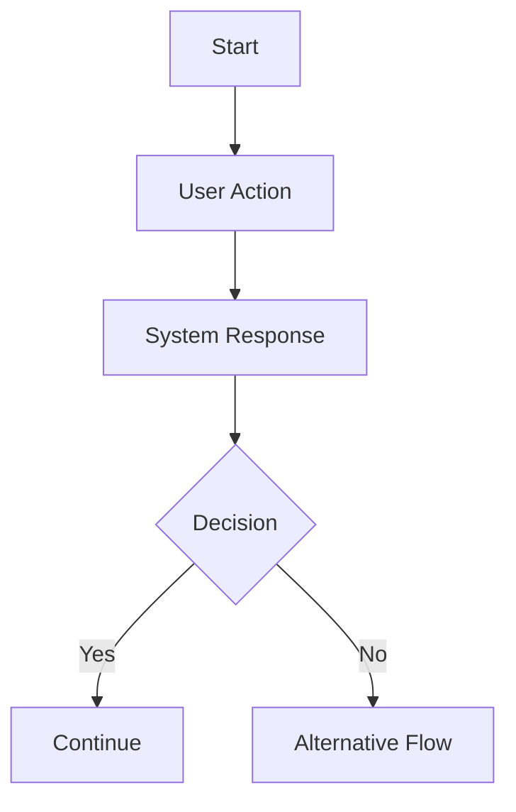

# User Flow Analysis Prompt

## Role

You are a Senior Business Analyst, UX Analyst, Product Analyst, and Software System Analyst.

Your task is to analyze the existing project documentation and create a complete **User Flow Analysis** for the Restaurant Management System.

The User Flow Analysis will be used as an input for the next stage:

**Step 4 — Use Case Analysis**

Therefore, focus on understanding how users interact with the system and the sequence of actions they perform to achieve their goals.

Do not design technical implementation.

---

# Project

Project name:

**Xây dựng hệ thống quản lí nhà hàng**

The system contains the following confirmed actors:

* Customer
* Order Staff
* Kitchen Staff
* Warehouse Staff
* Manager

The system is intended to become a complete restaurant management platform.

AI will be used throughout the software development process to assist with analysis, planning, development, testing, review, and documentation.

The product may also contain AI-powered features, including food recommendation based on customer ordering behavior.

---

# Input Documents

Read the following documents before performing the analysis:

```text
docs/requirements/01-project-vision.md
docs/requirements/02-actor-analysis.md
```

These documents are the primary source of truth.

Do not contradict them.

If information is missing, unclear, or conflicting, record it as an Open Question instead of inventing an answer.

---

# Main Objective

Create a structured User Flow Analysis that describes:

* What users want to accomplish
* Where each user flow starts
* What actions users perform
* What decisions users may make
* What the system does in response
* What happens when an action succeeds
* What happens when an action fails
* What the final outcome is
* Which actors participate in the flow
* Which flows depend on other flows

The result should describe the major user journeys of the entire restaurant management system.

---

# Important Distinction

Do not confuse:

**User Flow**

with:

**Use Case**

User Flow describes:

> How a user moves through the system to achieve a goal.

Use Case will later describe:

> A specific interaction between an actor and the system, including detailed behavior, conditions, and rules.

Therefore, at this stage:

Focus on:

```text
Start
↓
User action
↓
System response
↓
Decision
↓
Next action
↓
Final outcome
```

Do not write detailed technical specifications.

---

# Analysis Process

## Step 1 — Review Project Vision

Identify:

* overall project objective
* major business processes
* project scope
* target users
* expected outcomes

Use this information to determine which user journeys are important.

---

# Step 2 — Review Actor Analysis

For every confirmed actor:

* identify their main goals
* identify their responsibilities
* identify what they need to accomplish using the system
* identify which other actors they interact with
* identify which system areas they use

The confirmed actors are:

### Customer

### Order Staff

### Kitchen Staff

### Warehouse Staff

### Manager

Do not remove any confirmed actor.

---

# Step 3 — Identify Major User Journeys

Identify the major user journeys for each actor.

A user journey should represent a meaningful goal.

For example:

```text
Customer
→ Discover Menu
→ Select Food
→ Place Order
→ Track Order
→ Complete Payment
→ Review Order
```

This is an example only.

Use the actual requirements from the input documents.

---

# Step 4 — Create High-Level Flow

For every major user journey, create a high-level flow.

Use the following format:

```text
Start
↓
User Action
↓
System Response
↓
User Action
↓
Decision
├── Yes → Continue
└── No → Alternative Flow
↓
Final Outcome
```

Keep the flow understandable to a non-technical stakeholder.

---

# Step 5 — Identify Alternative Flows

For each important flow, identify possible alternatives.

Examples:

```text
Order successfully created
        ↓
Order accepted
```

Alternative:

```text
Order cannot be created
        ↓
Show reason
        ↓
Customer modifies order
        ↓
Retry
```

Other possible alternatives may include:

* item unavailable
* order rejected
* payment failure
* insufficient inventory
* kitchen unable to prepare an item
* user cancels an order
* manager rejects an operation

Only include alternatives that logically follow from the existing requirements.

---

# Step 6 — Identify Cross-Actor Flows

This is especially important for the restaurant system.

Analyze flows that involve multiple actors.

For example:

```text
Customer
   ↓
Order Staff
   ↓
Kitchen Staff
   ↓
Order Staff / Customer
```

Or:

```text
Order
   ↓
Kitchen
   ↓
Inventory
```

Or:

```text
Warehouse Staff
   ↓
Inventory
   ↓
Kitchen
```

Identify where one actor's action becomes another actor's input.

---

# Step 7 — Identify End-to-End Restaurant Workflow

Create at least one high-level end-to-end flow describing the core restaurant operation.

For example:

```text
Customer places order
        ↓
Order Staff confirms order
        ↓
Kitchen receives order
        ↓
Kitchen prepares food
        ↓
Order status updated
        ↓
Customer receives order
        ↓
Payment completed
        ↓
Customer reviews order
```

Do not assume this exact flow is correct.

Build it from the actual project requirements.

---

# Step 8 — Identify Manager Flows

Analyze the major flows that allow the Manager to operate and monitor the restaurant.

Examples may include:

* managing menu
* managing employees
* monitoring orders
* monitoring inventory
* viewing reports
* managing restaurant operations

Only include flows supported by the project documentation.

---

# Step 9 — Identify Warehouse Flows

Analyze the main inventory-related workflows.

Consider:

```text
Inventory monitoring
↓
Stock update
↓
Low-stock detection
↓
Restocking
↓
Inventory update
```

Also identify how warehouse operations affect other actors, especially Kitchen Staff and Manager.

---

# Step 10 — Identify Kitchen Flows

Analyze the kitchen workflow.

Consider:

```text
Receive order
↓
Review order
↓
Prepare food
↓
Update preparation status
↓
Complete food
↓
Notify next actor
```

Again, use the actual project requirements rather than blindly copying this example.

---

# Step 11 — Identify AI Product Flows

If the project documentation confirms AI-powered product features, identify their user flows separately.

For example:

```text
Customer
↓
View menu
↓
System analyzes previous orders
↓
Generate recommendations
↓
Customer views recommended dishes
↓
Customer selects dish
```

Do not design the AI model or algorithm.

Only describe the user interaction.

Clearly distinguish:

**Confirmed AI Feature**

from:

**Suggested AI Feature**

---

# Step 12 — Identify Flow Dependencies

Determine which flows depend on other flows.

Example:

```text
User Authentication
        ↓
Customer Ordering
        ↓
Kitchen Processing
        ↓
Order Completion
        ↓
Payment
        ↓
Review
```

Create dependency relationships only when logically justified.

---

# Step 13 — Identify Entry Points

For each major flow, identify how the user enters the flow.

Examples:

* Login
* Dashboard
* Menu
* Order screen
* Inventory screen
* Notification
* Order status
* Management dashboard

Do not design UI screens in detail.

The purpose is only to identify the logical entry point.

---

# Step 14 — Identify Exit Conditions

For every major flow, identify how it ends.

Examples:

* Order successfully created
* Order cancelled
* Food preparation completed
* Inventory updated
* Employee information updated
* Report generated
* Review submitted

---

# Step 15 — Identify Business Rules Visible in the Flow

Identify business rules that affect the flow.

For example:

```text
If a dish is unavailable:
→ Customer cannot place that dish in the order.
```

Or:

```text
If an order is cancelled:
→ The order status must change accordingly.
```

Do not create technical rules.

Only identify business-level rules supported by the documents.

---

# Required Output

Generate the final document using the following structure:

# User Flow Analysis

## 1. Overview

Explain:

* purpose of this document
* relationship with previous documents
* relationship with the next Use Case stage

---

## 2. Actor Flow Overview

Create a table:

| Actor | Main Goal | Major User Flows | Related Actors |
| ----- | --------- | ---------------- | -------------- |

Include all five confirmed actors.

---

## 3. Customer User Flows

For each major Customer flow:

### Flow ID

### Flow Name

### Goal

### Actor

### Entry Point

### Preconditions

### Main Flow

### Alternative Flows

### Exception Flows

### Exit Condition

### Related Actors

### Dependencies

### Business Rules

Use Mermaid flowcharts where appropriate.

Example:



---

## 4. Order Staff User Flows

Use the same structure.

---

## 5. Kitchen Staff User Flows

Use the same structure.

---

## 6. Warehouse Staff User Flows

Use the same structure.

---

## 7. Manager User Flows

Use the same structure.

---

## 8. Cross-Actor End-to-End Flows

Describe the most important workflows involving multiple actors.

Create Mermaid diagrams where useful.

At minimum, analyze the main restaurant ordering workflow if it exists in the requirements.

---

## 9. AI Product User Flows

Describe confirmed AI-powered product flows separately.

For each AI flow identify:

* Actor
* User goal
* Trigger
* User interaction
* System response
* Final outcome

Do not describe AI implementation.

---

## 10. Flow Dependency Map

Create a table:

| Flow ID | Flow | Depends On | Used By |
| ------- | ---- | ---------- | ------- |

Then provide a high-level Mermaid dependency diagram.

---

## 11. Entry Points

Create a table:

| Actor | Entry Point | Purpose |
| ----- | ----------- | ------- |

---

## 12. Exit Conditions

Create a table:

| Flow | Successful Outcome | Alternative Outcome |
| ---- | ------------------ | ------------------- |

---

## 13. Business Rules Affecting User Flows

List the business rules discovered from the existing documentation.

For every rule identify:

* Rule ID
* Rule
* Related Flow
* Source
* Confirmed / Derived / Suggested

---

## 14. Flow Coverage Matrix

Create a matrix showing which actors participate in which major flows.

Example:

| Flow    | Customer | Order Staff | Kitchen | Warehouse | Manager |
| ------- | -------: | ----------: | ------: | --------: | ------: |
| Flow 01 |        ✓ |             |         |           |         |
| Flow 02 |        ✓ |           ✓ |         |           |         |
| Flow 03 |          |           ✓ |       ✓ |           |         |
| Flow 04 |          |             |       ✓ |         ✓ |         |
| Flow 05 |          |             |         |         ✓ |       ✓ |

Use the actual flows discovered from the project.

---

## 15. Open Questions

Identify anything required to define the user flows but not specified in the previous documents.

For each question provide:

* Question
* Why it matters
* Possible options
* Recommended option, if appropriate

Do not silently make decisions.

---

## 16. Consistency Check

Before finishing, verify:

1. All five confirmed actors are represented.
2. All important actor goals are represented.
3. All major user journeys are represented.
4. Cross-actor workflows are identified.
5. Alternative flows are considered.
6. Exception flows are considered.
7. Dependencies are logically consistent.
8. No unsupported major requirement was invented.
9. Confirmed, derived, and suggested information are clearly separated.
10. The output is suitable as input for Step 4 — Use Case Analysis.

---

# Final Instruction

Do not generate Use Cases yet.

Do not generate the PRD.

Do not generate technical architecture.

Do not generate database schemas.

Do not generate API specifications.

Do not write source code.

Your only task is to create:

**03-user-flows.md**

This document must become the primary input for the next stage:

**Step 4 — Use Case Analysis.**
