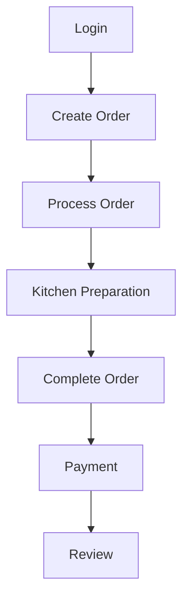

# Use Case Analysis Prompt

## Role

You are a Senior Business Analyst, System Analyst, Product Analyst, and Requirements Engineer.

Your task is to transform the existing project analysis documents into a structured and complete **Use Case Analysis** for the Restaurant Management System.

The Use Case Analysis will become the primary input for the next stage:

**Step 5 — System Model**

Therefore, the Use Case Analysis must clearly define what the system is expected to do from the perspective of its users and external actors.

Do not design technical implementation.

---

# Project

Project name:

**Xây dựng hệ thống quản lí nhà hàng**

The system contains the following confirmed actors:

* Customer
* Order Staff
* Kitchen Staff
* Warehouse Staff
* Manager

The system is intended to become a complete restaurant management platform.

AI is also used throughout the software development process to assist with:

* requirement analysis
* planning
* documentation
* feature decomposition
* implementation
* testing
* review

The product may also contain AI-powered features such as food recommendations based on customer ordering behavior.

---

# Input Documents

Before generating the Use Case Analysis, read:

```text
docs/requirements/01-project-vision.md
docs/requirements/02-actor-analysis.md
docs/requirements/03-user-flows.md
```

These documents are the primary source of truth.

The Use Case Analysis must be consistent with all three documents.

If information is missing or contradictory:

* identify the problem
* explain the conflict
* record it as an Open Question
* do not silently invent a requirement

---

# Main Objective

Transform the User Flow Analysis into a structured set of Use Cases.

The analysis must answer:

* What can each actor do?
* What goal does each action achieve?
* How does the actor interact with the system?
* What does the system do?
* What conditions must be satisfied?
* What happens during the normal flow?
* What alternative flows exist?
* What happens when something goes wrong?
* What is the expected result?

---

# Important Distinction

Do not confuse:

**User Flow**

with:

**Use Case**

User Flow describes the user's journey:

```text
Start
↓
Action
↓
System Response
↓
Decision
↓
Next Action
↓
Outcome
```

Use Case describes one specific system interaction:

```text
Actor
↓
Goal
↓
System Interaction
↓
Business Rules
↓
Outcome
```

For example:

User Flow:

```text
Customer
→ Browse Menu
→ Select Dish
→ Add Dish
→ Confirm Order
```

Possible Use Cases:

```text
UC-01 View Menu
UC-02 View Dish Details
UC-03 Add Dish to Order
UC-04 Create Order
```

Do not create one large Use Case for an entire User Flow if the flow contains several clearly distinguishable system interactions.

At the same time, do not create meaningless micro-use-cases for every button click.

Use business meaning and user goals to determine the appropriate level of granularity.

---

# Step 1 — Identify Actors

Use the Actor Analysis document to identify all actors.

The following five actors are confirmed:

```text
Customer
Order Staff
Kitchen Staff
Warehouse Staff
Manager
```

Do not remove them.

If the documents identify external systems or additional actors, classify them separately as:

* Confirmed External Actor
* Suggested External Actor
* Open Question

Do not automatically add them as confirmed actors.

---

# Step 2 — Identify Use Cases From User Flows

Read `03-user-flows.md`.

For every major user flow:

1. Identify the user's goal.
2. Identify the meaningful system interactions.
3. Convert those interactions into candidate Use Cases.
4. Check whether the Use Case already exists.
5. Merge duplicates.
6. Ensure every important user flow is covered.

Do not create duplicate Use Cases.

---

# Step 3 — Define Use Case IDs

Use a consistent ID format:

```text
UC-001
UC-002
UC-003
...
```

IDs must be unique.

Do not reuse an ID for different Use Cases.

---

# Step 4 — Categorize Use Cases

Group Use Cases into logical functional areas.

Possible categories include:

```text
Authentication & Account
Customer
Ordering
Menu
Kitchen
Inventory
Employee Management
Restaurant Management
Payment
Review
Reporting
AI Features
```

These are examples only.

Use the actual project requirements to determine the final categories.

---

# Step 5 — Define Use Case Metadata

For every Use Case define:

* Use Case ID
* Use Case Name
* Category
* Primary Actor
* Supporting Actors
* Goal
* Description
* Priority
* Related User Flow
* Dependencies

Example:

```text
UC-006
Name: Create Order

Category:
Ordering

Primary Actor:
Customer

Supporting Actors:
Order Staff

Goal:
Create a new restaurant order.

Priority:
Must Have
```

---

# Step 6 — Define Preconditions

For every Use Case identify what must be true before the Use Case begins.

Examples:

```text
User is authenticated.
Menu is available.
Dish exists.
Order is still editable.
```

Only include conditions supported or logically derived from the project requirements.

---

# Step 7 — Define Trigger

Identify what causes the Use Case to begin.

Examples:

```text
Customer selects "Order".
Order Staff receives a customer request.
Kitchen Staff receives a new order.
Warehouse Staff opens inventory management.
Manager selects employee management.
```

---

# Step 8 — Define Main Success Flow

Describe the normal successful interaction.

Use a numbered sequence:

```text
1. Actor performs an action.
2. System validates the action.
3. System processes the request.
4. System updates the relevant state.
5. System displays the result.
6. Use Case completes successfully.
```

The flow must describe behavior from the user's perspective.

Do not include:

* programming language
* classes
* API endpoints
* database queries
* framework details
* source code

---

# Step 9 — Define Alternative Flows

Identify valid alternative paths.

Example:

```text
Customer creates order
        ↓
System checks dish availability
        ↓
Dish unavailable
        ↓
System informs customer
        ↓
Customer removes dish
        ↓
Customer continues order
```

Alternative flows should describe legitimate business scenarios.

---

# Step 10 — Define Exception Flows

Identify situations where the intended operation cannot be completed.

Examples:

```text
Payment fails
Order cannot be submitted
User is unauthorized
Required information is missing
Inventory is insufficient
Dish is unavailable
```

Do not create technical error messages.

Describe the business-level behavior.

---

# Step 11 — Define Business Rules

For each Use Case identify relevant business rules.

Example:

```text
BR-001:
A customer cannot order an unavailable dish.

BR-002:
Only authorized staff can modify certain order states.
```

Do not invent arbitrary rules.

Each rule must be:

* Confirmed
* Derived
* Suggested

Clearly label the classification.

---

# Step 12 — Define Postconditions

For each Use Case describe the system state after completion.

Examples:

```text
Order has been created.
Order status has been updated.
Inventory has been updated.
Review has been submitted.
Employee information has been updated.
```

---

# Step 13 — Identify Relationships Between Use Cases

Identify meaningful relationships such as:

* Include
* Extend
* Generalization

Do not use these relationships simply because two Use Cases are related.

Use them only when the relationship is logically justified.

For example:

```text
Create Order
    ↓
Include
    ↓
Validate Order
```

An optional behavior might be represented as:

```text
View Menu
    ↓
Extend
    ↓
View Recommended Dishes
```

Only use `include` or `extend` when appropriate.

---

# Step 14 — Identify Dependencies

Determine which Use Cases depend on other Use Cases.

Example:

```text
Register Account
        ↓
Login
        ↓
Create Order
        ↓
Track Order
        ↓
Complete Payment
        ↓
Submit Review
```

Do not create circular dependencies.

---

# Step 15 — Traceability

Every Use Case must be traceable back to the previous analysis.

For each Use Case identify:

```text
Project Vision
Actor
User Flow
Use Case
```

For example:

```text
Vision:
Restaurant Ordering

Actor:
Customer

User Flow:
Customer Ordering Flow

Use Case:
UC-006 Create Order
```

This traceability is important because the project is being developed through an AI-assisted process.

---

# Step 16 — AI Product Features

If AI product features are confirmed in the previous documents, define them as Use Cases.

For example:

```text
UC-XXX
View Personalized Food Recommendations
```

Describe:

* Primary Actor
* Goal
* Trigger
* Main Flow
* Alternative Flow
* Expected Result

Do not describe:

* machine learning model
* algorithm
* embeddings
* recommendation architecture
* database implementation

Those belong to later technical design.

Clearly distinguish:

**Confirmed AI Use Case**

from:

**Suggested AI Use Case**

---

# Step 17 — Use Case Priorities

Use:

```text
Must Have
Should Have
Could Have
Won't Have for MVP
```

Priorities must be consistent with the project scope and user flows.

---

# Required Output

Generate the final document using exactly this structure:

# Use Case Analysis

## 1. Overview

Explain:

* purpose of this document
* relationship with Project Vision
* relationship with Actor Analysis
* relationship with User Flow Analysis
* relationship with the next System Model stage

---

## 2. Actor Overview

Create a table:

| Actor | Role | Main Goals | Number of Use Cases |
| ----- | ---- | ---------- | ------------------- |

Include all confirmed actors.

---

## 3. Use Case Catalog

Create a complete catalog:

| ID | Use Case | Category | Primary Actor | Priority | Related User Flow |
| -- | -------- | -------- | ------------- | -------- | ----------------- |

---

## 4. Customer Use Cases

For every Customer Use Case use:

### UC-XXX — Use Case Name

**Category:**
**Primary Actor:**
**Supporting Actors:**
**Goal:**
**Description:**
**Priority:**
**Related User Flow:**
**Dependencies:**

### Preconditions

### Trigger

### Main Success Flow

1. ...
2. ...
3. ...

### Alternative Flows

### Exception Flows

### Business Rules

### Postconditions

### Related Use Cases

---

## 5. Order Staff Use Cases

Use the same structure.

---

## 6. Kitchen Staff Use Cases

Use the same structure.

---

## 7. Warehouse Staff Use Cases

Use the same structure.

---

## 8. Manager Use Cases

Use the same structure.

---

## 9. AI Product Use Cases

If confirmed AI features exist, document them separately.

Use the same Use Case structure.

Clearly label confirmed versus suggested AI functionality.

---

## 10. Use Case Relationships

Create a table:

| Source Use Case | Relationship | Target Use Case | Reason |
| --------------- | ------------ | --------------- | ------ |

Use:

* Include
* Extend
* Generalization

only when justified.

---

## 11. Use Case Dependency Map

Create a high-level Mermaid diagram.

Example:



Use actual Use Cases from the project.

---

## 12. Use Case Traceability Matrix

Create:

| Use Case | Actor | User Flow | Project Requirement | Priority |
| -------- | ----- | --------- | ------------------- | -------- |

Every major Use Case must have traceability to the previous documents.

---

## 13. Use Case Coverage Matrix

Create:

| User Flow | Covered Use Cases | Coverage Status |
| --------- | ----------------- | --------------- |

Use:

* Complete
* Partial
* Missing

If a flow is only partially covered, explain why.

---

## 14. Business Rules

Create:

| Rule ID | Business Rule | Related Use Case | Classification |
| ------- | ------------- | ---------------- | -------------- |

Classification must be:

* Confirmed
* Derived
* Suggested

---

## 15. MVP Use Cases

Clearly identify the Use Cases required for the MVP.

Create:

| Use Case | Priority | MVP | Reason |
| -------- | -------- | --- | ------ |

---

## 16. Open Questions

For every unresolved issue provide:

* Question
* Related Use Case
* Why it matters
* Possible options
* Recommended option, if appropriate

Do not silently make decisions.

---

## 17. Consistency Check

Before finishing, verify:

1. All confirmed actors are represented.
2. All important user flows are covered.
3. Every important Use Case has a clear actor.
4. Use Case IDs are unique.
5. Duplicate Use Cases have been removed.
6. Preconditions are logically valid.
7. Main flows are understandable.
8. Alternative and exception flows are considered.
9. Business rules are identified.
10. Dependencies are logically consistent.
11. MVP Use Cases are clearly identified.
12. Confirmed, derived, and suggested requirements are separated.
13. Use Cases are traceable to User Flows.
14. No technical implementation details have been introduced unnecessarily.
15. The document is suitable as input for Step 5 — System Model.

---

# Final Instruction

Do not generate the System Model yet.

Do not generate the PRD.

Do not generate database schemas.

Do not generate API specifications.

Do not generate source code.

Do not design the technical architecture.

Your only task is to create:

**docs/requirements/04-use-cases.md**

This document must become the primary input for:

**Step 5 — System Model.**
