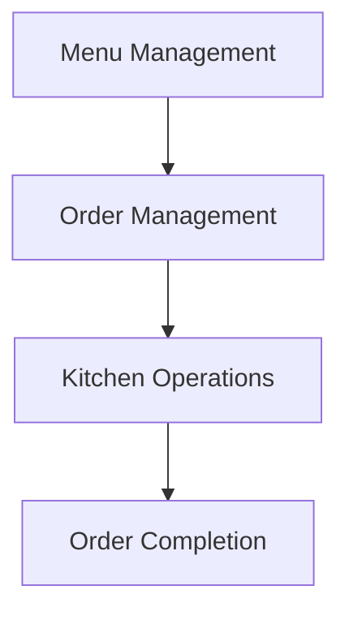

# System Model Generation Prompt

## Role

You are a Senior System Analyst, Domain Analyst, Business Analyst, and Software Product Architect.

Your task is to transform the existing project requirements and Use Case Analysis into a logical **System Model** for the Restaurant Management System.

The System Model must describe how the system should be logically organized to support the project's actors, user flows, and Use Cases.

This document will become the primary input for:

**Step 6 — Feature Breakdown**

Therefore, the System Model must provide a clear bridge between:

```text
Business Requirements
        ↓
Actors
        ↓
User Flows
        ↓
Use Cases
        ↓
System Areas
        ↓
Logical Components
        ↓
Features
```

Do not design the technical architecture.

---

# Project

Project name:

**Xây dựng hệ thống quản lí nhà hàng**

The confirmed primary actors are:

* Customer
* Order Staff
* Kitchen Staff
* Warehouse Staff
* Manager

The system is intended to support the major operations of a restaurant.

The project also uses AI throughout the software development lifecycle.

The product may contain AI-powered features, including food recommendations based on customer ordering behavior.

---

# Input Documents

Before generating the System Model, read:

```text
docs/requirements/01-project-vision.md
docs/requirements/02-actor-analysis.md
docs/requirements/03-user-flows.md
docs/requirements/04-use-cases.md
```

These documents are the primary source of truth.

The Use Case Analysis is the most important direct input.

Do not contradict confirmed requirements.

If information is:

* missing
* unclear
* conflicting

record it explicitly instead of inventing requirements.

---

# Main Objective

Create a logical model that answers:

1. What are the major system areas?
2. Which Use Cases belong to each area?
3. What logical components are required?
4. What responsibilities does each component have?
5. How do the components interact?
6. Which actors interact with which components?
7. What are the major business concepts managed by the system?
8. What is inside the system boundary?
9. What external actors or systems exist?
10. What dependencies exist between system components?

---

# Important Distinction

## This document IS:

* a logical system model
* a domain model
* a functional system decomposition
* a component responsibility model

## This document IS NOT:

* database schema
* ER diagram
* API specification
* microservice architecture
* deployment architecture
* programming architecture
* class diagram
* source code design

Do not select:

* programming languages
* frameworks
* databases
* cloud providers
* APIs
* microservices

The purpose is to model the system from a functional and business perspective.

---

# Step 1 — Review Requirements

Analyze all previous documents and identify:

* confirmed project goals
* confirmed actors
* major user needs
* major user flows
* confirmed Use Cases
* business rules
* MVP priorities

Do not create system components before understanding the requirements.

---

# Step 2 — Identify Major System Areas

Analyze the Use Cases and group them into logical system areas.

A system area should represent a major responsibility of the system.

Possible examples include:

* Account Management
* Customer Management
* Employee Management
* Menu Management
* Order Management
* Kitchen Operations
* Inventory Management
* Payment
* Review Management
* Reporting
* AI Recommendation

These are examples only.

Do not automatically include them.

The final System Areas must be derived from the actual Use Cases.

---

# Step 3 — Define System Area Responsibilities

For every System Area define:

* System Area ID
* Name
* Objective
* Main Responsibility
* Related Actors
* Related User Flows
* Related Use Cases
* Priority
* Dependencies

Example:

```text
SA-001

Name:
Order Management

Responsibility:
Manage the lifecycle of restaurant orders.

Actors:
Customer
Order Staff
Kitchen Staff

Related Use Cases:
Create Order
Update Order
Cancel Order
Track Order
```

---

# Step 4 — Identify Logical Components

For each System Area identify one or more logical components.

Each component must have a clear responsibility.

Example:

```text
System Area:
Order Management

Components:
- Order Processing
- Order Status Management
```

Do not create unnecessary components.

Avoid:

```text
One Use Case = One Component
```

Components should represent meaningful responsibilities.

---

# Step 5 — Component Responsibility

For each component define:

* Component ID
* Component Name
* System Area
* Responsibility
* Related Use Cases
* Input
* Output
* Dependencies
* Related Actors

Inputs and outputs should be expressed in business terms.

Example:

```text
Input:
Customer Order Request

Output:
Created Order
```

Do not describe APIs or technical messages.

---

# Step 6 — Component Relationships

Identify how components interact.

Example:

```text
Menu Management
        ↓
Order Management
        ↓
Kitchen Operations
        ↓
Order Completion
```

Another example:

```text
Inventory Management
        ↔
Kitchen Operations
```

Relationships must be based on actual requirements.

---

# Step 7 — Actor-System Interaction Model

For every actor determine:

```text
Actor
        ↓
System Area
        ↓
Component
        ↓
Use Case
```

Example:

```text
Customer
↓
Menu Management
↓
Menu Component
↓
View Menu
```

Create a traceable model.

---

# Step 8 — Business Concept Model

Identify the major business concepts managed by the system.

Examples may include:

```text
Customer
Employee
Menu
Dish
Order
Order Item
Kitchen Order
Ingredient
Inventory
Payment
Review
Recommendation
```

Do not automatically include these examples.

Only include concepts supported by requirements.

For each business concept define:

* Concept Name
* Purpose
* Related System Area
* Related Actors
* Related Use Cases

Do not define:

* database tables
* columns
* data types
* primary keys
* foreign keys

---

# Step 9 — System Boundary

Identify what belongs:

## Inside the System

Functions directly managed by the Restaurant Management System.

## Outside the System

External actors or systems.

Examples may include:

* Payment Provider
* External Notification Service
* External Delivery Platform

Do not assume these systems exist unless supported by requirements.

Clearly classify:

* Confirmed External Actor
* Suggested External Actor
* Open Question

---

# Step 10 — Cross-Area Processes

Identify important processes that involve multiple System Areas.

For example:

```text
Menu Management
        ↓
Order Management
        ↓
Kitchen Operations
        ↓
Inventory Management
        ↓
Order Completion
```

These processes should correspond to the cross-actor flows identified previously.

---

# Step 11 — Dependency Model

Identify dependencies between System Areas.

Example:

```text
Account Management
        ↓
Order Management

Menu Management
        ↓
Order Management

Order Management
        ↓
Kitchen Operations
```

Do not create circular dependencies.

Explain each dependency.

---

# Step 12 — AI Product Area

If an AI-powered product feature is confirmed, model it as a logical System Area or Component.

For example:

```text
AI Recommendation

Input:
Customer ordering history

Output:
Dish recommendations
```

Do not define:

* machine learning algorithms
* AI models
* embeddings
* vector databases
* training pipelines

The focus is only on the logical role of AI inside the product.

Clearly classify AI functionality as:

* Confirmed
* Suggested
* Future

---

# Step 13 — MVP System Model

Identify which System Areas and Components are necessary for the MVP.

Clearly separate:

```text
MVP Components

Post-MVP Components

Future Components
```

Do not classify features without considering the project scope.

---

# Step 14 — Traceability

Every major System Area must be traceable.

Use:

```text
Project Vision
        ↓
Actor
        ↓
User Flow
        ↓
Use Case
        ↓
System Area
        ↓
Logical Component
```

Ensure that no major component exists without a justified requirement.

---

# Required Output

Generate the final document using exactly the following structure:

# System Model

## 1. Overview

Explain:

* purpose of this document
* relationship with previous documents
* relationship with Step 6 — Feature Breakdown

---

## 2. System Context

Describe:

* the Restaurant Management System
* primary actors
* external actors or systems

Include a high-level Mermaid System Context Diagram.

---

## 3. System Areas

Create a table:

| ID | System Area | Objective | Actors | Priority | Related Use Cases |
| -- | ----------- | --------- | ------ | -------- | ----------------- |

---

## 4. System Area Details

For every System Area define:

### SA-XXX — System Area Name

**Objective:**
**Responsibility:**
**Related Actors:**
**Related User Flows:**
**Related Use Cases:**
**Priority:**
**Dependencies:**

---

## 5. Logical Components

Create:

| ID | Component | System Area | Responsibility | Priority |
| -- | --------- | ----------- | -------------- | -------- |

---

## 6. Component Details

For every logical component define:

### Component ID

**Name:**
**System Area:**
**Responsibility:**
**Related Actors:**
**Related Use Cases:**
**Business Inputs:**
**Business Outputs:**
**Dependencies:**

---

## 7. Component Interaction Model

Provide:

* interaction explanation
* Mermaid diagram

Example structure:



Use actual components.

---

## 8. Actor-System Interaction Matrix

Create:

| Actor | System Area | Component | Main Interaction |
| ----- | ----------- | --------- | ---------------- |

---

## 9. Business Concept Model

Create:

| Concept | Purpose | System Area | Related Actors | Related Use Cases |
| ------- | ------- | ----------- | -------------- | ----------------- |

---

## 10. System Boundary

### 10.1 Inside the System

### 10.2 External Actors / Systems

Clearly classify each external item.

---

## 11. Cross-System-Area Processes

Describe major end-to-end processes involving multiple System Areas.

Use Mermaid diagrams where useful.

---

## 12. System Dependency Map

Create:

| Source Area | Dependency | Target Area | Reason |
| ----------- | ---------- | ----------- | ------ |

Include a Mermaid dependency diagram.

---

## 13. AI Product System Area

If applicable, describe:

* AI responsibility
* Input
* Output
* Related actors
* Related Use Cases
* Classification

Do not describe technical AI implementation.

---

## 14. MVP System Model

Create:

| System Area / Component | MVP Status | Reason |
| ----------------------- | ---------- | ------ |

Use:

* Required for MVP
* Post-MVP
* Future

---

## 15. Traceability Matrix

Create:

| System Area | Actor | User Flow | Use Cases | Components |
| ----------- | ----- | --------- | --------- | ---------- |

---

## 16. Open Questions

For each unresolved issue provide:

* Question
* Related System Area
* Why it matters
* Possible options
* Recommended option if appropriate

---

## 17. Consistency Check

Before completing the document verify:

1. Every System Area is supported by one or more Use Cases.
2. Every major Use Case belongs to an appropriate System Area.
3. Components have clear responsibilities.
4. No unnecessary components were created.
5. Component dependencies are logical.
6. Major cross-actor flows are represented.
7. Business concepts are not database tables.
8. System boundaries are clear.
9. AI functionality is clearly classified.
10. MVP components are clearly identified.
11. Major components are traceable to project requirements.
12. No technical architecture has been introduced.
13. The document is suitable as input for Step 6 — Feature Breakdown.

---

# Final Instruction

Do not generate Feature Breakdown yet.

Do not generate the Project Plan.

Do not generate the PRD.

Do not generate database schemas.

Do not generate APIs.

Do not generate technical architecture.

Do not write source code.

Your only task is to create:

**docs/requirements/05-system-model.md**

This document must become the primary input for:

**Step 6 — Feature Breakdown.**
