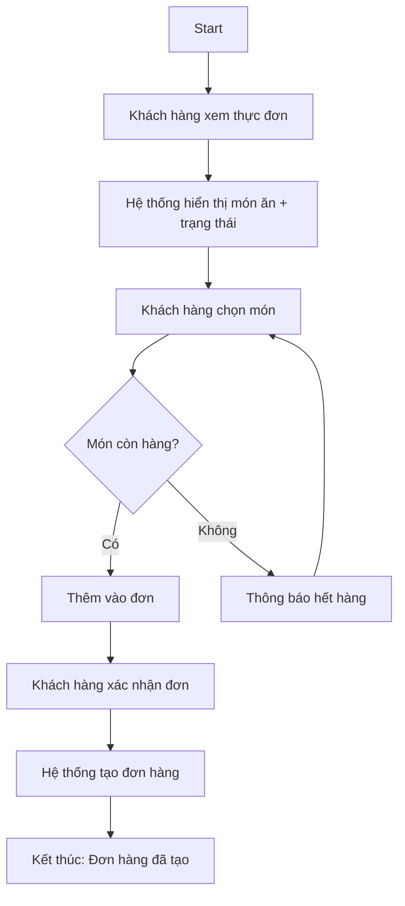
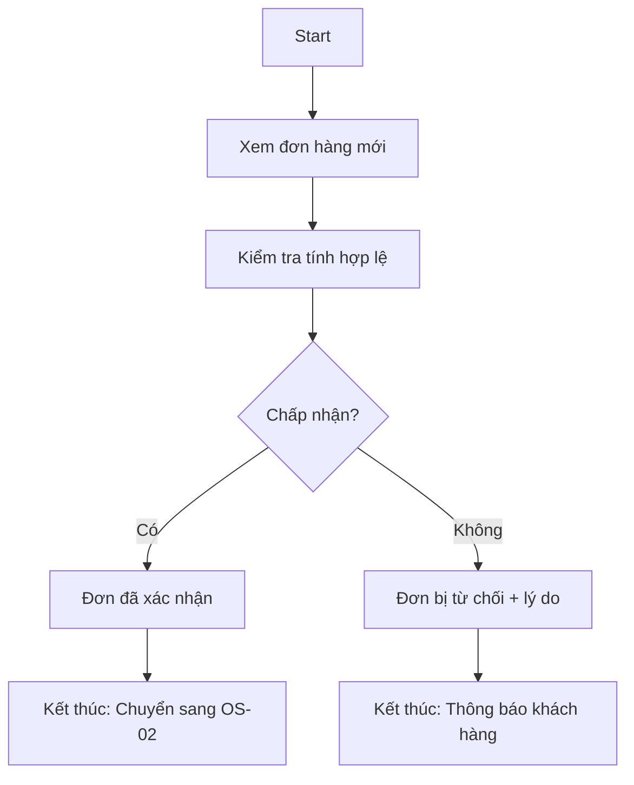
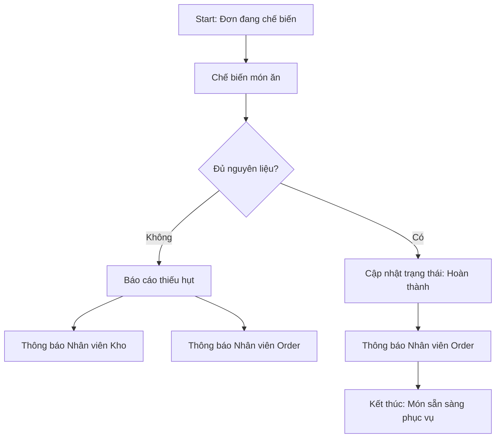
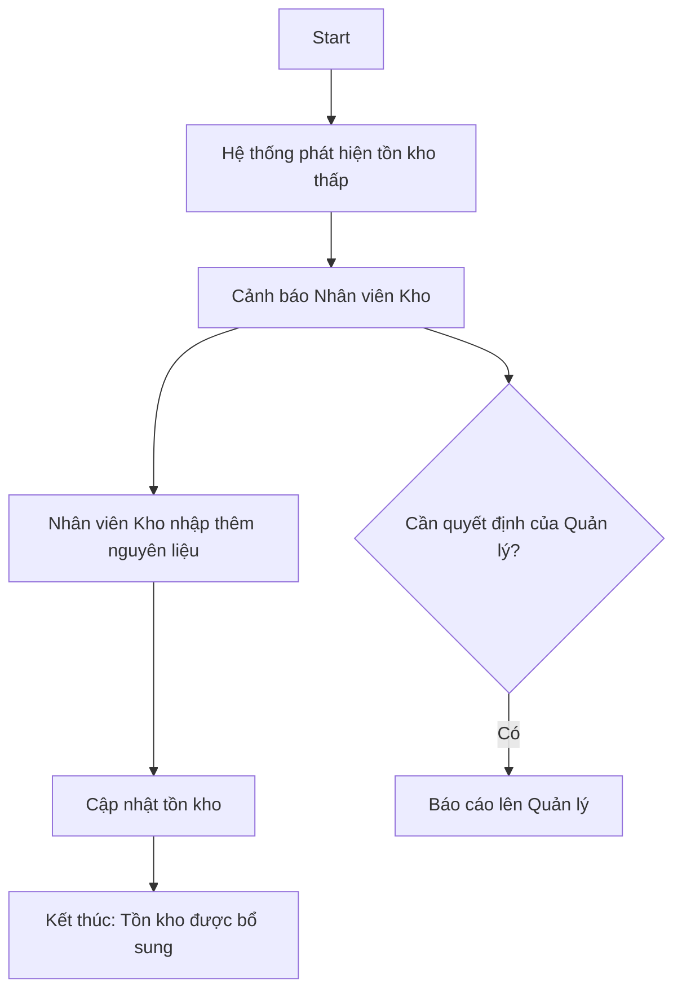
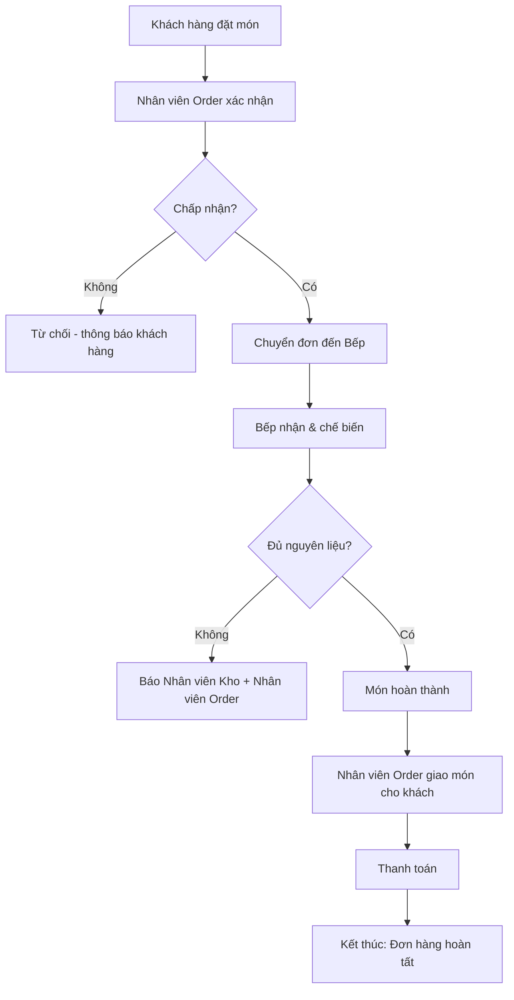
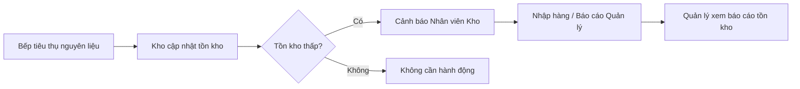
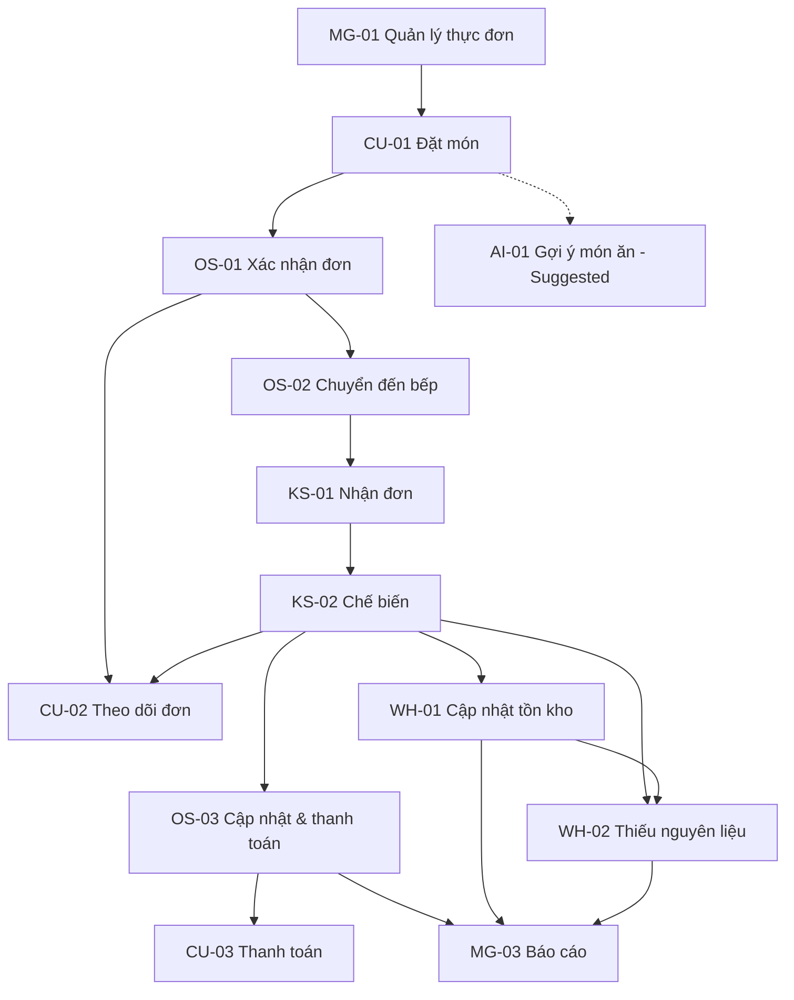

# Phân Tích Luồng Người Dùng (User Flow Analysis)

*Tài liệu tham chiếu: `docs/requirements/01-project-vision.md`, `docs/requirements/02-actor-analysis.md`*

## 1. Tổng Quan

**Mục đích của tài liệu này** là mô tả cách năm actor đã được xác nhận (Khách hàng, Nhân viên Order, Nhân viên Bếp, Nhân viên Kho, Quản lý) di chuyển qua hệ thống để đạt được mục tiêu của họ — bao gồm điểm bắt đầu, hành động, phản hồi của hệ thống, các quyết định, luồng thay thế/ngoại lệ, và kết quả cuối cùng.

**Mối quan hệ với các tài liệu trước:** Tài liệu này được xây dựng trực tiếp từ mục tiêu, phạm vi, và các khu vực chức năng cốt lõi trong Project Vision (`01-project-vision.md`), cũng như mục tiêu, trách nhiệm, và ma trận actor trong Actor Analysis (`02-actor-analysis.md`). Không có actor, mục tiêu, hoặc khu vực chức năng nào bị thêm/bớt mà không có căn cứ từ hai tài liệu đó.

**Mối quan hệ với giai đoạn tiếp theo:** Tài liệu này là đầu vào chính cho **Bước 4 — Phân tích Use Case**. Mỗi luồng chính (major flow) được mô tả ở đây sẽ được phân rã thành một hoặc nhiều use case chi tiết ở giai đoạn sau. Tài liệu này **không** mô tả use case chi tiết, không thiết kế UI, và không đề cập kỹ thuật triển khai.

## 2. Tổng Quan Luồng Theo Actor

| Actor | Mục tiêu chính | Luồng người dùng chính | Actor liên quan |
|---|---|---|---|
| Khách hàng | Đặt món dễ dàng và theo dõi được đơn hàng | CU-01 Xem thực đơn & Đặt món; CU-02 Theo dõi đơn hàng; CU-03 Thanh toán | Nhân viên Order |
| Nhân viên Order | Ghi nhận và xử lý đơn hàng chính xác, kịp thời | OS-01 Tiếp nhận & xác nhận đơn hàng; OS-02 Chuyển đơn đến bếp; OS-03 Cập nhật trạng thái & xử lý thanh toán | Khách hàng, Nhân viên Bếp |
| Nhân viên Bếp | Chế biến món ăn đúng thứ tự, đúng nội dung đơn | KS-01 Nhận đơn từ hàng đợi; KS-02 Chế biến & cập nhật trạng thái | Nhân viên Order, Nhân viên Kho |
| Nhân viên Kho | Duy trì mức tồn kho chính xác, tránh thiếu hụt | WH-01 Theo dõi & cập nhật tồn kho; WH-02 Phát hiện tồn kho thấp & nhập hàng | Nhân viên Bếp, Quản lý |
| Quản lý | Giám sát vận hành và ra quyết định dựa trên dữ liệu | MG-01 Quản lý thực đơn; MG-02 Quản lý nhân sự; MG-03 Giám sát & xem báo cáo | Tất cả các actor khác |

## 3. Luồng Người Dùng Của Khách Hàng

### CU-01 — Xem Thực Đơn & Đặt Món

**Flow ID:** CU-01
**Flow Name:** Xem Thực Đơn & Đặt Món
**Goal:** Khách hàng xem các món ăn hiện có và tạo một đơn hàng.
**Actor:** Khách hàng
**Entry Point:** Màn hình Thực đơn (Menu)
**Preconditions:** Thực đơn đã được Quản lý thiết lập và cập nhật trạng thái còn/hết hàng.

**Main Flow:**
```text
Start
↓
Khách hàng xem thực đơn
↓
Hệ thống hiển thị danh sách món ăn kèm trạng thái còn hàng
↓
Khách hàng chọn món và số lượng
↓
Khách hàng xác nhận đặt món
↓
Hệ thống tạo đơn hàng và gửi cho Nhân viên Order
↓
Final Outcome: Đơn hàng được tạo thành công
```

**Alternative Flows:**
- Khách hàng chỉnh sửa đơn hàng trước khi xác nhận (thêm/bớt món) → quay lại bước chọn món.

**Exception Flows:**
- Món ăn khách chọn đã hết hàng → hệ thống thông báo và không cho thêm món đó vào đơn.

**Exit Condition:** Đơn hàng được tạo thành công và chuyển sang trạng thái "chờ xác nhận".

**Related Actors:** Nhân viên Order (nhận đơn tiếp theo trong flow OS-01).

**Dependencies:** Không phụ thuộc luồng nào trước đó (là điểm bắt đầu của luồng end-to-end).

**Business Rules:**
- Nếu món ăn hết hàng → khách hàng không thể thêm món đó vào đơn (BR-01).



---

### CU-02 — Theo Dõi Đơn Hàng

**Flow ID:** CU-02
**Flow Name:** Theo Dõi Đơn Hàng
**Goal:** Khách hàng biết được trạng thái hiện tại của đơn hàng mình đã đặt.
**Actor:** Khách hàng
**Entry Point:** Màn hình Trạng thái Đơn hàng
**Preconditions:** Đơn hàng đã được tạo (CU-01 đã hoàn thành).

**Main Flow:**
```text
Start
↓
Khách hàng mở màn hình trạng thái đơn hàng
↓
Hệ thống hiển thị trạng thái hiện tại (chờ xác nhận / đang chế biến / hoàn thành)
↓
Final Outcome: Khách hàng nắm được tiến độ đơn hàng
```

**Alternative Flows:**
- Khách hàng huỷ đơn khi đơn còn ở trạng thái "chờ xác nhận".

**Exception Flows:**
- Đơn hàng bị Nhân viên Order từ chối → hệ thống hiển thị lý do từ chối cho khách hàng.

**Exit Condition:** Khách hàng thấy trạng thái cập nhật, hoặc đơn được huỷ.

**Related Actors:** Nhân viên Order, Nhân viên Bếp (là nguồn cập nhật trạng thái).

**Dependencies:** Phụ thuộc CU-01 (đơn hàng phải tồn tại), OS-01/OS-02, KS-01/KS-02 (nguồn cập nhật trạng thái).

**Business Rules:**
- Nếu đơn hàng bị huỷ → trạng thái đơn phải được cập nhật tương ứng (BR-02).

---

### CU-03 — Thanh Toán

**Flow ID:** CU-03
**Flow Name:** Thanh Toán
**Goal:** Khách hàng hoàn tất thanh toán cho đơn hàng đã sử dụng.
**Actor:** Khách hàng (phối hợp với Nhân viên Order)
**Entry Point:** Màn hình Thanh toán / Nhân viên Order thực hiện thanh toán
**Preconditions:** Đơn hàng đã ở trạng thái hoàn thành chế biến/phục vụ.

**Main Flow:**
```text
Start
↓
Nhân viên Order tổng hợp hoá đơn
↓
Khách hàng thực hiện thanh toán
↓
Hệ thống ghi nhận giao dịch
↓
Final Outcome: Đơn hàng được đánh dấu đã thanh toán
```

**Alternative Flows:** Không xác định — hình thức thanh toán cụ thể chưa được xác nhận (xem Mục 15 — Câu hỏi mở).

**Exception Flows:**
- Thanh toán thất bại → hệ thống giữ nguyên trạng thái "chưa thanh toán" và cho phép thử lại.

**Exit Condition:** Giao dịch được ghi nhận thành công.

**Related Actors:** Nhân viên Order.

**Dependencies:** Phụ thuộc vào việc đơn hàng đã hoàn thành (E2E-01).

**Business Rules:**
- Đơn hàng chỉ được đóng khi thanh toán đã được ghi nhận (BR-03).

> **Lưu ý:** Chi tiết phương thức thanh toán (tiền mặt, thẻ, ví điện tử) chưa được xác nhận trong Project Vision — được ghi nhận là câu hỏi mở, không tự ý giả định.

---

## 4. Luồng Người Dùng Của Nhân Viên Order

### OS-01 — Tiếp Nhận & Xác Nhận Đơn Hàng

**Flow ID:** OS-01
**Goal:** Nhân viên Order xác nhận đơn hàng khách vừa đặt.
**Actor:** Nhân viên Order
**Entry Point:** Danh sách đơn hàng mới (Dashboard đơn hàng)
**Preconditions:** Có đơn hàng mới từ CU-01.

**Main Flow:**
```text
Start
↓
Nhân viên Order xem đơn hàng mới
↓
Nhân viên Order kiểm tra tính hợp lệ của đơn
↓
Quyết định: Chấp nhận hay Từ chối?
├── Chấp nhận → Đơn chuyển sang trạng thái "đã xác nhận"
└── Từ chối → Đơn chuyển sang trạng thái "bị từ chối", nêu lý do
↓
Final Outcome: Đơn hàng được xác nhận hoặc từ chối
```

**Alternative Flows:** Nhân viên Order chỉnh sửa đơn (ví dụ số lượng) trước khi xác nhận, nếu được phép.

**Exception Flows:** Đơn hàng chứa món đã hết hàng ngay tại thời điểm xác nhận → cần thông báo lại cho khách hàng.

**Exit Condition:** Đơn hàng ở trạng thái "đã xác nhận" (chuyển tiếp sang OS-02) hoặc "bị từ chối" (kết thúc luồng, thông báo khách).

**Related Actors:** Khách hàng (nhận kết quả xác nhận/từ chối).

**Dependencies:** Phụ thuộc CU-01.

**Business Rules:**
- Nếu đơn hàng bị từ chối → trạng thái đơn phải được cập nhật và khách hàng phải được thông báo lý do (BR-04).



---

### OS-02 — Chuyển Đơn Đến Bếp

**Flow ID:** OS-02
**Goal:** Đơn hàng đã xác nhận được gửi đến Nhân viên Bếp để chế biến.
**Actor:** Nhân viên Order
**Entry Point:** Đơn hàng ở trạng thái "đã xác nhận" (tự động hoặc thủ công)
**Preconditions:** OS-01 đã hoàn thành với kết quả "chấp nhận".

**Main Flow:**
```text
Start
↓
Hệ thống/Nhân viên Order chuyển đơn đã xác nhận vào hàng đợi bếp
↓
Nhân viên Bếp nhận được đơn (KS-01)
↓
Final Outcome: Đơn hàng xuất hiện trong hàng đợi chế biến
```

**Alternative Flows:** Không có (luồng chuyển tiếp trực tiếp).

**Exception Flows:** Hàng đợi bếp quá tải / bếp báo không thể chuẩn bị món → cần cơ chế thông báo ngược lại cho Nhân viên Order (xem BR-05).

**Exit Condition:** Đơn hàng nằm trong hàng đợi bếp, sẵn sàng để chế biến.

**Related Actors:** Nhân viên Bếp.

**Dependencies:** Phụ thuộc OS-01.

**Business Rules:**
- Nếu bếp không thể chuẩn bị một món trong đơn → trạng thái món/đơn phải phản ánh điều này và Nhân viên Order cần được thông báo (BR-05).

---

### OS-03 — Cập Nhật Trạng Thái & Xử Lý Thanh Toán

**Flow ID:** OS-03
**Goal:** Nhân viên Order cập nhật trạng thái đơn khi hoàn thành và xử lý thanh toán.
**Actor:** Nhân viên Order
**Entry Point:** Đơn hàng ở trạng thái "đã chế biến xong" (từ KS-02)
**Preconditions:** Bếp đã hoàn thành chế biến.

**Main Flow:**
```text
Start
↓
Nhân viên Order nhận thông báo đơn đã hoàn thành
↓
Nhân viên Order giao món cho khách hàng
↓
Nhân viên Order thực hiện thu tiền / thanh toán (CU-03)
↓
Hệ thống cập nhật trạng thái đơn thành "hoàn tất"
↓
Final Outcome: Đơn hàng hoàn tất
```

**Alternative Flows:** Không có.

**Exception Flows:** Khách hàng khiếu nại món ăn không đúng → không thuộc phạm vi xác nhận (xem Mục 15).

**Exit Condition:** Đơn hàng ở trạng thái "hoàn tất" và đã thanh toán.

**Related Actors:** Khách hàng.

**Dependencies:** Phụ thuộc KS-02, CU-03.

**Business Rules:**
- Đơn hàng chỉ được đóng khi đã thanh toán (BR-03, lặp lại từ CU-03).

---

## 5. Luồng Người Dùng Của Nhân Viên Bếp

### KS-01 — Nhận Đơn Từ Hàng Đợi

**Flow ID:** KS-01
**Goal:** Nhân viên Bếp nắm được các đơn hàng cần chế biến, theo đúng thứ tự ưu tiên.
**Actor:** Nhân viên Bếp
**Entry Point:** Màn hình Hàng đợi Bếp (Kitchen Queue)
**Preconditions:** Có đơn hàng đã được chuyển đến từ OS-02.

**Main Flow:**
```text
Start
↓
Nhân viên Bếp xem hàng đợi đơn hàng
↓
Hệ thống hiển thị đơn theo thứ tự ưu tiên (ví dụ: thời gian tạo đơn)
↓
Nhân viên Bếp chọn đơn để bắt đầu chế biến
↓
Final Outcome: Đơn được đánh dấu "đang chế biến"
```

**Alternative Flows:** Không có ở mức luồng chính.

**Exception Flows:** Không đủ nguyên liệu để chế biến món trong đơn → xem KS-02 (luồng ngoại lệ liên quan đến Nhân viên Kho).

**Exit Condition:** Đơn chuyển sang trạng thái "đang chế biến".

**Related Actors:** Nhân viên Order (nguồn của đơn hàng).

**Dependencies:** Phụ thuộc OS-02.

**Business Rules:** Không có quy tắc riêng ngoài việc tuân theo thứ tự hàng đợi.

---

### KS-02 — Chế Biến & Cập Nhật Trạng Thái

**Flow ID:** KS-02
**Goal:** Hoàn thành việc chế biến món ăn và thông báo cho các actor liên quan.
**Actor:** Nhân viên Bếp
**Entry Point:** Đơn ở trạng thái "đang chế biến" (từ KS-01)
**Preconditions:** KS-01 đã hoàn thành.

**Main Flow:**
```text
Start
↓
Nhân viên Bếp chế biến món ăn
↓
Quyết định: Đủ nguyên liệu để hoàn thành?
├── Có → Nhân viên Bếp cập nhật trạng thái "hoàn thành"
└── Không → Xem luồng ngoại lệ bên dưới
↓
Hệ thống thông báo cho Nhân viên Order (OS-03)
↓
Final Outcome: Món ăn đã sẵn sàng để phục vụ
```

**Alternative Flows:** Không có.

**Exception Flows:**
```text
Thiếu nguyên liệu để hoàn thành món
        ↓
Nhân viên Bếp báo cáo tình trạng thiếu hụt
        ↓
Hệ thống thông báo cho Nhân viên Kho (WH-02) và Nhân viên Order
        ↓
Nhân viên Order thông báo lại cho khách hàng
```

**Exit Condition:** Món ăn hoàn thành và được thông báo, hoặc đơn/món bị đánh dấu "không thể hoàn thành" do thiếu nguyên liệu.

**Related Actors:** Nhân viên Order, Nhân viên Kho.

**Dependencies:** Phụ thuộc KS-01; có thể kích hoạt WH-02.

**Business Rules:**
- Nếu bếp không đủ nguyên liệu để hoàn thành món → trạng thái món phải phản ánh điều này và cần thông báo cho Nhân viên Kho/Nhân viên Order (BR-06).



---

## 6. Luồng Người Dùng Của Nhân Viên Kho

### WH-01 — Theo Dõi & Cập Nhật Tồn Kho

**Flow ID:** WH-01
**Goal:** Duy trì dữ liệu tồn kho phản ánh đúng thực tế.
**Actor:** Nhân viên Kho
**Entry Point:** Màn hình Quản lý Tồn kho
**Preconditions:** Có hoạt động sử dụng nguyên liệu (từ KS-02) hoặc nhập hàng mới.

**Main Flow:**
```text
Start
↓
Nhân viên Kho xem mức tồn kho hiện tại
↓
Nhân viên Kho cập nhật số lượng (sau khi sử dụng hoặc nhập hàng)
↓
Hệ thống lưu lại thay đổi tồn kho
↓
Final Outcome: Dữ liệu tồn kho được cập nhật
```

**Alternative Flows:** Không có.

**Exception Flows:** Số lượng nhập/xuất không hợp lệ (ví dụ: âm) → hệ thống từ chối cập nhật.

**Exit Condition:** Tồn kho được cập nhật chính xác.

**Related Actors:** Nhân viên Bếp (là nguồn tiêu thụ nguyên liệu), Quản lý (người xem báo cáo tồn kho).

**Dependencies:** Có thể được kích hoạt bởi KS-02 (tiêu thụ nguyên liệu).

**Business Rules:** Không phát sinh quy tắc kinh doanh mới ngoài việc dữ liệu phải chính xác.

---

### WH-02 — Phát Hiện Tồn Kho Thấp & Nhập Hàng

**Flow ID:** WH-02
**Goal:** Phát hiện sớm tình trạng thiếu nguyên liệu và xử lý việc nhập hàng.
**Actor:** Nhân viên Kho
**Entry Point:** Cảnh báo tồn kho thấp (hệ thống tự phát hiện) hoặc kiểm tra định kỳ
**Preconditions:** Mức tồn kho của một nguyên liệu giảm xuống dưới ngưỡng nhất định.

**Main Flow:**
```text
Start
↓
Hệ thống phát hiện tồn kho thấp
↓
Nhân viên Kho nhận cảnh báo
↓
Nhân viên Kho tiến hành nhập thêm nguyên liệu
↓
Hệ thống cập nhật lại mức tồn kho
↓
Final Outcome: Tồn kho được bổ sung
```

**Alternative Flows:** Nhân viên Kho báo cáo tình trạng thiếu hụt cho Quản lý nếu cần quyết định về ngân sách/nhà cung cấp.

**Exception Flows:** Không thể nhập hàng kịp thời → Nhân viên Bếp có thể gặp tình huống thiếu nguyên liệu (liên kết ngược với KS-02).

**Exit Condition:** Tồn kho được bổ sung, hoặc tình trạng thiếu hụt được báo cáo lên Quản lý.

**Related Actors:** Nhân viên Bếp, Quản lý.

**Dependencies:** Có thể được kích hoạt bởi KS-02 (báo cáo thiếu nguyên liệu) hoặc theo dõi định kỳ (WH-01).

**Business Rules:**
- Nếu tồn kho xuống dưới ngưỡng quy định → hệ thống phải cảnh báo Nhân viên Kho (BR-07). *(Ngưỡng cụ thể chưa được xác nhận — xem Mục 15.)*



---

## 7. Luồng Người Dùng Của Quản Lý

### MG-01 — Quản Lý Thực Đơn

**Flow ID:** MG-01
**Goal:** Duy trì thực đơn chính xác, cập nhật (thêm/sửa/xoá món, trạng thái còn/hết hàng).
**Actor:** Quản lý
**Entry Point:** Màn hình Quản lý Thực đơn
**Preconditions:** Không có.

**Main Flow:**
```text
Start
↓
Quản lý xem danh sách món ăn hiện có
↓
Quản lý thêm/sửa/xoá món hoặc cập nhật trạng thái còn/hết hàng
↓
Hệ thống lưu thay đổi
↓
Final Outcome: Thực đơn được cập nhật, phản ánh ngay trên CU-01
```

**Alternative Flows:** Không có.

**Exception Flows:** Xoá món đang có trong đơn hàng chưa hoàn tất → cần cơ chế xử lý (chưa xác nhận, xem Mục 15).

**Exit Condition:** Thực đơn được cập nhật thành công.

**Related Actors:** Khách hàng (bị ảnh hưởng trực tiếp bởi thay đổi thực đơn).

**Dependencies:** Là điều kiện tiên quyết cho CU-01.

**Business Rules:**
- Nếu món ăn hết hàng → phải được đánh dấu ngay để khách hàng không thể đặt (liên kết với BR-01).

---

### MG-02 — Quản Lý Nhân Sự

**Flow ID:** MG-02
**Goal:** Quản lý thông tin và vai trò của Nhân viên Order, Nhân viên Bếp, Nhân viên Kho.
**Actor:** Quản lý
**Entry Point:** Màn hình Quản lý Nhân sự
**Preconditions:** Không có.

**Main Flow:**
```text
Start
↓
Quản lý xem danh sách nhân viên
↓
Quản lý thêm/sửa/xoá thông tin nhân viên hoặc vai trò
↓
Hệ thống lưu thay đổi
↓
Final Outcome: Thông tin nhân sự được cập nhật
```

**Alternative Flows:** Không có.

**Exception Flows:** Không có (mức chi tiết như lịch làm việc/lương chưa được xác nhận trong phạm vi — xem Mục 15).

**Exit Condition:** Thông tin nhân sự được cập nhật thành công.

**Related Actors:** Nhân viên Order, Nhân viên Bếp, Nhân viên Kho (chịu ảnh hưởng gián tiếp qua phân quyền).

**Dependencies:** Không phụ thuộc luồng nào khác.

**Business Rules:** Không phát sinh quy tắc kinh doanh cụ thể trong tài liệu nguồn.

---

### MG-03 — Giám Sát Hoạt Động & Xem Báo Cáo

**Flow ID:** MG-03
**Goal:** Có cái nhìn tổng thể, kịp thời về đơn hàng, tồn kho, và hiệu suất để ra quyết định.
**Actor:** Quản lý
**Entry Point:** Dashboard Quản lý / Màn hình Báo cáo
**Preconditions:** Có dữ liệu hoạt động (đơn hàng, tồn kho) từ các luồng khác.

**Main Flow:**
```text
Start
↓
Quản lý mở dashboard/báo cáo
↓
Hệ thống tổng hợp dữ liệu từ Đơn hàng, Tồn kho, Nhân sự
↓
Quản lý xem báo cáo (doanh thu, số lượng đơn, tồn kho)
↓
Final Outcome: Quản lý có thông tin để ra quyết định
```

**Alternative Flows:** Quản lý lọc báo cáo theo khoảng thời gian hoặc khu vực chức năng.

**Exception Flows:** Không đủ dữ liệu để tạo báo cáo (ví dụ: chưa có đơn hàng nào) → hệ thống hiển thị trạng thái trống thay vì lỗi.

**Exit Condition:** Báo cáo được hiển thị thành công.

**Related Actors:** Tất cả actor khác (là nguồn dữ liệu đầu vào).

**Dependencies:** Phụ thuộc vào dữ liệu từ E2E-01 (đơn hàng) và WH-01/WH-02 (tồn kho).

**Business Rules:** Không phát sinh quy tắc riêng ngoài việc dữ liệu phải phản ánh đúng các giao dịch đã diễn ra.

---

## 8. Luồng End-to-End Đa Actor (Cross-Actor)

### E2E-01 — Quy Trình Đặt Món Đến Hoàn Tất (Luồng Vận Hành Cốt Lõi)

Đây là luồng end-to-end quan trọng nhất, được xây dựng từ các luồng riêng lẻ ở trên, phản ánh đúng quy trình vận hành cốt lõi đã mô tả trong Project Vision.

```text
Khách hàng đặt món (CU-01)
        ↓
Nhân viên Order xác nhận đơn (OS-01)
        ↓
Đơn được chuyển đến Bếp (OS-02)
        ↓
Nhân viên Bếp nhận và chế biến (KS-01, KS-02)
        ↓
Trạng thái đơn được cập nhật
        ↓
Khách hàng nhận món (thông qua Nhân viên Order)
        ↓
Thanh toán được thực hiện (OS-03, CU-03)
        ↓
Final Outcome: Đơn hàng hoàn tất
```



> **Ghi chú:** Luồng đánh giá đơn hàng sau khi hoàn tất (review) **không được đưa vào** luồng cốt lõi này vì tính năng Đánh giá được xác định là **ngoài phạm vi khu vực chức năng cốt lõi** trong Project Vision (Mục 6).

### E2E-02 — Luồng Ảnh Hưởng Tồn Kho (Bếp → Kho → Quản Lý)

```text
Nhân viên Bếp tiêu thụ nguyên liệu khi chế biến (KS-02)
        ↓
Nhân viên Kho cập nhật tồn kho (WH-01)
        ↓
Hệ thống phát hiện tồn kho thấp nếu có (WH-02)
        ↓
Nhân viên Kho xử lý nhập hàng hoặc báo cáo Quản lý
        ↓
Quản lý theo dõi tình trạng tồn kho qua báo cáo (MG-03)
```



---

## 9. Luồng Người Dùng Của Tính Năng AI Trong Sản Phẩm

Theo Project Vision (Mục 8), tính năng AI duy nhất được đề cập cho sản phẩm là **Gợi ý Món ăn (Food Recommendation)**, và được xác định rõ là sẽ **triển khai sau khi hệ thống cốt lõi hoàn thiện** — do đó được phân loại là:

**Trạng thái: Suggested / Planned AI Feature (chưa thuộc phạm vi triển khai hiện tại — "may be added" theo Project Vision)**

### AI-01 — Gợi Ý Món Ăn Cho Khách Hàng

- **Actor:** Khách hàng
- **User goal:** Nhận gợi ý món ăn phù hợp với sở thích cá nhân để đặt món nhanh hơn.
- **Trigger:** Khách hàng mở màn hình thực đơn (sau khi đã có lịch sử đặt món).
- **User interaction:** Khách hàng xem danh sách món được gợi ý, có thể chọn thêm vào đơn hàng.
- **System response:** Hệ thống phân tích lịch sử đơn hàng trước đó của khách hàng và hiển thị danh sách món gợi ý (không mô tả thuật toán/mô hình cụ thể).
- **Final outcome:** Khách hàng chọn món từ danh sách gợi ý hoặc bỏ qua và tiếp tục chọn món như bình thường (CU-01).

```text
Khách hàng
↓
Xem thực đơn (CU-01)
↓
Hệ thống phân tích lịch sử đặt món (nếu có)
↓
Hệ thống hiển thị danh sách món gợi ý
↓
Khách hàng xem gợi ý
↓
Khách hàng chọn món gợi ý hoặc tiếp tục chọn món thông thường
```

> Không có tính năng AI nào khác được xác nhận trong tài liệu nguồn. Bất kỳ đề xuất AI nào khác (ví dụ: dự báo tồn kho bằng AI, tối ưu lịch bếp bằng AI) đều **chưa được đề cập** và không được đưa vào tài liệu này để tránh mở rộng phạm vi ngoài ý muốn.

---

## 10. Bản Đồ Phụ Thuộc Giữa Các Luồng

| Flow ID | Flow | Depends On | Used By |
|---|---|---|---|
| CU-01 | Xem thực đơn & Đặt món | MG-01 (thực đơn phải tồn tại) | OS-01 |
| OS-01 | Tiếp nhận & xác nhận đơn | CU-01 | OS-02, CU-02 |
| OS-02 | Chuyển đơn đến bếp | OS-01 | KS-01 |
| KS-01 | Nhận đơn từ hàng đợi | OS-02 | KS-02 |
| KS-02 | Chế biến & cập nhật trạng thái | KS-01 | OS-03, WH-02 (trường hợp thiếu nguyên liệu), CU-02 |
| OS-03 | Cập nhật trạng thái & thanh toán | KS-02, CU-03 | MG-03 |
| CU-02 | Theo dõi đơn hàng | CU-01, OS-01, KS-02 | — |
| CU-03 | Thanh toán | KS-02 (đơn hoàn thành) | OS-03 |
| WH-01 | Theo dõi & cập nhật tồn kho | KS-02 (tiêu thụ nguyên liệu) | WH-02, MG-03 |
| WH-02 | Phát hiện tồn kho thấp & nhập hàng | WH-01, KS-02 (báo thiếu) | MG-03 |
| MG-01 | Quản lý thực đơn | — | CU-01 |
| MG-02 | Quản lý nhân sự | — | — |
| MG-03 | Giám sát & xem báo cáo | OS-03, WH-01, WH-02 | — |
| AI-01 | Gợi ý món ăn (Suggested) | CU-01 (lịch sử đơn hàng) | CU-01 |



---

## 11. Điểm Vào (Entry Points)

| Actor | Entry Point | Purpose |
|---|---|---|
| Khách hàng | Màn hình Thực đơn | Bắt đầu quá trình xem món và đặt món (CU-01) |
| Khách hàng | Màn hình Trạng thái Đơn hàng | Theo dõi tiến độ đơn hàng đã đặt (CU-02) |
| Nhân viên Order | Dashboard Đơn hàng mới | Tiếp nhận và xác nhận đơn (OS-01) |
| Nhân viên Bếp | Màn hình Hàng đợi Bếp | Nhận và xử lý đơn cần chế biến (KS-01) |
| Nhân viên Kho | Màn hình Quản lý Tồn kho | Theo dõi và cập nhật tồn kho (WH-01) |
| Nhân viên Kho | Thông báo cảnh báo tồn kho thấp | Xử lý nhập hàng khẩn cấp (WH-02) |
| Quản lý | Dashboard Quản lý | Giám sát tổng thể hoạt động (MG-03) |
| Quản lý | Màn hình Quản lý Thực đơn | Cập nhật món ăn (MG-01) |
| Quản lý | Màn hình Quản lý Nhân sự | Quản lý thông tin nhân viên (MG-02) |

## 12. Điều Kiện Kết Thúc (Exit Conditions)

| Flow | Successful Outcome | Alternative Outcome |
|---|---|---|
| CU-01 | Đơn hàng được tạo thành công | Món hết hàng — khách hàng không thể thêm vào đơn |
| CU-02 | Khách hàng thấy trạng thái cập nhật | Đơn bị huỷ / bị từ chối |
| CU-03 | Giao dịch thanh toán được ghi nhận | Thanh toán thất bại — cho phép thử lại |
| OS-01 | Đơn được xác nhận | Đơn bị từ chối kèm lý do |
| OS-02 | Đơn xuất hiện trong hàng đợi bếp | Bếp báo không thể chuẩn bị |
| OS-03 | Đơn hoàn tất và đã thanh toán | — |
| KS-01 | Đơn chuyển sang "đang chế biến" | — |
| KS-02 | Món được đánh dấu hoàn thành | Thiếu nguyên liệu — báo cáo Nhân viên Kho |
| WH-01 | Tồn kho được cập nhật chính xác | Số lượng cập nhật không hợp lệ — bị từ chối |
| WH-02 | Tồn kho được bổ sung | Không nhập kịp — báo cáo Quản lý |
| MG-01 | Thực đơn được cập nhật | Xoá món đang có trong đơn dở dang (chưa xác định cách xử lý) |
| MG-02 | Thông tin nhân sự được cập nhật | — |
| MG-03 | Báo cáo hiển thị thành công | Không đủ dữ liệu — hiển thị trạng thái trống |
| AI-01 (Suggested) | Khách hàng chọn món từ gợi ý | Khách hàng bỏ qua gợi ý, chọn món thông thường |

## 13. Quy Tắc Kinh Doanh Ảnh Hưởng Đến Luồng

| Rule ID | Quy tắc | Luồng liên quan | Nguồn | Confirmed / Derived / Suggested |
|---|---|---|---|---|
| BR-01 | Nếu món ăn hết hàng, khách hàng không thể thêm món đó vào đơn | CU-01, MG-01 | Project Vision (vấn đề "customer ordering") | Derived |
| BR-02 | Nếu đơn hàng bị huỷ, trạng thái đơn phải được cập nhật tương ứng | CU-02 | Project Vision (vấn đề "order processing") | Derived |
| BR-03 | Đơn hàng chỉ được đóng khi thanh toán đã được ghi nhận | CU-03, OS-03 | Project Vision (khu vực chức năng "Payment") | Derived |
| BR-04 | Nếu đơn hàng bị từ chối, hệ thống phải ghi nhận lý do và thông báo khách hàng | OS-01 | Suy luận từ vấn đề "order processing" | Suggested |
| BR-05 | Nếu bếp không thể chuẩn bị một món, trạng thái đơn/món phải phản ánh điều này và thông báo Nhân viên Order | OS-02, KS-02 | Project Vision (vấn đề "kitchen coordination") | Derived |
| BR-06 | Nếu bếp không đủ nguyên liệu để hoàn thành món, phải thông báo cho Nhân viên Kho | KS-02, WH-02 | Project Vision (vấn đề "inventory management") | Derived |
| BR-07 | Nếu tồn kho xuống dưới ngưỡng quy định, hệ thống phải cảnh báo Nhân viên Kho | WH-02 | Project Vision (khu vực chức năng "Inventory Management") | Derived — *ngưỡng cụ thể chưa xác nhận* |

## 14. Ma Trận Bao Phủ Luồng (Flow Coverage Matrix)

| Flow | Khách hàng | Nhân viên Order | Nhân viên Bếp | Nhân viên Kho | Quản lý |
|---|---:|---:|---:|---:|---:|
| CU-01 | ✓ | | | | |
| CU-02 | ✓ | ○ | ○ | | |
| CU-03 | ✓ | ✓ | | | |
| OS-01 | ○ | ✓ | | | |
| OS-02 | | ✓ | ✓ | | |
| OS-03 | ○ | ✓ | | | |
| KS-01 | | ○ | ✓ | | |
| KS-02 | | ○ | ✓ | ○ | |
| WH-01 | | | ○ | ✓ | ○ |
| WH-02 | | | ○ | ✓ | ○ |
| MG-01 | ○ | | | | ✓ |
| MG-02 | | ○ | ○ | ○ | ✓ |
| MG-03 | | ○ | ○ | ○ | ✓ |
| AI-01 (Suggested) | ✓ | | | | |

*(✓ = tham gia trực tiếp/chính; ○ = liên quan gián tiếp/phụ)*

## 15. Câu Hỏi Còn Bỏ Ngỏ

| Question | Why it matters | Possible options | Recommended option |
|---|---|---|---|
| Phương thức thanh toán cụ thể là gì (tiền mặt, thẻ, ví điện tử)? | Ảnh hưởng trực tiếp đến luồng CU-03/OS-03 và các luồng ngoại lệ liên quan | (a) Chỉ tiền mặt; (b) Tiền mặt + thẻ; (c) Đa phương thức | Không đề xuất — cần xác nhận từ Project Vision Mục 10 |
| Ngưỡng "tồn kho thấp" được xác định như thế nào (cố định, theo tỉ lệ, do Quản lý thiết lập)? | Ảnh hưởng đến việc kích hoạt WH-02 | (a) Ngưỡng cố định toàn hệ thống; (b) Ngưỡng theo từng nguyên liệu, do Nhân viên Kho/Quản lý thiết lập | Đề xuất (b) vì linh hoạt hơn, nhưng cần Quản lý xác nhận |
| Khi Quản lý xoá một món đang nằm trong đơn hàng chưa hoàn tất (MG-01), hệ thống xử lý ra sao? | Ảnh hưởng đến tính toàn vẹn của luồng đặt món đang diễn ra | (a) Không cho xoá nếu đang có đơn dở dang; (b) Cho xoá nhưng đơn cũ vẫn giữ nguyên món đã đặt | Không đề xuất — cần quyết định nghiệp vụ từ phía dự án |
| Khách hàng có cần tài khoản để đặt món và theo dõi đơn không? | Ảnh hưởng đến điểm vào của CU-01/CU-02 và có cần bước đăng nhập hay không | (a) Bắt buộc tài khoản; (b) Cho phép đặt món dạng khách vãng lai | Đã được ghi nhận là câu hỏi mở từ Actor Analysis — giữ nguyên trạng thái mở |
| Khiếu nại/phản hồi của khách hàng về món ăn có được xử lý trong hệ thống không? | Ảnh hưởng đến việc có cần luồng riêng ngoài luồng cốt lõi hay không | (a) Không xử lý trong hệ thống (ngoài phạm vi); (b) Bổ sung luồng phản hồi cơ bản | Phù hợp với Project Vision: khu vực "Review" hiện ngoài phạm vi cốt lõi — giữ (a) cho đến khi có quyết định khác |
| Tính năng Gợi ý Món ăn (AI-01) có được triển khai trong phiên bản đầu tiên hay để giai đoạn sau? | Ảnh hưởng đến việc AI-01 có được đưa vào Use Case Analysis (Bước 4) hay không | (a) Triển khai ngay; (b) Triển khai sau khi hệ thống cốt lõi hoàn thiện | Theo Project Vision: (b) — triển khai sau |

## 16. Kiểm Tra Tính Nhất Quán (Consistency Check)

- [x] Cả năm actor đã xác nhận đều được thể hiện đầy đủ (Khách hàng, Nhân viên Order, Nhân viên Bếp, Nhân viên Kho, Quản lý).
- [x] Các mục tiêu quan trọng của từng actor (theo Actor Analysis) đều được phản ánh trong các luồng tương ứng.
- [x] Các hành trình người dùng chính (major user journeys) đều được mô tả (đặt món, xác nhận, chế biến, tồn kho, giám sát/báo cáo).
- [x] Các luồng đa actor (cross-actor) đã được xác định (E2E-01, E2E-02).
- [x] Các luồng thay thế (alternative flows) đã được xem xét cho từng luồng chính.
- [x] Các luồng ngoại lệ (exception flows) đã được xem xét (hết hàng, từ chối đơn, thiếu nguyên liệu, thanh toán thất bại).
- [x] Các mối phụ thuộc (dependencies) nhất quán về mặt logic (được thể hiện ở Mục 10).
- [x] Không có yêu cầu lớn nào được tự ý thêm vào ngoài tài liệu nguồn; các nội dung chưa xác nhận đều được gắn nhãn Suggested/Derived hoặc đưa vào Câu hỏi mở.
- [x] Thông tin xác nhận (Confirmed), suy luận (Derived), và đề xuất (Suggested) được phân biệt rõ ràng, đặc biệt ở Mục 9 (AI-01) và Mục 13 (Business Rules).
- [x] Tài liệu phù hợp để làm đầu vào cho Bước 4 — Phân tích Use Case, với các Flow ID rõ ràng có thể ánh xạ trực tiếp sang các use case chi tiết.