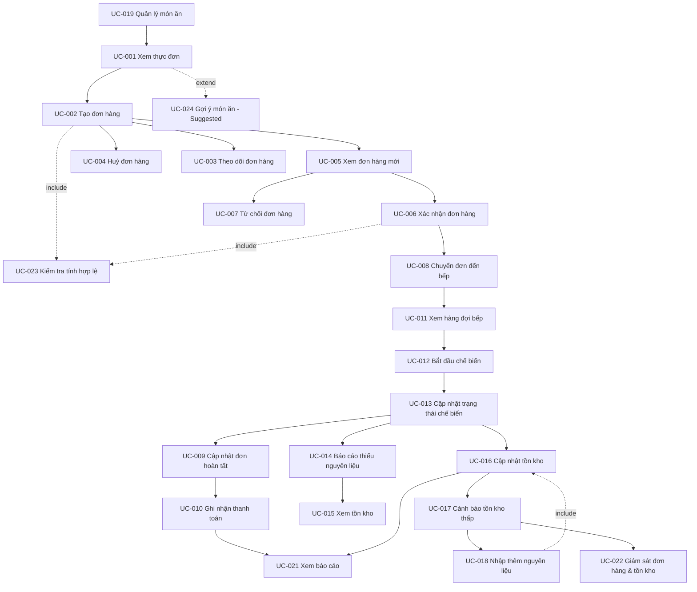

# Phân Tích Use Case (Use Case Analysis)

*Tài liệu tham chiếu: `docs/requirements/01-project-vision.md`, `docs/requirements/02-actor-analysis.md`, `docs/requirements/03-user-flows.md`*

## 1. Tổng Quan

**Mục đích của tài liệu này** là chuyển hoá các luồng người dùng (User Flows) đã được xác định thành một tập hợp Use Case có cấu trúc, mô tả cụ thể hệ thống cần làm gì từ góc nhìn của từng actor.

**Mối quan hệ với Project Vision:** Mỗi Use Case đều bắt nguồn từ một khu vực chức năng cốt lõi (Core System Area) đã được xác nhận trong `01-project-vision.md` (Mục 6), đảm bảo không có chức năng nào nằm ngoài phạm vi đã thống nhất.

**Mối quan hệ với Actor Analysis:** Actor chính (Primary Actor) và actor hỗ trợ (Supporting Actor) của mỗi Use Case được lấy trực tiếp từ trách nhiệm và mục tiêu đã phân tích trong `02-actor-analysis.md`. Không có actor mới nào được thêm vào ngoài 5 actor đã xác nhận.

**Mối quan hệ với User Flow Analysis:** Mỗi Use Case tương ứng với một hoặc một phần của Flow ID trong `03-user-flows.md`. Một luồng người dùng lớn (ví dụ CU-01) được tách thành nhiều Use Case nhỏ hơn khi luồng đó chứa nhiều tương tác hệ thống có ý nghĩa nghiệp vụ riêng biệt (ví dụ: Xem Thực Đơn và Tạo Đơn Hàng).

**Mối quan hệ với giai đoạn tiếp theo:** Tài liệu này là đầu vào chính cho **Bước 5 — System Model**, nơi các Use Case sẽ được chuyển hoá thành các mô hình hệ thống (ví dụ: sơ đồ use case UML, mô hình khái niệm). Tài liệu này **không** thiết kế kiến trúc kỹ thuật, cơ sở dữ liệu, hay API.

## 2. Tổng Quan Actor

| Actor | Vai trò | Mục tiêu chính | Số lượng Use Case |
|---|---|---|---|
| Khách hàng (Customer) | Người đặt món và sử dụng dịch vụ | Đặt món dễ dàng, theo dõi đơn hàng | 5 |
| Nhân viên Order (Order Staff) | Tiếp nhận, xử lý đơn hàng | Xử lý đơn chính xác, kịp thời | 6 |
| Nhân viên Bếp (Kitchen Staff) | Chế biến món ăn | Chế biến đúng, đúng thứ tự | 4 |
| Nhân viên Kho (Warehouse Staff) | Quản lý tồn kho nguyên liệu | Duy trì tồn kho chính xác, tránh thiếu hụt | 4 |
| Quản lý (Manager) | Giám sát và điều hành nhà hàng | Ra quyết định dựa trên dữ liệu vận hành | 4 |
| *(Hỗ trợ chung — Include use case)* | — | Đảm bảo tính hợp lệ của đơn hàng | 1 |

*(Tổng: 24 Use Case, chưa tính UC-024 AI đang ở trạng thái Suggested/Planned — đã được tính trong bảng trên thuộc nhóm Khách hàng.)*

## 3. Danh Mục Use Case (Use Case Catalog)

| ID | Use Case | Category | Primary Actor | Priority | Related User Flow |
|---|---|---|---|---|---|
| UC-001 | Xem Thực Đơn | Ordering | Khách hàng | Must Have | CU-01 |
| UC-002 | Tạo Đơn Hàng | Ordering | Khách hàng | Must Have | CU-01 |
| UC-003 | Theo Dõi Trạng Thái Đơn Hàng | Ordering | Khách hàng | Must Have | CU-02 |
| UC-004 | Huỷ Đơn Hàng | Ordering | Khách hàng | Should Have | CU-02 |
| UC-005 | Xem Danh Sách Đơn Hàng Mới | Order Processing | Nhân viên Order | Must Have | OS-01 |
| UC-006 | Xác Nhận Đơn Hàng | Order Processing | Nhân viên Order | Must Have | OS-01 |
| UC-007 | Từ Chối Đơn Hàng | Order Processing | Nhân viên Order | Must Have | OS-01 |
| UC-008 | Chuyển Đơn Đến Bếp | Order Processing | Nhân viên Order | Must Have | OS-02 |
| UC-009 | Cập Nhật Trạng Thái Đơn Hoàn Tất | Order Processing | Nhân viên Order | Must Have | OS-03 |
| UC-010 | Ghi Nhận Thanh Toán | Payment | Nhân viên Order | Must Have | OS-03, CU-03 |
| UC-011 | Xem Hàng Đợi Bếp | Kitchen | Nhân viên Bếp | Must Have | KS-01 |
| UC-012 | Bắt Đầu Chế Biến Đơn | Kitchen | Nhân viên Bếp | Must Have | KS-01 |
| UC-013 | Cập Nhật Trạng Thái Chế Biến | Kitchen | Nhân viên Bếp | Must Have | KS-02 |
| UC-014 | Báo Cáo Thiếu Nguyên Liệu | Kitchen | Nhân viên Bếp | Must Have | KS-02 |
| UC-015 | Xem Tồn Kho | Inventory | Nhân viên Kho | Must Have | WH-01 |
| UC-016 | Cập Nhật Số Lượng Tồn Kho | Inventory | Nhân viên Kho | Must Have | WH-01 |
| UC-017 | Nhận Cảnh Báo Tồn Kho Thấp | Inventory | Nhân viên Kho | Must Have | WH-02 |
| UC-018 | Nhập Thêm Nguyên Liệu | Inventory | Nhân viên Kho | Must Have | WH-02 |
| UC-019 | Quản Lý Món Ăn | Menu Management | Quản lý | Must Have | MG-01 |
| UC-020 | Quản Lý Thông Tin Nhân Viên | Employee Management | Quản lý | Must Have | MG-02 |
| UC-021 | Xem Báo Cáo Vận Hành | Reporting | Quản lý | Must Have | MG-03 |
| UC-022 | Giám Sát Đơn Hàng & Tồn Kho | Restaurant Management | Quản lý | Should Have | MG-03 |
| UC-023 | Kiểm Tra Tính Hợp Lệ Của Đơn Hàng | Ordering (Include) | *(Hỗ trợ — không có actor trực tiếp)* | Must Have | CU-01, OS-01 |
| UC-024 | Xem Gợi Ý Món Ăn Cá Nhân Hoá | AI Features | Khách hàng | Could Have *(Suggested/Planned)* | AI-01 |

## 4. Use Case Của Khách Hàng

### UC-001 — Xem Thực Đơn

**Category:** Ordering
**Primary Actor:** Khách hàng
**Supporting Actors:** Không có
**Goal:** Xem danh sách món ăn hiện có kèm trạng thái còn/hết hàng.
**Description:** Khách hàng truy cập màn hình thực đơn để tìm hiểu các món ăn có thể đặt.
**Priority:** Must Have
**Related User Flow:** CU-01
**Dependencies:** Phụ thuộc UC-019 (thực đơn phải được Quản lý thiết lập trước).

#### Preconditions
- Thực đơn đã được Quản lý thiết lập (UC-019 đã thực hiện ít nhất một lần).

#### Trigger
- Khách hàng mở màn hình Thực đơn.

#### Main Success Flow
1. Khách hàng mở màn hình thực đơn.
2. Hệ thống truy xuất danh sách món ăn hiện có.
3. Hệ thống hiển thị danh sách món ăn kèm trạng thái còn/hết hàng.
4. Khách hàng xem thông tin món ăn.
5. Use Case hoàn tất.

#### Alternative Flows
- Không có.

#### Exception Flows
- Thực đơn hiện chưa có món nào → hệ thống hiển thị trạng thái trống thay vì lỗi.

#### Business Rules
- BR-001: Món ăn có trạng thái "hết hàng" vẫn được hiển thị nhưng không thể chọn để đặt (Derived — liên kết UC-002).

#### Postconditions
- Không thay đổi trạng thái hệ thống (chỉ đọc dữ liệu).

#### Related Use Cases
- Extend: UC-024 Xem Gợi Ý Món Ăn Cá Nhân Hoá (tuỳ chọn, Suggested).

---

### UC-002 — Tạo Đơn Hàng

**Category:** Ordering
**Primary Actor:** Khách hàng
**Supporting Actors:** Nhân viên Order (nhận đơn ở bước tiếp theo)
**Goal:** Tạo một đơn hàng mới gồm một hoặc nhiều món ăn.
**Description:** Khách hàng chọn món, xác định số lượng, và xác nhận để tạo đơn hàng.
**Priority:** Must Have
**Related User Flow:** CU-01
**Dependencies:** Phụ thuộc UC-001 (phải xem được thực đơn trước).

#### Preconditions
- Thực đơn đã hiển thị (UC-001 đã thực hiện).
- Có ít nhất một món ăn ở trạng thái còn hàng.

#### Trigger
- Khách hàng chọn một hoặc nhiều món và nhấn xác nhận đặt món.

#### Main Success Flow
1. Khách hàng chọn món ăn và số lượng.
2. Hệ thống kiểm tra tính hợp lệ của đơn hàng (UC-023 — *include*).
3. Khách hàng xác nhận đặt món.
4. Hệ thống tạo đơn hàng mới với trạng thái "chờ xác nhận".
5. Hệ thống gửi đơn hàng đến danh sách đơn hàng mới của Nhân viên Order.
6. Use Case hoàn tất.

#### Alternative Flows
- Khách hàng chỉnh sửa lựa chọn món trước khi xác nhận → quay lại bước 1.

#### Exception Flows
- Món ăn khách chọn đã chuyển sang trạng thái hết hàng trong lúc chọn → hệ thống thông báo và không cho thêm món đó (liên kết UC-023).

#### Business Rules
- BR-001: Khách hàng không thể đặt món đang ở trạng thái hết hàng (Derived).

#### Postconditions
- Một đơn hàng mới được tạo với trạng thái "chờ xác nhận".

#### Related Use Cases
- Include: UC-023 Kiểm Tra Tính Hợp Lệ Của Đơn Hàng.
- Dẫn đến: UC-005 (Nhân viên Order xem đơn hàng mới).

---

### UC-003 — Theo Dõi Trạng Thái Đơn Hàng

**Category:** Ordering
**Primary Actor:** Khách hàng
**Supporting Actors:** Không có
**Goal:** Nắm được tiến độ xử lý của đơn hàng đã đặt.
**Priority:** Must Have
**Related User Flow:** CU-02
**Dependencies:** Phụ thuộc UC-002; cập nhật trạng thái đến từ UC-006, UC-007, UC-009, UC-013.

#### Preconditions
- Đơn hàng đã tồn tại (UC-002 đã hoàn tất).

#### Trigger
- Khách hàng mở màn hình trạng thái đơn hàng.

#### Main Success Flow
1. Khách hàng mở màn hình trạng thái đơn hàng.
2. Hệ thống truy xuất trạng thái hiện tại của đơn hàng.
3. Hệ thống hiển thị trạng thái (chờ xác nhận / đã xác nhận / đang chế biến / hoàn thành).
4. Use Case hoàn tất.

#### Alternative Flows
- Đơn hàng bị từ chối (UC-007) → hệ thống hiển thị lý do từ chối cho khách hàng.

#### Exception Flows
- Không tìm thấy đơn hàng (ví dụ đã bị xoá) → hệ thống thông báo tương ứng.

#### Business Rules
- BR-002: Trạng thái đơn hàng hiển thị cho khách hàng phải phản ánh đúng trạng thái mới nhất trong hệ thống (Derived).

#### Postconditions
- Không thay đổi trạng thái hệ thống.

#### Related Use Cases
- Phụ thuộc kết quả của: UC-006, UC-007, UC-009, UC-013.

---

### UC-004 — Huỷ Đơn Hàng

**Category:** Ordering
**Primary Actor:** Khách hàng
**Supporting Actors:** Nhân viên Order
**Goal:** Huỷ một đơn hàng chưa được xử lý.
**Priority:** Should Have
**Related User Flow:** CU-02
**Dependencies:** Phụ thuộc UC-002.

#### Preconditions
- Đơn hàng đang ở trạng thái "chờ xác nhận" (chưa được Nhân viên Order xác nhận).

#### Trigger
- Khách hàng chọn huỷ đơn hàng.

#### Main Success Flow
1. Khách hàng chọn huỷ đơn hàng.
2. Hệ thống kiểm tra đơn hàng có còn ở trạng thái cho phép huỷ hay không.
3. Hệ thống cập nhật trạng thái đơn thành "đã huỷ".
4. Hệ thống thông báo cho Nhân viên Order.
5. Use Case hoàn tất.

#### Alternative Flows
- Không có.

#### Exception Flows
- Đơn hàng đã được xác nhận hoặc đang chế biến → hệ thống từ chối yêu cầu huỷ và thông báo lý do.

#### Business Rules
- BR-003: Đơn hàng chỉ có thể bị huỷ khi còn ở trạng thái "chờ xác nhận" (Derived — mức độ chính xác của điều kiện này cần Quản lý xác nhận, xem Mục 16).

#### Postconditions
- Đơn hàng chuyển sang trạng thái "đã huỷ", hoặc yêu cầu bị từ chối nếu không đủ điều kiện.

#### Related Use Cases
- Liên quan: UC-003.

---

## 5. Use Case Của Nhân Viên Order

### UC-005 — Xem Danh Sách Đơn Hàng Mới

**Category:** Order Processing
**Primary Actor:** Nhân viên Order
**Supporting Actors:** Không có
**Goal:** Nắm bắt các đơn hàng mới cần xử lý.
**Priority:** Must Have
**Related User Flow:** OS-01
**Dependencies:** Phụ thuộc UC-002.

#### Preconditions
- Có ít nhất một đơn hàng ở trạng thái "chờ xác nhận".

#### Trigger
- Nhân viên Order mở Dashboard đơn hàng mới.

#### Main Success Flow
1. Nhân viên Order mở màn hình danh sách đơn hàng mới.
2. Hệ thống hiển thị danh sách đơn hàng đang chờ xử lý.
3. Use Case hoàn tất.

#### Alternative Flows
- Không có.

#### Exception Flows
- Không có đơn hàng mới → hệ thống hiển thị danh sách trống.

#### Business Rules
- Không có quy tắc riêng.

#### Postconditions
- Không thay đổi trạng thái hệ thống.

#### Related Use Cases
- Dẫn đến: UC-006, UC-007.

---

### UC-006 — Xác Nhận Đơn Hàng

**Category:** Order Processing
**Primary Actor:** Nhân viên Order
**Supporting Actors:** Khách hàng
**Goal:** Xác nhận một đơn hàng hợp lệ để chuyển sang xử lý.
**Priority:** Must Have
**Related User Flow:** OS-01
**Dependencies:** Phụ thuộc UC-005.

#### Preconditions
- Đơn hàng đang ở trạng thái "chờ xác nhận".

#### Trigger
- Nhân viên Order chọn xác nhận một đơn hàng cụ thể.

#### Main Success Flow
1. Nhân viên Order xem chi tiết đơn hàng.
2. Hệ thống kiểm tra lại tính hợp lệ của đơn hàng (UC-023 — *include*).
3. Nhân viên Order xác nhận đơn hàng.
4. Hệ thống cập nhật trạng thái đơn thành "đã xác nhận".
5. Use Case hoàn tất.

#### Alternative Flows
- Không có.

#### Exception Flows
- Một món trong đơn không còn khả dụng tại thời điểm xác nhận → hệ thống thông báo và yêu cầu xử lý trước khi xác nhận.

#### Business Rules
- BR-004: Chỉ đơn hàng còn hợp lệ (các món vẫn khả dụng) mới có thể được xác nhận (Derived).

#### Postconditions
- Đơn hàng chuyển sang trạng thái "đã xác nhận".

#### Related Use Cases
- Include: UC-023.
- Dẫn đến: UC-008.

---

### UC-007 — Từ Chối Đơn Hàng

**Category:** Order Processing
**Primary Actor:** Nhân viên Order
**Supporting Actors:** Khách hàng
**Goal:** Từ chối một đơn hàng không thể xử lý.
**Priority:** Must Have
**Related User Flow:** OS-01
**Dependencies:** Phụ thuộc UC-005.

#### Preconditions
- Đơn hàng đang ở trạng thái "chờ xác nhận".

#### Trigger
- Nhân viên Order chọn từ chối một đơn hàng cụ thể.

#### Main Success Flow
1. Nhân viên Order xem chi tiết đơn hàng.
2. Nhân viên Order chọn từ chối và nhập lý do.
3. Hệ thống cập nhật trạng thái đơn thành "bị từ chối" kèm lý do.
4. Hệ thống thông báo cho khách hàng.
5. Use Case hoàn tất.

#### Alternative Flows
- Không có.

#### Exception Flows
- Không nhập lý do từ chối → hệ thống yêu cầu nhập lý do trước khi hoàn tất.

#### Business Rules
- BR-005: Đơn hàng bị từ chối phải có lý do và phải thông báo cho khách hàng (Suggested — chưa được xác nhận rõ ràng trong Project Vision, chỉ được suy luận từ vấn đề "order processing").

#### Postconditions
- Đơn hàng chuyển sang trạng thái "bị từ chối".

#### Related Use Cases
- Liên quan: UC-003 (khách hàng thấy lý do từ chối).

---

### UC-008 — Chuyển Đơn Đến Bếp

**Category:** Order Processing
**Primary Actor:** Nhân viên Order
**Supporting Actors:** Nhân viên Bếp
**Goal:** Đưa đơn hàng đã xác nhận vào hàng đợi chế biến của bếp.
**Priority:** Must Have
**Related User Flow:** OS-02
**Dependencies:** Phụ thuộc UC-006.

#### Preconditions
- Đơn hàng đang ở trạng thái "đã xác nhận".

#### Trigger
- Đơn hàng được xác nhận (có thể tự động kích hoạt hoặc do Nhân viên Order thực hiện thủ công — xem Mục 16).

#### Main Success Flow
1. Hệ thống/Nhân viên Order chuyển đơn hàng vào hàng đợi bếp.
2. Hệ thống cập nhật trạng thái đơn thành "trong hàng đợi bếp".
3. Hệ thống thông báo cho Nhân viên Bếp.
4. Use Case hoàn tất.

#### Alternative Flows
- Không có.

#### Exception Flows
- Bếp báo hàng đợi quá tải hoặc không thể tiếp nhận thêm → cần cơ chế xử lý (chưa xác nhận, xem Mục 16).

#### Business Rules
- Không có quy tắc riêng ngoài BR-004.

#### Postconditions
- Đơn hàng xuất hiện trong hàng đợi bếp.

#### Related Use Cases
- Dẫn đến: UC-011.

---

### UC-009 — Cập Nhật Trạng Thái Đơn Hoàn Tất

**Category:** Order Processing
**Primary Actor:** Nhân viên Order
**Supporting Actors:** Khách hàng
**Goal:** Đánh dấu đơn hàng đã được giao món cho khách hàng.
**Priority:** Must Have
**Related User Flow:** OS-03
**Dependencies:** Phụ thuộc UC-013 (bếp đã hoàn thành chế biến).

#### Preconditions
- Đơn hàng đang ở trạng thái "đã chế biến xong".

#### Trigger
- Nhân viên Order giao món cho khách hàng.

#### Main Success Flow
1. Nhân viên Order nhận thông báo đơn đã chế biến xong.
2. Nhân viên Order giao món cho khách hàng.
3. Nhân viên Order xác nhận hoàn tất việc giao món trên hệ thống.
4. Hệ thống cập nhật trạng thái đơn thành "đã giao món".
5. Use Case hoàn tất.

#### Alternative Flows
- Không có.

#### Exception Flows
- Không có.

#### Business Rules
- Không có quy tắc riêng.

#### Postconditions
- Đơn hàng chuyển sang trạng thái "đã giao món", sẵn sàng cho UC-010.

#### Related Use Cases
- Dẫn đến: UC-010.

---

### UC-010 — Ghi Nhận Thanh Toán

**Category:** Payment
**Primary Actor:** Nhân viên Order
**Supporting Actors:** Khách hàng
**Goal:** Ghi nhận giao dịch thanh toán và đóng đơn hàng.
**Priority:** Must Have
**Related User Flow:** OS-03, CU-03
**Dependencies:** Phụ thuộc UC-009.

#### Preconditions
- Đơn hàng đang ở trạng thái "đã giao món".

#### Trigger
- Khách hàng thực hiện thanh toán.

#### Main Success Flow
1. Nhân viên Order tổng hợp hoá đơn cho đơn hàng.
2. Khách hàng thực hiện thanh toán.
3. Nhân viên Order ghi nhận giao dịch thanh toán vào hệ thống.
4. Hệ thống cập nhật trạng thái đơn thành "hoàn tất".
5. Use Case hoàn tất.

#### Alternative Flows
- Không xác định — hình thức thanh toán cụ thể chưa được xác nhận (xem Mục 16).

#### Exception Flows
- Thanh toán thất bại → hệ thống giữ trạng thái đơn ở "đã giao món, chưa thanh toán" và cho phép thử lại.

#### Business Rules
- BR-006: Đơn hàng chỉ được đóng (trạng thái "hoàn tất") khi giao dịch thanh toán đã được ghi nhận thành công (Derived).

#### Postconditions
- Đơn hàng chuyển sang trạng thái "hoàn tất" sau khi giao dịch thanh toán được ghi nhận.

#### Related Use Cases
- Liên quan: UC-021 (dữ liệu thanh toán được tổng hợp vào báo cáo).

---

## 6. Use Case Của Nhân Viên Bếp

### UC-011 — Xem Hàng Đợi Bếp

**Category:** Kitchen
**Primary Actor:** Nhân viên Bếp
**Supporting Actors:** Không có
**Goal:** Nắm được các đơn hàng cần chế biến theo đúng thứ tự ưu tiên.
**Priority:** Must Have
**Related User Flow:** KS-01
**Dependencies:** Phụ thuộc UC-008.

#### Preconditions
- Có ít nhất một đơn hàng trong hàng đợi bếp.

#### Trigger
- Nhân viên Bếp mở màn hình hàng đợi bếp.

#### Main Success Flow
1. Nhân viên Bếp mở màn hình hàng đợi.
2. Hệ thống hiển thị danh sách đơn hàng theo thứ tự ưu tiên (ví dụ: thời gian tạo đơn).
3. Use Case hoàn tất.

#### Alternative Flows
- Không có.

#### Exception Flows
- Hàng đợi trống → hệ thống hiển thị trạng thái trống.

#### Business Rules
- Không có quy tắc riêng.

#### Postconditions
- Không thay đổi trạng thái hệ thống.

#### Related Use Cases
- Dẫn đến: UC-012.

---

### UC-012 — Bắt Đầu Chế Biến Đơn

**Category:** Kitchen
**Primary Actor:** Nhân viên Bếp
**Supporting Actors:** Không có
**Goal:** Đánh dấu một đơn hàng bắt đầu được chế biến.
**Priority:** Must Have
**Related User Flow:** KS-01
**Dependencies:** Phụ thuộc UC-011.

#### Preconditions
- Đơn hàng đang ở trạng thái "trong hàng đợi bếp".

#### Trigger
- Nhân viên Bếp chọn một đơn để bắt đầu chế biến.

#### Main Success Flow
1. Nhân viên Bếp chọn đơn hàng từ hàng đợi.
2. Hệ thống cập nhật trạng thái đơn thành "đang chế biến".
3. Use Case hoàn tất.

#### Alternative Flows
- Không có.

#### Exception Flows
- Không có.

#### Business Rules
- Không có quy tắc riêng.

#### Postconditions
- Đơn hàng chuyển sang trạng thái "đang chế biến".

#### Related Use Cases
- Dẫn đến: UC-013.

---

### UC-013 — Cập Nhật Trạng Thái Chế Biến

**Category:** Kitchen
**Primary Actor:** Nhân viên Bếp
**Supporting Actors:** Nhân viên Order
**Goal:** Đánh dấu món ăn đã chế biến xong.
**Priority:** Must Have
**Related User Flow:** KS-02
**Dependencies:** Phụ thuộc UC-012.

#### Preconditions
- Đơn hàng đang ở trạng thái "đang chế biến".

#### Trigger
- Nhân viên Bếp hoàn thành việc chế biến món ăn.

#### Main Success Flow
1. Nhân viên Bếp hoàn thành chế biến món ăn.
2. Nhân viên Bếp cập nhật trạng thái món/đơn thành "hoàn thành".
3. Hệ thống thông báo cho Nhân viên Order.
4. Use Case hoàn tất.

#### Alternative Flows
- Không có.

#### Exception Flows
- Thiếu nguyên liệu để hoàn thành món → kích hoạt UC-014, đơn/món được đánh dấu "không thể hoàn thành" tạm thời.

#### Business Rules
- BR-007: Nếu bếp không đủ nguyên liệu để hoàn thành món, trạng thái món phải phản ánh điều này (Derived).

#### Postconditions
- Món/đơn chuyển sang trạng thái "đã chế biến xong", sẵn sàng cho UC-009.

#### Related Use Cases
- Dẫn đến: UC-009.
- Có thể kích hoạt: UC-014.

---

### UC-014 — Báo Cáo Thiếu Nguyên Liệu

**Category:** Kitchen
**Primary Actor:** Nhân viên Bếp
**Supporting Actors:** Nhân viên Kho, Nhân viên Order
**Goal:** Thông báo tình trạng thiếu nguyên liệu ảnh hưởng đến việc chế biến.
**Priority:** Must Have
**Related User Flow:** KS-02
**Dependencies:** Là luồng ngoại lệ của UC-013.

#### Preconditions
- Nhân viên Bếp phát hiện không đủ nguyên liệu để hoàn thành một món trong đơn.

#### Trigger
- Nhân viên Bếp chọn báo cáo thiếu nguyên liệu cho một món cụ thể.

#### Main Success Flow
1. Nhân viên Bếp báo cáo tình trạng thiếu nguyên liệu.
2. Hệ thống thông báo cho Nhân viên Kho.
3. Hệ thống thông báo cho Nhân viên Order.
4. Use Case hoàn tất.

#### Alternative Flows
- Không có.

#### Exception Flows
- Không có.

#### Business Rules
- BR-008: Khi thiếu nguyên liệu, cả Nhân viên Kho và Nhân viên Order đều phải được thông báo (Derived).

#### Postconditions
- Nhân viên Kho và Nhân viên Order nhận được thông báo thiếu nguyên liệu.

#### Related Use Cases
- Kích hoạt: UC-017 (gián tiếp, nếu dẫn đến kiểm tra tồn kho).

---

## 7. Use Case Của Nhân Viên Kho

### UC-015 — Xem Tồn Kho

**Category:** Inventory
**Primary Actor:** Nhân viên Kho
**Supporting Actors:** Không có
**Goal:** Xem mức tồn kho hiện tại của nguyên liệu.
**Priority:** Must Have
**Related User Flow:** WH-01
**Dependencies:** Không có.

#### Preconditions
- Không có.

#### Trigger
- Nhân viên Kho mở màn hình quản lý tồn kho.

#### Main Success Flow
1. Nhân viên Kho mở màn hình tồn kho.
2. Hệ thống hiển thị danh sách nguyên liệu và số lượng hiện tại.
3. Use Case hoàn tất.

#### Alternative Flows
- Không có.

#### Exception Flows
- Không có.

#### Business Rules
- Không có quy tắc riêng.

#### Postconditions
- Không thay đổi trạng thái hệ thống.

#### Related Use Cases
- Dẫn đến: UC-016.

---

### UC-016 — Cập Nhật Số Lượng Tồn Kho

**Category:** Inventory
**Primary Actor:** Nhân viên Kho
**Supporting Actors:** Không có
**Goal:** Cập nhật số lượng nguyên liệu sau khi sử dụng hoặc nhập hàng.
**Priority:** Must Have
**Related User Flow:** WH-01
**Dependencies:** Có thể được kích hoạt bởi UC-013 (tiêu thụ nguyên liệu).

#### Preconditions
- Nguyên liệu cần cập nhật đã tồn tại trong hệ thống.

#### Trigger
- Nhân viên Kho nhập số lượng thay đổi (tăng/giảm).

#### Main Success Flow
1. Nhân viên Kho chọn nguyên liệu cần cập nhật.
2. Nhân viên Kho nhập số lượng thay đổi.
3. Hệ thống kiểm tra tính hợp lệ của số lượng.
4. Hệ thống lưu lại thay đổi tồn kho.
5. Hệ thống kiểm tra ngưỡng tồn kho thấp (kích hoạt UC-017 nếu cần).
6. Use Case hoàn tất.

#### Alternative Flows
- Không có.

#### Exception Flows
- Số lượng nhập vào không hợp lệ (ví dụ: âm) → hệ thống từ chối cập nhật.

#### Business Rules
- BR-009: Số lượng tồn kho không được phép là số âm (Derived).

#### Postconditions
- Mức tồn kho được cập nhật chính xác.

#### Related Use Cases
- Có thể kích hoạt: UC-017.

---

### UC-017 — Nhận Cảnh Báo Tồn Kho Thấp

**Category:** Inventory
**Primary Actor:** Nhân viên Kho
**Supporting Actors:** Quản lý (nhận thông báo nếu cần quyết định)
**Goal:** Được cảnh báo sớm khi một nguyên liệu sắp hết.
**Priority:** Must Have
**Related User Flow:** WH-02
**Dependencies:** Được kích hoạt bởi UC-016.

#### Preconditions
- Mức tồn kho của một nguyên liệu giảm xuống dưới ngưỡng quy định.

#### Trigger
- Hệ thống tự động phát hiện tồn kho thấp sau khi cập nhật (UC-016) hoặc theo kiểm tra định kỳ.

#### Main Success Flow
1. Hệ thống phát hiện mức tồn kho dưới ngưỡng.
2. Hệ thống gửi cảnh báo cho Nhân viên Kho.
3. Use Case hoàn tất.

#### Alternative Flows
- Nhân viên Kho báo cáo tình trạng thiếu hụt cho Quản lý nếu cần quyết định về ngân sách/nhà cung cấp.

#### Exception Flows
- Không có.

#### Business Rules
- BR-010: Nếu tồn kho xuống dưới ngưỡng quy định, hệ thống phải cảnh báo Nhân viên Kho (Derived — *ngưỡng cụ thể chưa xác nhận*, xem Mục 16).

#### Postconditions
- Nhân viên Kho nhận được cảnh báo.

#### Related Use Cases
- Dẫn đến: UC-018.

---

### UC-018 — Nhập Thêm Nguyên Liệu

**Category:** Inventory
**Primary Actor:** Nhân viên Kho
**Supporting Actors:** Không có
**Goal:** Bổ sung nguyên liệu vào kho khi tồn kho thấp hoặc theo kế hoạch.
**Priority:** Must Have
**Related User Flow:** WH-02
**Dependencies:** Thường được kích hoạt bởi UC-017.

#### Preconditions
- Không có (có thể chủ động thực hiện hoặc do cảnh báo UC-017).

#### Trigger
- Nhân viên Kho quyết định nhập thêm nguyên liệu.

#### Main Success Flow
1. Nhân viên Kho chọn nguyên liệu cần nhập thêm.
2. Nhân viên Kho nhập số lượng nhập kho.
3. Hệ thống cập nhật lại mức tồn kho (thông qua UC-016 — *include*).
4. Use Case hoàn tất.

#### Alternative Flows
- Không có.

#### Exception Flows
- Không thể nhập hàng kịp thời → tình trạng thiếu hụt được duy trì và có thể ảnh hưởng đến UC-013 trong tương lai.

#### Business Rules
- Không có quy tắc riêng ngoài BR-009.

#### Postconditions
- Mức tồn kho được bổ sung.

#### Related Use Cases
- Include: UC-016.

---

## 8. Use Case Của Quản Lý

### UC-019 — Quản Lý Món Ăn

**Category:** Menu Management
**Primary Actor:** Quản lý
**Supporting Actors:** Không có
**Goal:** Thêm, sửa, xoá món ăn và cập nhật trạng thái còn/hết hàng.
**Priority:** Must Have
**Related User Flow:** MG-01
**Dependencies:** Là điều kiện tiên quyết cho UC-001.

#### Preconditions
- Không có.

#### Trigger
- Quản lý mở màn hình quản lý thực đơn.

#### Main Success Flow
1. Quản lý xem danh sách món ăn hiện có.
2. Quản lý thêm/sửa/xoá món hoặc cập nhật trạng thái còn/hết hàng.
3. Hệ thống lưu thay đổi.
4. Hệ thống cập nhật ngay hiển thị trên UC-001.
5. Use Case hoàn tất.

#### Alternative Flows
- Không có.

#### Exception Flows
- Xoá món đang có trong đơn hàng chưa hoàn tất → cần cơ chế xử lý (chưa xác nhận, xem Mục 16).

#### Business Rules
- BR-001 (liên kết): Món hết hàng phải được đánh dấu ngay để khách hàng không thể đặt.

#### Postconditions
- Thực đơn được cập nhật.

#### Related Use Cases
- Là điều kiện tiên quyết cho: UC-001.

---

### UC-020 — Quản Lý Thông Tin Nhân Viên

**Category:** Employee Management
**Primary Actor:** Quản lý
**Supporting Actors:** Không có
**Goal:** Quản lý thông tin và vai trò của Nhân viên Order, Nhân viên Bếp, Nhân viên Kho.
**Priority:** Must Have
**Related User Flow:** MG-02
**Dependencies:** Không có.

#### Preconditions
- Không có.

#### Trigger
- Quản lý mở màn hình quản lý nhân sự.

#### Main Success Flow
1. Quản lý xem danh sách nhân viên.
2. Quản lý thêm/sửa/xoá thông tin nhân viên hoặc vai trò.
3. Hệ thống lưu thay đổi.
4. Use Case hoàn tất.

#### Alternative Flows
- Không có.

#### Exception Flows
- Không có (mức chi tiết như lịch làm việc/lương chưa được xác nhận trong phạm vi — xem Mục 16).

#### Business Rules
- Không có quy tắc riêng được xác nhận.

#### Postconditions
- Thông tin nhân sự được cập nhật.

#### Related Use Cases
- Không có liên kết đặc biệt.

---

### UC-021 — Xem Báo Cáo Vận Hành

**Category:** Reporting
**Primary Actor:** Quản lý
**Supporting Actors:** Không có
**Goal:** Xem báo cáo tổng hợp về doanh thu, đơn hàng, và tồn kho.
**Priority:** Must Have
**Related User Flow:** MG-03
**Dependencies:** Phụ thuộc dữ liệu từ UC-010 (thanh toán) và UC-016 (tồn kho).

#### Preconditions
- Có dữ liệu hoạt động (đơn hàng, tồn kho) đã được ghi nhận.

#### Trigger
- Quản lý mở màn hình báo cáo.

#### Main Success Flow
1. Quản lý mở màn hình báo cáo.
2. Hệ thống tổng hợp dữ liệu từ đơn hàng, tồn kho, nhân sự.
3. Hệ thống hiển thị báo cáo (doanh thu, số lượng đơn, tồn kho).
4. Use Case hoàn tất.

#### Alternative Flows
- Quản lý lọc báo cáo theo khoảng thời gian hoặc khu vực chức năng.

#### Exception Flows
- Không đủ dữ liệu để tạo báo cáo → hệ thống hiển thị trạng thái trống thay vì lỗi.

#### Business Rules
- Không có quy tắc riêng ngoài việc dữ liệu phải phản ánh đúng các giao dịch đã diễn ra.

#### Postconditions
- Không thay đổi trạng thái hệ thống (chỉ đọc dữ liệu).

#### Related Use Cases
- Phụ thuộc: UC-010, UC-016, UC-017.

---

### UC-022 — Giám Sát Đơn Hàng & Tồn Kho

**Category:** Restaurant Management
**Primary Actor:** Quản lý
**Supporting Actors:** Không có
**Goal:** Theo dõi trạng thái hiện tại của các đơn hàng và tồn kho theo thời gian thực để hỗ trợ ra quyết định vận hành.
**Priority:** Should Have
**Related User Flow:** MG-03
**Dependencies:** Phụ thuộc UC-005 đến UC-018 (nguồn dữ liệu).

#### Preconditions
- Có dữ liệu đơn hàng/tồn kho đang hoạt động.

#### Trigger
- Quản lý mở dashboard giám sát.

#### Main Success Flow
1. Quản lý mở dashboard giám sát.
2. Hệ thống hiển thị tình trạng đơn hàng đang xử lý và mức tồn kho hiện tại.
3. Use Case hoàn tất.

#### Alternative Flows
- Không có.

#### Exception Flows
- Không có dữ liệu để hiển thị → hệ thống hiển thị trạng thái trống.

#### Business Rules
- Không có quy tắc riêng.

#### Postconditions
- Không thay đổi trạng thái hệ thống.

#### Related Use Cases
- Liên quan: UC-021 (bổ sung cho nhau — giám sát thời gian thực và báo cáo tổng hợp).

---

## 9. Use Case Hỗ Trợ Chung (Include Use Case)

### UC-023 — Kiểm Tra Tính Hợp Lệ Của Đơn Hàng

**Category:** Ordering (Include)
**Primary Actor:** *(Không có actor trực tiếp — được kích hoạt nội bộ bởi UC-002 và UC-006)*
**Supporting Actors:** Không có
**Goal:** Đảm bảo đơn hàng không chứa món ăn không hợp lệ (hết hàng, không tồn tại) trước khi được tạo hoặc xác nhận.
**Priority:** Must Have
**Related User Flow:** CU-01, OS-01
**Dependencies:** Được `include` bởi UC-002 và UC-006.

#### Preconditions
- Có một đơn hàng hoặc danh sách món đang chờ kiểm tra.

#### Trigger
- Được gọi tự động từ UC-002 (tạo đơn) hoặc UC-006 (xác nhận đơn).

#### Main Success Flow
1. Hệ thống kiểm tra từng món trong đơn hàng.
2. Hệ thống xác nhận tất cả món đều còn hàng và hợp lệ.
3. Hệ thống trả kết quả "hợp lệ" cho use case gọi.

#### Alternative Flows
- Không có.

#### Exception Flows
- Có món không hợp lệ (hết hàng) → hệ thống trả kết quả "không hợp lệ" kèm danh sách món bị ảnh hưởng.

#### Business Rules
- BR-001: Đơn hàng không được chứa món ăn ở trạng thái hết hàng (Derived).

#### Postconditions
- Trả về kết quả hợp lệ/không hợp lệ cho use case gọi.

#### Related Use Cases
- Include bởi: UC-002, UC-006.

---

## 10. Use Case Của Tính Năng AI Trong Sản Phẩm

> **Trạng thái: Suggested / Planned AI Use Case** — Theo Project Vision (Mục 8), tính năng gợi ý món ăn **"có thể được bổ sung sau khi hệ thống cốt lõi hoàn thiện"**. Do đó, UC-024 dưới đây **không thuộc phạm vi triển khai bắt buộc (MVP)** và được ghi nhận riêng để không làm mở rộng phạm vi ngoài ý muốn.

### UC-024 — Xem Gợi Ý Món Ăn Cá Nhân Hoá

**Category:** AI Features
**Primary Actor:** Khách hàng
**Supporting Actors:** Không có
**Goal:** Nhận gợi ý món ăn phù hợp với sở thích cá nhân dựa trên lịch sử đặt món.
**Priority:** Could Have *(Suggested/Planned — không thuộc MVP)*
**Related User Flow:** AI-01
**Dependencies:** Phụ thuộc UC-001 và giả định có lịch sử đơn hàng của khách hàng (phụ thuộc câu hỏi mở về tài khoản khách hàng).

#### Preconditions
- Khách hàng có lịch sử đặt món trước đó (giả định cần có cơ chế nhận diện khách hàng — chưa được xác nhận).

#### Trigger
- Khách hàng mở màn hình thực đơn (UC-001).

#### Main Success Flow
1. Khách hàng mở màn hình thực đơn.
2. Hệ thống phân tích lịch sử đặt món trước đó của khách hàng (không mô tả thuật toán/mô hình cụ thể).
3. Hệ thống hiển thị danh sách món ăn được gợi ý.
4. Khách hàng xem gợi ý và có thể chọn thêm vào đơn hàng.
5. Use Case hoàn tất.

#### Alternative Flows
- Khách hàng bỏ qua gợi ý và tiếp tục chọn món như bình thường (UC-001, UC-002).

#### Exception Flows
- Khách hàng chưa có lịch sử đặt món → hệ thống không hiển thị gợi ý cá nhân hoá (có thể hiển thị món phổ biến, nếu được xác nhận sau).

#### Business Rules
- Chưa có quy tắc kinh doanh được xác nhận — thuộc giai đoạn thiết kế sau (Suggested).

#### Postconditions
- Không bắt buộc thay đổi trạng thái hệ thống; nếu khách hàng chọn món gợi ý, món được thêm vào đơn (liên kết UC-002).

#### Related Use Cases
- Extend: UC-001 Xem Thực Đơn.

---

## 11. Mối Quan Hệ Giữa Các Use Case

| Source Use Case | Relationship | Target Use Case | Reason |
|---|---|---|---|
| UC-002 Tạo Đơn Hàng | Include | UC-023 Kiểm Tra Tính Hợp Lệ Của Đơn Hàng | Việc kiểm tra tính hợp lệ luôn phải xảy ra mỗi khi tạo đơn — hành vi bắt buộc, không phải tuỳ chọn |
| UC-006 Xác Nhận Đơn Hàng | Include | UC-023 Kiểm Tra Tính Hợp Lệ Của Đơn Hàng | Cần kiểm tra lại tính hợp lệ tại thời điểm xác nhận, vì trạng thái món có thể đã thay đổi |
| UC-018 Nhập Thêm Nguyên Liệu | Include | UC-016 Cập Nhật Số Lượng Tồn Kho | Nhập thêm nguyên liệu luôn kéo theo việc cập nhật số lượng tồn kho — hành vi bắt buộc |
| UC-001 Xem Thực Đơn | Extend | UC-024 Xem Gợi Ý Món Ăn Cá Nhân Hoá | Gợi ý món ăn là hành vi **tuỳ chọn**, chỉ xảy ra khi có đủ điều kiện (lịch sử đặt món) và tính năng đã được triển khai |

*(Không có quan hệ Generalization nào được xác định — các actor và use case hiện tại không có biến thể chuyên biệt hoá cần mô hình hoá ở mức này.)*

## 12. Sơ Đồ Phụ Thuộc Use Case

## 13. Ma Trận Truy Vết Use Case (Traceability Matrix)

| Use Case | Actor | User Flow | Project Requirement (Vision) | Priority |
|---|---|---|---|---|
| UC-001 | Khách hàng | CU-01 | Khu vực chức năng: Menu Management | Must Have |
| UC-002 | Khách hàng | CU-01 | Khu vực chức năng: Order Management | Must Have |
| UC-003 | Khách hàng | CU-02 | Vấn đề: Information synchronization | Must Have |
| UC-004 | Khách hàng | CU-02 | Vấn đề: Order processing | Should Have |
| UC-005 | Nhân viên Order | OS-01 | Khu vực chức năng: Order Management | Must Have |
| UC-006 | Nhân viên Order | OS-01 | Khu vực chức năng: Order Management | Must Have |
| UC-007 | Nhân viên Order | OS-01 | Vấn đề: Order processing | Must Have |
| UC-008 | Nhân viên Order | OS-02 | Vấn đề: Kitchen coordination | Must Have |
| UC-009 | Nhân viên Order | OS-03 | Khu vực chức năng: Order Management | Must Have |
| UC-010 | Nhân viên Order | OS-03, CU-03 | Khu vực chức năng: Payment | Must Have |
| UC-011 | Nhân viên Bếp | KS-01 | Khu vực chức năng: Kitchen Management | Must Have |
| UC-012 | Nhân viên Bếp | KS-01 | Khu vực chức năng: Kitchen Management | Must Have |
| UC-013 | Nhân viên Bếp | KS-02 | Khu vực chức năng: Kitchen Management | Must Have |
| UC-014 | Nhân viên Bếp | KS-02 | Vấn đề: Kitchen coordination, Inventory management | Must Have |
| UC-015 | Nhân viên Kho | WH-01 | Khu vực chức năng: Inventory Management | Must Have |
| UC-016 | Nhân viên Kho | WH-01 | Khu vực chức năng: Inventory Management | Must Have |
| UC-017 | Nhân viên Kho | WH-02 | Vấn đề: Inventory management | Must Have |
| UC-018 | Nhân viên Kho | WH-02 | Khu vực chức năng: Inventory Management | Must Have |
| UC-019 | Quản lý | MG-01 | Khu vực chức năng: Menu Management | Must Have |
| UC-020 | Quản lý | MG-02 | Khu vực chức năng: Employee Management | Must Have |
| UC-021 | Quản lý | MG-03 | Khu vực chức năng: Reporting | Must Have |
| UC-022 | Quản lý | MG-03 | Vấn đề: Restaurant management | Should Have |
| UC-023 | *(Hỗ trợ)* | CU-01, OS-01 | Vấn đề: Customer ordering, Order processing | Must Have |
| UC-024 | Khách hàng | AI-01 | Mục 8 Project Vision: AI Features in the Product | Could Have (Suggested) |

## 14. Ma Trận Bao Phủ Use Case (Coverage Matrix)

| User Flow | Covered Use Cases | Coverage Status |
|---|---|---|
| CU-01 | UC-001, UC-002, UC-023 | Complete |
| CU-02 | UC-003, UC-004 | Complete |
| CU-03 | UC-010 | Complete *(gộp với OS-03 vì đây là hành động phối hợp)* |
| OS-01 | UC-005, UC-006, UC-007, UC-023 | Complete |
| OS-02 | UC-008 | Complete |
| OS-03 | UC-009, UC-010 | Complete |
| KS-01 | UC-011, UC-012 | Complete |
| KS-02 | UC-013, UC-014 | Complete |
| WH-01 | UC-015, UC-016 | Complete |
| WH-02 | UC-017, UC-018 | Complete |
| MG-01 | UC-019 | Complete |
| MG-02 | UC-020 | Complete |
| MG-03 | UC-021, UC-022 | Complete |
| AI-01 | UC-024 | Partial — *chỉ mô tả tương tác người dùng; thuật toán/mô hình AI chưa thiết kế (theo đúng phạm vi giai đoạn này), và tính năng chưa được xác nhận triển khai trong MVP* |

## 15. Quy Tắc Kinh Doanh (Business Rules)

| Rule ID | Business Rule | Related Use Case | Classification |
|---|---|---|---|
| BR-001 | Khách hàng không thể đặt/xác nhận món ăn đang ở trạng thái hết hàng | UC-001, UC-002, UC-006, UC-023 | Derived |
| BR-002 | Trạng thái đơn hàng hiển thị cho khách hàng phải phản ánh đúng trạng thái mới nhất | UC-003 | Derived |
| BR-003 | Đơn hàng chỉ có thể bị huỷ khi còn ở trạng thái "chờ xác nhận" | UC-004 | Derived — *điều kiện cụ thể cần xác nhận thêm* |
| BR-004 | Chỉ đơn hàng còn hợp lệ (món vẫn khả dụng) mới có thể được xác nhận | UC-006 | Derived |
| BR-005 | Đơn hàng bị từ chối phải có lý do và phải thông báo cho khách hàng | UC-007 | Suggested |
| BR-006 | Đơn hàng chỉ được đóng khi giao dịch thanh toán đã được ghi nhận thành công | UC-010 | Derived |
| BR-007 | Nếu bếp không đủ nguyên liệu để hoàn thành món, trạng thái món phải phản ánh điều này | UC-013 | Derived |
| BR-008 | Khi thiếu nguyên liệu, cả Nhân viên Kho và Nhân viên Order đều phải được thông báo | UC-014 | Derived |
| BR-009 | Số lượng tồn kho không được phép là số âm | UC-016, UC-018 | Derived |
| BR-010 | Nếu tồn kho xuống dưới ngưỡng quy định, hệ thống phải cảnh báo Nhân viên Kho | UC-017 | Derived — *ngưỡng cụ thể chưa xác nhận* |

## 16. Use Case Thuộc MVP

| Use Case | Priority | MVP | Reason |
|---|---|---|---|
| UC-001 | Must Have | ✓ | Điều kiện tiên quyết để đặt món — không thể vận hành nếu thiếu |
| UC-002 | Must Have | ✓ | Chức năng cốt lõi của toàn hệ thống |
| UC-003 | Must Have | ✓ | Cần thiết để khách hàng và các bên liên quan biết trạng thái đơn |
| UC-004 | Should Have | ○ | Cải thiện trải nghiệm nhưng hệ thống vẫn vận hành được nếu tạm hoãn |
| UC-005 | Must Have | ✓ | Bắt buộc để xử lý đơn hàng |
| UC-006 | Must Have | ✓ | Bắt buộc để đơn hàng được xử lý |
| UC-007 | Must Have | ✓ | Cần thiết để xử lý các đơn không hợp lệ |
| UC-008 | Must Have | ✓ | Kết nối trực tiếp giữa Order và Kitchen |
| UC-009 | Must Have | ✓ | Hoàn tất vòng đời đơn hàng |
| UC-010 | Must Have | ✓ | Bắt buộc để đóng đơn hàng |
| UC-011 | Must Have | ✓ | Bắt buộc để bếp hoạt động |
| UC-012 | Must Have | ✓ | Bắt buộc để bếp hoạt động |
| UC-013 | Must Have | ✓ | Bắt buộc để hoàn thành vòng đời đơn hàng |
| UC-014 | Must Have | ✓ | Cần thiết để xử lý tình huống thiếu nguyên liệu, một vấn đề cốt lõi đã nêu trong Vision |
| UC-015 | Must Have | ✓ | Cần thiết cho quản lý kho cơ bản |
| UC-016 | Must Have | ✓ | Cần thiết cho quản lý kho cơ bản |
| UC-017 | Must Have | ✓ | Giải quyết trực tiếp vấn đề "inventory management" trong Vision |
| UC-018 | Must Have | ✓ | Hoàn thiện vòng đời quản lý tồn kho |
| UC-019 | Must Have | ✓ | Không thể vận hành đặt món nếu không có thực đơn |
| UC-020 | Must Have | ✓ | Cần thiết cho quản lý nhân sự cơ bản |
| UC-021 | Must Have | ✓ | Giải quyết trực tiếp vấn đề "reporting" trong Vision |
| UC-022 | Should Have | ○ | Bổ sung giá trị nhưng UC-021 đã đáp ứng nhu cầu báo cáo cơ bản |
| UC-023 | Must Have | ✓ | Là use case hỗ trợ bắt buộc (include) cho các luồng cốt lõi |
| UC-024 | Could Have (Suggested) | ✗ | Project Vision xác định rõ đây là tính năng bổ sung **sau khi** hệ thống cốt lõi hoàn thiện, không thuộc MVP |

## 17. Câu Hỏi Còn Bỏ Ngỏ

| Question | Related Use Case | Why it matters | Possible options | Recommended option |
|---|---|---|---|---|
| Phương thức thanh toán cụ thể là gì (tiền mặt, thẻ, ví điện tử)? | UC-010 | Ảnh hưởng đến main flow và exception flow của việc ghi nhận thanh toán | (a) Chỉ tiền mặt; (b) Tiền mặt + thẻ; (c) Đa phương thức | Không đề xuất — cần xác nhận từ dự án |
| Ngưỡng "tồn kho thấp" được xác định như thế nào? | UC-017 | Ảnh hưởng trực tiếp đến điều kiện kích hoạt cảnh báo | (a) Ngưỡng cố định toàn hệ thống; (b) Ngưỡng theo từng nguyên liệu | Đề xuất (b), cần Quản lý/Nhân viên Kho xác nhận |
| Việc chuyển đơn từ "đã xác nhận" sang hàng đợi bếp (UC-008) là tự động hay thủ công? | UC-008 | Ảnh hưởng đến việc UC-008 có cần một hành động rõ ràng của Nhân viên Order hay là một bước tự động của hệ thống | (a) Tự động ngay khi xác nhận; (b) Nhân viên Order thao tác thủ công | Đề xuất (a) để giảm thao tác thủ công, nhưng cần xác nhận |
| Điều kiện chính xác để huỷ đơn hàng (UC-004) là gì — chỉ khi "chờ xác nhận", hay cũng cho phép huỷ khi "đã xác nhận" nhưng chưa vào bếp? | UC-004 | Ảnh hưởng đến precondition và business rule BR-003 | (a) Chỉ khi "chờ xác nhận"; (b) Cho phép huỷ đến khi bắt đầu chế biến | Không đề xuất — cần quyết định nghiệp vụ |
| Khi Quản lý xoá một món đang nằm trong đơn hàng chưa hoàn tất (UC-019), hệ thống xử lý ra sao? | UC-019 | Ảnh hưởng đến tính toàn vẹn dữ liệu của các đơn đang xử lý | (a) Không cho xoá nếu đang có đơn dở dang; (b) Cho xoá nhưng đơn cũ giữ nguyên món đã đặt | Không đề xuất — cần quyết định nghiệp vụ |
| Khách hàng có cần tài khoản để đặt món và xem lịch sử (ảnh hưởng UC-024)? | UC-024 | UC-024 phụ thuộc vào việc hệ thống nhận diện được khách hàng qua nhiều lần đặt món | (a) Bắt buộc tài khoản; (b) Cho phép đặt món dạng khách vãng lai (không hỗ trợ gợi ý cá nhân hoá) | Đã ghi nhận là câu hỏi mở từ Actor Analysis — giữ nguyên trạng thái mở |
| Bếp báo hàng đợi quá tải (UC-008, exception) cần được xử lý như thế nào? | UC-008 | Ảnh hưởng đến việc có cần thêm một use case xử lý quá tải hay không | (a) Không xử lý ở giai đoạn MVP; (b) Bổ sung cơ chế ưu tiên/giới hạn đơn | Đề xuất (a) cho MVP, xem xét lại sau |

## 18. Kiểm Tra Tính Nhất Quán (Consistency Check)

1. [x] Tất cả các actor đã xác nhận đều được thể hiện (Khách hàng, Nhân viên Order, Nhân viên Bếp, Nhân viên Kho, Quản lý).
2. [x] Tất cả các luồng người dùng quan trọng trong `03-user-flows.md` đều được bao phủ (xem Mục 14).
3. [x] Mỗi Use Case quan trọng đều có actor rõ ràng (ngoại trừ UC-023, được ghi chú rõ là use case hỗ trợ/include).
4. [x] Các ID Use Case là duy nhất (UC-001 đến UC-024).
5. [x] Không có Use Case trùng lặp.
6. [x] Các điều kiện tiên quyết (preconditions) hợp lý về mặt logic.
7. [x] Các luồng chính (main flow) dễ hiểu, không chứa chi tiết kỹ thuật.
8. [x] Các luồng thay thế và ngoại lệ đã được xem xét cho từng Use Case.
9. [x] Các quy tắc kinh doanh đã được xác định và phân loại (Confirmed/Derived/Suggested) — xem Mục 15.
10. [x] Các mối phụ thuộc logic nhất quán, không có phụ thuộc vòng tròn (xem Mục 12).
11. [x] Các Use Case thuộc MVP đã được xác định rõ ràng (Mục 16).
12. [x] Thông tin xác nhận, suy luận, và đề xuất được phân biệt rõ ràng (đặc biệt ở UC-024 và các quy tắc kinh doanh).
13. [x] Tất cả Use Case đều có thể truy vết ngược về User Flow tương ứng (Mục 13).
14. [x] Không có chi tiết triển khai kỹ thuật nào được đưa vào một cách không cần thiết.
15. [x] Tài liệu phù hợp để làm đầu vào cho Bước 5 — System Model.