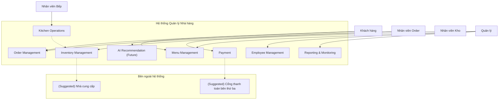
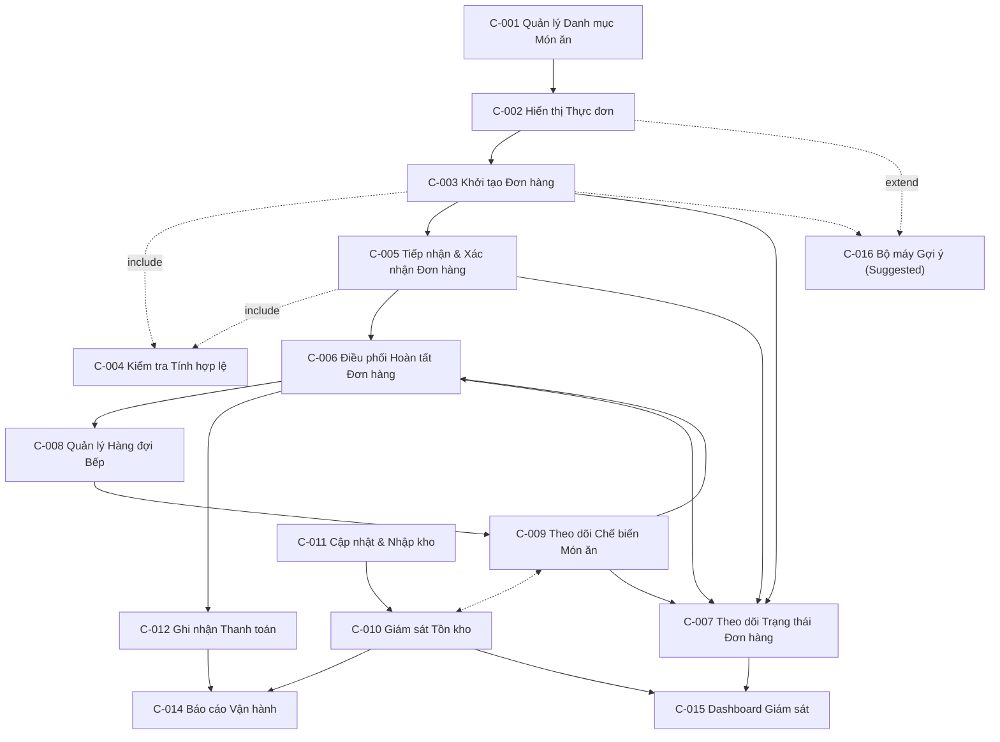
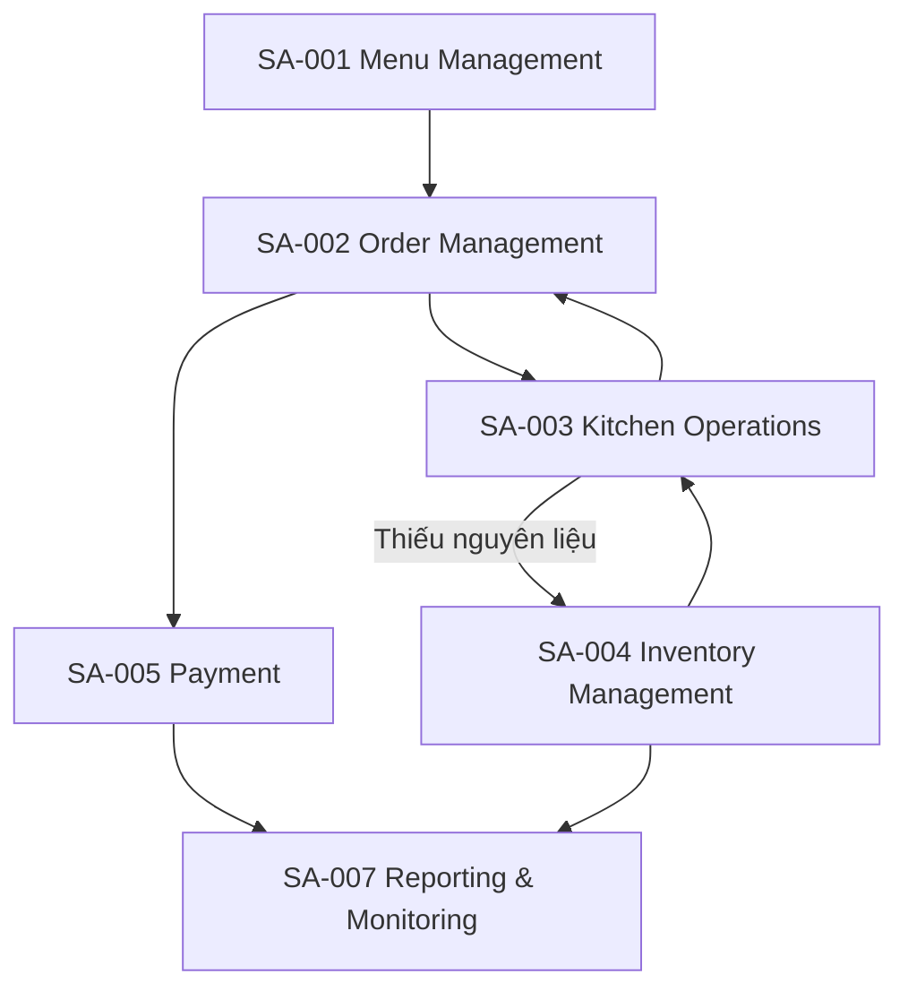
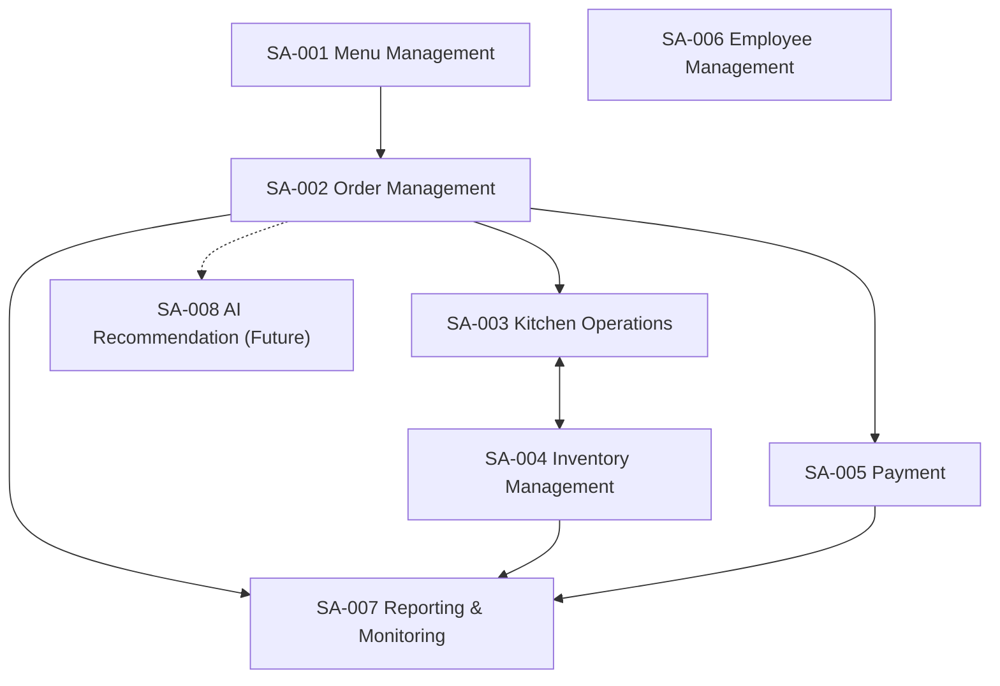

# Mô Hình Hệ Thống (System Model)

*Tài liệu tham chiếu: `docs/requirements/01-project-vision.md`, `docs/requirements/02-actor-analysis.md`, `docs/requirements/03-user-flows.md`, `docs/requirements/04-use-cases.md`*

## 1. Tổng Quan

**Mục đích của tài liệu này** là chuyển hoá 24 Use Case đã xác nhận trong `04-use-cases.md` thành một **mô hình hệ thống logic**: các khu vực hệ thống (System Area), thành phần logic (Logical Component), khái niệm nghiệp vụ (Business Concept), và ranh giới hệ thống. Đây là cầu nối giữa yêu cầu nghiệp vụ và việc phân rã tính năng ở giai đoạn sau.

**Mối quan hệ với các tài liệu trước:** Mỗi System Area đều được nhóm trực tiếp từ các Category của Use Case (`04-use-cases.md`, Mục 3), và mỗi Component đều gắn với một hoặc nhiều Use Case cụ thể — không có thành phần nào được tạo ra ngoài phạm vi đã xác nhận.

**Mối quan hệ với Bước 6 — Feature Breakdown:** Tài liệu này là đầu vào chính cho việc phân rã tính năng. Mỗi Logical Component ở đây sẽ được chia nhỏ hơn thành các tính năng cụ thể (features) ở giai đoạn tiếp theo.

Đây là một **mô hình logic/mô hình miền (domain)** — **không phải** sơ đồ ER, lược đồ cơ sở dữ liệu, đặc tả API, hay kiến trúc kỹ thuật.

## 2. Bối Cảnh Hệ Thống (System Context)

**Hệ thống Quản lý Nhà hàng** là một nền tảng logic kết nối năm actor chính đã xác nhận:

- **Khách hàng** — khởi tạo nhu cầu đặt món.
- **Nhân viên Order** — xử lý đơn hàng.
- **Nhân viên Bếp** — chế biến món ăn.
- **Nhân viên Kho** — quản lý nguyên liệu.
- **Quản lý** — giám sát và điều hành.

Ở giai đoạn này, **chưa có actor hoặc hệ thống bên ngoài nào được xác nhận chính thức** (ví dụ: cổng thanh toán bên thứ ba, nhà cung cấp). Các mục liên quan được ghi nhận là *Suggested External Actor* hoặc *Open Question* ở Mục 10.

## 3. Các Khu Vực Hệ Thống (System Areas)

| ID | System Area | Objective | Actors | Priority | Related Use Cases |
|---|---|---|---|---|---|
| SA-001 | Quản lý Thực đơn (Menu Management) | Duy trì danh sách món ăn chính xác, cập nhật | Khách hàng, Quản lý | Must Have | UC-001, UC-019 |
| SA-002 | Quản lý Đơn hàng (Order Management) | Quản lý toàn bộ vòng đời của đơn hàng, từ tạo đến hoàn tất | Khách hàng, Nhân viên Order, Nhân viên Bếp | Must Have | UC-002, UC-003, UC-004, UC-005, UC-006, UC-007, UC-008, UC-009, UC-023 |
| SA-003 | Vận Hành Bếp (Kitchen Operations) | Điều phối việc chế biến món ăn theo đơn hàng | Nhân viên Bếp, Nhân viên Order | Must Have | UC-011, UC-012, UC-013, UC-014 |
| SA-004 | Quản lý Tồn kho (Inventory Management) | Theo dõi và duy trì mức tồn kho nguyên liệu chính xác | Nhân viên Kho, Nhân viên Bếp, Quản lý | Must Have | UC-015, UC-016, UC-017, UC-018 |
| SA-005 | Thanh toán (Payment) | Ghi nhận giao dịch và đóng vòng đời đơn hàng | Nhân viên Order, Khách hàng | Must Have | UC-010 |
| SA-006 | Quản lý Nhân sự (Employee Management) | Quản lý thông tin và vai trò của nhân viên | Quản lý | Must Have | UC-020 |
| SA-007 | Báo cáo & Giám sát (Reporting & Monitoring) | Cung cấp cái nhìn tổng hợp và thời gian thực để hỗ trợ ra quyết định | Quản lý | Must Have (báo cáo) / Should Have (giám sát thời gian thực) | UC-021, UC-022 |
| SA-008 | Gợi ý AI (AI Recommendation) | Gợi ý món ăn cá nhân hoá dựa trên lịch sử đặt món | Khách hàng | Could Have *(Suggested/Future)* | UC-024 |

## 4. Chi Tiết Từng Khu Vực Hệ Thống

### SA-001 — Quản lý Thực đơn (Menu Management)

**Objective:** Đảm bảo khách hàng luôn thấy thông tin thực đơn chính xác và cập nhật.
**Responsibility:** Quản lý danh mục món ăn (thêm/sửa/xoá) và trạng thái còn/hết hàng; hiển thị thực đơn cho khách hàng.
**Related Actors:** Quản lý (quản trị), Khách hàng (xem).
**Related User Flows:** MG-01, CU-01.
**Related Use Cases:** UC-019 (Quản lý món ăn), UC-001 (Xem thực đơn).
**Priority:** Must Have.
**Dependencies:** Không phụ thuộc khu vực khác; là điều kiện tiên quyết cho SA-002.

---

### SA-002 — Quản lý Đơn hàng (Order Management)

**Objective:** Đảm bảo đơn hàng được tạo, xác nhận, xử lý, và theo dõi chính xác trong suốt vòng đời.
**Responsibility:** Tạo đơn hàng, kiểm tra tính hợp lệ, xác nhận/từ chối, chuyển đến bếp, theo dõi trạng thái, và huỷ đơn khi hợp lệ.
**Related Actors:** Khách hàng, Nhân viên Order, Nhân viên Bếp (nhận đầu ra của khu vực này).
**Related User Flows:** CU-01, CU-02, OS-01, OS-02, OS-03 (một phần).
**Related Use Cases:** UC-002, UC-003, UC-004, UC-005, UC-006, UC-007, UC-008, UC-009, UC-023.
**Priority:** Must Have.
**Dependencies:** Phụ thuộc SA-001 (cần thực đơn hợp lệ để tạo đơn); là điều kiện tiên quyết cho SA-003 và SA-005.

---

### SA-003 — Vận Hành Bếp (Kitchen Operations)

**Objective:** Đảm bảo đơn hàng được chế biến đúng thứ tự, đúng nội dung.
**Responsibility:** Quản lý hàng đợi chế biến, cập nhật trạng thái chế biến, và báo cáo tình trạng thiếu nguyên liệu.
**Related Actors:** Nhân viên Bếp, Nhân viên Order (nhận thông báo), Nhân viên Kho (nhận báo cáo thiếu hụt).
**Related User Flows:** KS-01, KS-02.
**Related Use Cases:** UC-011, UC-012, UC-013, UC-014.
**Priority:** Must Have.
**Dependencies:** Phụ thuộc SA-002 (nhận đơn đã xác nhận); có tương tác hai chiều với SA-004 (tiêu thụ/báo cáo nguyên liệu).

---

### SA-004 — Quản lý Tồn kho (Inventory Management)

**Objective:** Duy trì dữ liệu tồn kho chính xác và phát hiện sớm tình trạng thiếu hụt.
**Responsibility:** Theo dõi mức tồn kho, cập nhật số lượng, cảnh báo tồn kho thấp, và xử lý nhập hàng.
**Related Actors:** Nhân viên Kho, Nhân viên Bếp (nguồn tiêu thụ), Quản lý (nhận báo cáo).
**Related User Flows:** WH-01, WH-02.
**Related Use Cases:** UC-015, UC-016, UC-017, UC-018.
**Priority:** Must Have.
**Dependencies:** Có tương tác hai chiều với SA-003; cung cấp dữ liệu cho SA-007.

---

### SA-005 — Thanh toán (Payment)

**Objective:** Đảm bảo mọi đơn hàng được thanh toán và đóng đúng quy trình.
**Responsibility:** Ghi nhận giao dịch thanh toán và cập nhật trạng thái đơn hàng thành hoàn tất.
**Related Actors:** Nhân viên Order, Khách hàng.
**Related User Flows:** OS-03, CU-03.
**Related Use Cases:** UC-010.
**Priority:** Must Have.
**Dependencies:** Phụ thuộc SA-002 (đơn hàng phải ở trạng thái "đã giao"); cung cấp dữ liệu cho SA-007.

---

### SA-006 — Quản lý Nhân sự (Employee Management)

**Objective:** Duy trì thông tin nhân sự và vai trò chính xác.
**Responsibility:** Quản lý hồ sơ và vai trò của Nhân viên Order, Nhân viên Bếp, Nhân viên Kho.
**Related Actors:** Quản lý.
**Related User Flows:** MG-02.
**Related Use Cases:** UC-020.
**Priority:** Must Have.
**Dependencies:** Độc lập tương đối; không phụ thuộc trực tiếp vào khu vực khác trong mô hình logic hiện tại.

---

### SA-007 — Báo cáo & Giám sát (Reporting & Monitoring)

**Objective:** Cung cấp cho Quản lý dữ liệu tổng hợp và thời gian thực để ra quyết định.
**Responsibility:** Tổng hợp báo cáo vận hành (doanh thu, đơn hàng, tồn kho) và cung cấp dashboard giám sát thời gian thực.
**Related Actors:** Quản lý.
**Related User Flows:** MG-03.
**Related Use Cases:** UC-021, UC-022.
**Priority:** Must Have (báo cáo) / Should Have (giám sát thời gian thực).
**Dependencies:** Phụ thuộc dữ liệu đầu ra từ SA-002, SA-004, SA-005.

---

### SA-008 — Gợi ý AI (AI Recommendation)

**Objective:** Cải thiện trải nghiệm đặt món của khách hàng thông qua gợi ý cá nhân hoá.
**Responsibility:** Phân tích lịch sử đặt món và hiển thị danh sách món gợi ý (logic, không mô tả thuật toán).
**Related Actors:** Khách hàng.
**Related User Flows:** AI-01.
**Related Use Cases:** UC-024.
**Priority:** Could Have — **Suggested/Future**, theo đúng phân loại trong Project Vision (Mục 8) và Use Case Analysis (Mục 10).
**Dependencies:** Phụ thuộc dữ liệu lịch sử đơn hàng từ SA-002 (giả định cần cơ chế nhận diện khách hàng — xem Mục 16).

## 5. Danh Sách Thành Phần Logic (Logical Components)

| ID | Component | System Area | Responsibility | Priority |
|---|---|---|---|---|
| C-001 | Quản lý Danh mục Món ăn | SA-001 | Thêm/sửa/xoá món ăn, cập nhật trạng thái còn/hết hàng | Must Have |
| C-002 | Hiển thị Thực đơn | SA-001 | Hiển thị thực đơn hiện có cho khách hàng | Must Have |
| C-003 | Khởi tạo Đơn hàng | SA-002 | Tiếp nhận lựa chọn món và tạo đơn hàng mới | Must Have |
| C-004 | Kiểm tra Tính hợp lệ Đơn hàng | SA-002 | Xác minh món ăn còn hợp lệ trước khi tạo/xác nhận đơn (dùng chung) | Must Have |
| C-005 | Tiếp nhận & Xác nhận Đơn hàng | SA-002 | Xem, xác nhận, hoặc từ chối đơn hàng mới | Must Have |
| C-006 | Điều phối Hoàn tất Đơn hàng | SA-002 | Chuyển đơn đến bếp và cập nhật trạng thái giao hàng | Must Have |
| C-007 | Theo dõi Trạng thái Đơn hàng | SA-002 | Cung cấp trạng thái đơn hàng cho khách hàng; xử lý huỷ đơn | Must Have |
| C-008 | Quản lý Hàng đợi Bếp | SA-003 | Sắp xếp và hiển thị thứ tự đơn cần chế biến | Must Have |
| C-009 | Theo dõi Chế biến Món ăn | SA-003 | Cập nhật trạng thái chế biến; báo cáo thiếu nguyên liệu | Must Have |
| C-010 | Giám sát Tồn kho | SA-004 | Hiển thị mức tồn kho hiện tại; phát cảnh báo tồn kho thấp | Must Have |
| C-011 | Cập nhật & Nhập kho | SA-004 | Cập nhật số lượng tồn kho sau sử dụng hoặc nhập hàng | Must Have |
| C-012 | Ghi nhận Thanh toán | SA-005 | Ghi nhận giao dịch và đóng đơn hàng | Must Have |
| C-013 | Quản lý Hồ sơ Nhân viên | SA-006 | Quản lý thông tin và vai trò nhân viên | Must Have |
| C-014 | Báo cáo Vận hành | SA-007 | Tổng hợp và hiển thị báo cáo doanh thu/đơn hàng/tồn kho | Must Have |
| C-015 | Dashboard Giám sát Thời gian thực | SA-007 | Hiển thị tình trạng đơn hàng và tồn kho hiện tại | Should Have |
| C-016 | Bộ máy Gợi ý (logic) | SA-008 | Phân tích lịch sử và tạo danh sách món gợi ý | Could Have *(Suggested/Future)* |

## 6. Chi Tiết Từng Thành Phần Logic

### C-001 — Quản lý Danh mục Món ăn

**System Area:** SA-001
**Responsibility:** Cho phép Quản lý thêm, sửa, xoá món ăn và cập nhật trạng thái còn/hết hàng.
**Related Actors:** Quản lý.
**Related Use Cases:** UC-019.
**Business Inputs:** Thông tin món ăn (tên, mô tả, giá, trạng thái) do Quản lý cung cấp.
**Business Outputs:** Danh mục món ăn đã cập nhật.
**Dependencies:** Là nguồn dữ liệu cho C-002.

### C-002 — Hiển thị Thực đơn

**System Area:** SA-001
**Responsibility:** Hiển thị danh sách món ăn kèm trạng thái cho khách hàng.
**Related Actors:** Khách hàng.
**Related Use Cases:** UC-001.
**Business Inputs:** Danh mục món ăn từ C-001.
**Business Outputs:** Thực đơn hiển thị cho khách hàng.
**Dependencies:** Phụ thuộc C-001; là điểm mở rộng (extend) cho C-016 (gợi ý AI).

### C-003 — Khởi tạo Đơn hàng

**System Area:** SA-002
**Responsibility:** Tiếp nhận lựa chọn món từ khách hàng và tạo đơn hàng mới.
**Related Actors:** Khách hàng.
**Related Use Cases:** UC-002.
**Business Inputs:** Yêu cầu đặt món của khách hàng (danh sách món, số lượng).
**Business Outputs:** Đơn hàng mới ở trạng thái "chờ xác nhận".
**Dependencies:** Include C-004; là nguồn đầu vào cho C-005.

### C-004 — Kiểm tra Tính hợp lệ Đơn hàng

**System Area:** SA-002
**Responsibility:** Xác minh các món trong đơn hàng đều còn hợp lệ (còn hàng) tại thời điểm tạo hoặc xác nhận đơn.
**Related Actors:** *(Không trực tiếp — thành phần dùng chung, được C-003 và C-005 gọi)*.
**Related Use Cases:** UC-023.
**Business Inputs:** Danh sách món trong đơn hàng cần kiểm tra.
**Business Outputs:** Kết quả hợp lệ/không hợp lệ kèm danh sách món bị ảnh hưởng (nếu có).
**Dependencies:** Phụ thuộc dữ liệu thực đơn từ C-001/C-002; được dùng bởi C-003 và C-005.

### C-005 — Tiếp nhận & Xác nhận Đơn hàng

**System Area:** SA-002
**Responsibility:** Cho phép Nhân viên Order xem, xác nhận, hoặc từ chối các đơn hàng mới.
**Related Actors:** Nhân viên Order, Khách hàng (nhận kết quả).
**Related Use Cases:** UC-005, UC-006, UC-007.
**Business Inputs:** Đơn hàng ở trạng thái "chờ xác nhận".
**Business Outputs:** Đơn hàng ở trạng thái "đã xác nhận" hoặc "bị từ chối".
**Dependencies:** Include C-004; là nguồn đầu vào cho C-006.

### C-006 — Điều phối Hoàn tất Đơn hàng

**System Area:** SA-002
**Responsibility:** Chuyển đơn đã xác nhận vào hàng đợi bếp, và cập nhật trạng thái khi đơn được giao cho khách hàng.
**Related Actors:** Nhân viên Order, Nhân viên Bếp.
**Related Use Cases:** UC-008, UC-009.
**Business Inputs:** Đơn hàng đã xác nhận (từ C-005); thông báo chế biến hoàn tất (từ C-009).
**Business Outputs:** Đơn hàng trong hàng đợi bếp; đơn hàng ở trạng thái "đã giao".
**Dependencies:** Phụ thuộc C-005 và C-009 (SA-003); là nguồn đầu vào cho C-012.

### C-007 — Theo dõi Trạng thái Đơn hàng

**System Area:** SA-002
**Responsibility:** Hiển thị trạng thái đơn hàng cho khách hàng và xử lý yêu cầu huỷ đơn.
**Related Actors:** Khách hàng.
**Related Use Cases:** UC-003, UC-004.
**Business Inputs:** Trạng thái đơn hàng hiện tại (từ C-003, C-005, C-006, C-009); yêu cầu huỷ đơn.
**Business Outputs:** Trạng thái đơn hàng hiển thị; đơn hàng ở trạng thái "đã huỷ" (nếu hợp lệ).
**Dependencies:** Phụ thuộc dữ liệu trạng thái từ nhiều thành phần khác trong SA-002 và SA-003.

### C-008 — Quản lý Hàng đợi Bếp

**System Area:** SA-003
**Responsibility:** Sắp xếp và hiển thị các đơn hàng cần chế biến theo thứ tự ưu tiên.
**Related Actors:** Nhân viên Bếp.
**Related Use Cases:** UC-011, UC-012.
**Business Inputs:** Đơn hàng đã chuyển từ C-006.
**Business Outputs:** Hàng đợi chế biến; đơn hàng ở trạng thái "đang chế biến".
**Dependencies:** Phụ thuộc C-006; là nguồn đầu vào cho C-009.

### C-009 — Theo dõi Chế biến Món ăn

**System Area:** SA-003
**Responsibility:** Cập nhật trạng thái hoàn thành chế biến và báo cáo tình trạng thiếu nguyên liệu.
**Related Actors:** Nhân viên Bếp, Nhân viên Kho (nhận báo cáo), Nhân viên Order (nhận thông báo hoàn thành).
**Related Use Cases:** UC-013, UC-014.
**Business Inputs:** Đơn hàng ở trạng thái "đang chế biến" (từ C-008).
**Business Outputs:** Món ăn ở trạng thái "hoàn thành"; báo cáo thiếu nguyên liệu (nếu có).
**Dependencies:** Phụ thuộc C-008; tương tác hai chiều với C-010 (SA-004); là nguồn đầu vào cho C-006.

### C-010 — Giám sát Tồn kho

**System Area:** SA-004
**Responsibility:** Hiển thị mức tồn kho hiện tại và phát cảnh báo khi tồn kho xuống dưới ngưỡng.
**Related Actors:** Nhân viên Kho, Quản lý (nhận báo cáo).
**Related Use Cases:** UC-015, UC-017.
**Business Inputs:** Dữ liệu tồn kho hiện tại; báo cáo tiêu thụ nguyên liệu từ C-009.
**Business Outputs:** Thông tin tồn kho hiển thị; cảnh báo tồn kho thấp.
**Dependencies:** Nhận dữ liệu từ C-011 và C-009; là nguồn đầu vào cho C-014.

### C-011 — Cập nhật & Nhập kho

**System Area:** SA-004
**Responsibility:** Cập nhật số lượng tồn kho sau khi sử dụng hoặc khi nhập thêm nguyên liệu.
**Related Actors:** Nhân viên Kho.
**Related Use Cases:** UC-016, UC-018.
**Business Inputs:** Số lượng nguyên liệu thay đổi (tăng/giảm) do Nhân viên Kho nhập.
**Business Outputs:** Mức tồn kho đã cập nhật.
**Dependencies:** Cung cấp dữ liệu cho C-010.

### C-012 — Ghi nhận Thanh toán

**System Area:** SA-005
**Responsibility:** Ghi nhận giao dịch thanh toán và đóng đơn hàng.
**Related Actors:** Nhân viên Order, Khách hàng.
**Related Use Cases:** UC-010.
**Business Inputs:** Đơn hàng ở trạng thái "đã giao" (từ C-006); thông tin thanh toán.
**Business Outputs:** Đơn hàng ở trạng thái "hoàn tất"; dữ liệu giao dịch.
**Dependencies:** Phụ thuộc C-006; cung cấp dữ liệu cho C-014.

### C-013 — Quản lý Hồ sơ Nhân viên

**System Area:** SA-006
**Responsibility:** Quản lý thông tin và vai trò của nhân viên.
**Related Actors:** Quản lý.
**Related Use Cases:** UC-020.
**Business Inputs:** Thông tin nhân viên do Quản lý cung cấp.
**Business Outputs:** Hồ sơ nhân viên đã cập nhật.
**Dependencies:** Độc lập tương đối với các thành phần khác.

### C-014 — Báo cáo Vận hành

**System Area:** SA-007
**Responsibility:** Tổng hợp và hiển thị báo cáo doanh thu, số lượng đơn hàng, và tình trạng tồn kho.
**Related Actors:** Quản lý.
**Related Use Cases:** UC-021.
**Business Inputs:** Dữ liệu giao dịch từ C-012; dữ liệu tồn kho từ C-010.
**Business Outputs:** Báo cáo tổng hợp hiển thị cho Quản lý.
**Dependencies:** Phụ thuộc C-012 và C-010.

### C-015 — Dashboard Giám sát Thời gian thực

**System Area:** SA-007
**Responsibility:** Hiển thị tình trạng hiện tại của đơn hàng và tồn kho cho Quản lý.
**Related Actors:** Quản lý.
**Related Use Cases:** UC-022.
**Business Inputs:** Trạng thái đơn hàng (từ C-007) và tồn kho (từ C-010).
**Business Outputs:** Dashboard hiển thị tình trạng vận hành hiện tại.
**Dependencies:** Phụ thuộc C-007 và C-010.

### C-016 — Bộ máy Gợi ý (logic)

**System Area:** SA-008
**Responsibility:** Phân tích lịch sử đặt món và tạo danh sách món gợi ý cho khách hàng (chỉ mô tả ở mức logic, không mô tả thuật toán).
**Related Actors:** Khách hàng.
**Related Use Cases:** UC-024.
**Business Inputs:** Lịch sử đơn hàng của khách hàng (từ C-003, giả định cần nhận diện khách hàng).
**Business Outputs:** Danh sách món ăn gợi ý.
**Dependencies:** Phụ thuộc dữ liệu lịch sử đơn hàng từ SA-002; extend của C-002.
**Classification:** **Suggested/Future** — chưa thuộc phạm vi MVP.

## 7. Mô Hình Tương Tác Giữa Các Thành Phần

Luồng tương tác chính giữa các thành phần phản ánh đúng vòng đời đơn hàng cốt lõi: từ hiển thị thực đơn, tạo đơn, xác nhận, chế biến, đến thanh toán và báo cáo — với hai điểm tương tác hai chiều quan trọng là Bếp ↔ Tồn kho và Đơn hàng ↔ Báo cáo.

## 8. Ma Trận Tương Tác Actor–Hệ Thống

| Actor | System Area | Component | Main Interaction |
|---|---|---|---|
| Khách hàng | SA-001 | C-002 | Xem thực đơn |
| Khách hàng | SA-002 | C-003 | Tạo đơn hàng |
| Khách hàng | SA-002 | C-007 | Theo dõi/huỷ đơn hàng |
| Khách hàng | SA-005 | C-012 | Thực hiện thanh toán (phối hợp với Nhân viên Order) |
| Khách hàng | SA-008 | C-016 | Xem gợi ý món ăn *(Suggested)* |
| Nhân viên Order | SA-002 | C-005 | Xác nhận/từ chối đơn hàng |
| Nhân viên Order | SA-002 | C-006 | Chuyển đơn đến bếp, cập nhật giao hàng |
| Nhân viên Order | SA-005 | C-012 | Ghi nhận thanh toán |
| Nhân viên Bếp | SA-003 | C-008 | Xem và tiếp nhận hàng đợi chế biến |
| Nhân viên Bếp | SA-003 | C-009 | Cập nhật trạng thái chế biến, báo cáo thiếu nguyên liệu |
| Nhân viên Kho | SA-004 | C-010 | Xem tồn kho, nhận cảnh báo |
| Nhân viên Kho | SA-004 | C-011 | Cập nhật số lượng, nhập hàng |
| Quản lý | SA-001 | C-001 | Quản lý danh mục món ăn |
| Quản lý | SA-006 | C-013 | Quản lý hồ sơ nhân viên |
| Quản lý | SA-007 | C-014, C-015 | Xem báo cáo và dashboard giám sát |

## 9. Mô Hình Khái Niệm Nghiệp Vụ (Business Concept Model)

| Concept | Purpose | Related System Area | Related Actors | Related Use Cases |
|---|---|---|---|---|
| Món ăn (Dish) | Đại diện cho một món trong thực đơn, bao gồm trạng thái còn/hết hàng | SA-001 | Khách hàng, Quản lý | UC-001, UC-019 |
| Thực đơn (Menu) | Tập hợp các món ăn hiện có của nhà hàng | SA-001 | Khách hàng, Quản lý | UC-001, UC-019 |
| Đơn hàng (Order) | Đại diện cho một yêu cầu đặt món của khách hàng, có vòng đời trạng thái | SA-002 | Khách hàng, Nhân viên Order, Nhân viên Bếp | UC-002 đến UC-009, UC-023 |
| Mục đơn hàng (Order Item) | Một món ăn cụ thể và số lượng trong một đơn hàng | SA-002 | Khách hàng, Nhân viên Order | UC-002 |
| Hàng đợi Bếp (Kitchen Queue) | Danh sách các đơn hàng đang chờ hoặc đang được chế biến | SA-003 | Nhân viên Bếp | UC-011, UC-012, UC-013 |
| Nguyên liệu (Ingredient) | Một loại vật tư/nguyên liệu được theo dõi trong kho | SA-004 | Nhân viên Kho, Nhân viên Bếp | UC-015 đến UC-018 |
| Tồn kho (Inventory) | Mức số lượng hiện có của từng nguyên liệu | SA-004 | Nhân viên Kho, Quản lý | UC-015 đến UC-018 |
| Giao dịch Thanh toán (Payment Transaction) | Ghi nhận việc thanh toán cho một đơn hàng | SA-005 | Nhân viên Order, Khách hàng | UC-010 |
| Nhân viên (Employee) | Đại diện cho một người dùng thuộc vai trò Order/Bếp/Kho | SA-006 | Quản lý | UC-020 |
| Báo cáo Vận hành (Operational Report) | Tổng hợp dữ liệu doanh thu, đơn hàng, tồn kho theo thời gian | SA-007 | Quản lý | UC-021, UC-022 |
| Gợi ý Món ăn (Recommendation) | Danh sách món ăn được gợi ý riêng cho từng khách hàng | SA-008 | Khách hàng | UC-024 *(Suggested)* |

*(Đây là các khái niệm nghiệp vụ ở mức logic — không phải bảng cơ sở dữ liệu, không có khoá chính/khoá ngoại hay kiểu dữ liệu cụ thể.)*

## 10. Ranh Giới Hệ Thống (System Boundary)

### 10.1 Bên Trong Hệ Thống

- Quản lý thực đơn (SA-001)
- Quản lý đơn hàng (SA-002)
- Vận hành bếp (SA-003)
- Quản lý tồn kho (SA-004)
- Ghi nhận thanh toán ở mức nghiệp vụ (SA-005) — *chỉ ghi nhận giao dịch, không xử lý cổng thanh toán*
- Quản lý nhân sự (SA-006)
- Báo cáo & giám sát (SA-007)
- Gợi ý AI (SA-008) — *thuộc phạm vi logic tương lai, chưa triển khai trong MVP*

### 10.2 Actor / Hệ thống Bên Ngoài

| Tên | Phân loại | Ghi chú |
|---|---|---|
| Nhà cung cấp (Supplier) | **Suggested External Actor** | Có thể liên quan đến việc nhập hàng (SA-004) nhưng chưa được xác nhận là tương tác trực tiếp với hệ thống |
| Cổng thanh toán bên thứ ba (Payment Gateway) | **Suggested External Actor** | Project Vision xác định việc tích hợp thanh toán nâng cao nằm ngoài phạm vi hiện tại; SA-005 chỉ ghi nhận giao dịch ở mức nghiệp vụ |
| Dịch vụ thông báo bên ngoài (SMS/Email) | **Open Question** | Chưa có tài liệu nào xác nhận nhu cầu gửi thông báo qua kênh bên ngoài |
| Nền tảng giao hàng bên thứ ba (Delivery Platform) | **Open Question** | Project Vision liệt kê giao hàng là "ngoài phạm vi" cho phiên bản đầu tiên, nhưng chưa loại trừ hoàn toàn cho tương lai |

## 11. Các Quy Trình Xuyên Khu Vực (Cross-System-Area Processes)

### Quy trình cốt lõi: Đặt món → Hoàn tất

Quy trình này phản ánh đúng luồng E2E-01 và E2E-02 trong `03-user-flows.md`: từ việc thực đơn được thiết lập, đến khi đơn hàng được tạo, xác nhận, chuyển bếp, chế biến (có thể ảnh hưởng ngược đến tồn kho), hoàn tất, thanh toán, và cuối cùng phản ánh vào báo cáo.

## 12. Bản Đồ Phụ Thuộc Hệ Thống (System Dependency Map)

| Source Area | Dependency | Target Area | Reason |
|---|---|---|---|
| SA-002 Order Management | depends on | SA-001 Menu Management | Đơn hàng chỉ có thể được tạo dựa trên món ăn hợp lệ trong thực đơn |
| SA-003 Kitchen Operations | depends on | SA-002 Order Management | Bếp chỉ xử lý các đơn đã được xác nhận |
| SA-003 Kitchen Operations | ↔ (hai chiều) | SA-004 Inventory Management | Bếp tiêu thụ nguyên liệu; kho báo cáo tình trạng thiếu hụt ngược lại cho bếp |
| SA-005 Payment | depends on | SA-002 Order Management | Thanh toán chỉ thực hiện khi đơn hàng đã ở trạng thái "đã giao" |
| SA-007 Reporting & Monitoring | depends on | SA-002 Order Management | Báo cáo cần dữ liệu đơn hàng đã hoàn tất |
| SA-007 Reporting & Monitoring | depends on | SA-004 Inventory Management | Báo cáo cần dữ liệu tồn kho |
| SA-007 Reporting & Monitoring | depends on | SA-005 Payment | Báo cáo doanh thu cần dữ liệu giao dịch |
| SA-008 AI Recommendation | depends on | SA-002 Order Management | Gợi ý món ăn cần dữ liệu lịch sử đơn hàng |

*(SA-006 Quản lý Nhân sự không có phụ thuộc trực tiếp với các khu vực khác trong mô hình logic hiện tại; đây không phải là lỗi mà phản ánh đúng tính độc lập tương đối của chức năng quản lý hồ sơ nhân sự.)*

Không có phụ thuộc vòng tròn nào được xác định trong mô hình.

## 13. Khu Vực Hệ Thống Cho Tính Năng AI Sản Phẩm

**SA-008 — Gợi ý AI (AI Recommendation)**

- **AI Responsibility:** Phân tích lịch sử đặt món của khách hàng và tạo danh sách món ăn gợi ý phù hợp với sở thích cá nhân.
- **Input:** Lịch sử đơn hàng của khách hàng (business concept: Order, Order Item).
- **Output:** Danh sách món ăn được gợi ý (business concept: Recommendation).
- **Related Actors:** Khách hàng.
- **Related Use Cases:** UC-024.
- **Classification:** **Suggested / Future** — Project Vision (Mục 8) xác định rõ tính năng này "có thể được bổ sung sau khi hệ thống cốt lõi hoàn thiện". Không có mô hình thuật toán, embedding, hay pipeline huấn luyện nào được mô tả ở tài liệu này — đây thuộc giai đoạn thiết kế kỹ thuật sau này.

## 14. Mô Hình Hệ Thống Cho MVP

| System Area / Component | MVP Status | Reason |
|---|---|---|
| SA-001 / C-001 Quản lý Danh mục Món ăn | Required for MVP | Điều kiện tiên quyết để vận hành đặt món |
| SA-001 / C-002 Hiển thị Thực đơn | Required for MVP | Điều kiện tiên quyết để khách hàng đặt món |
| SA-002 / C-003 Khởi tạo Đơn hàng | Required for MVP | Chức năng cốt lõi |
| SA-002 / C-004 Kiểm tra Tính hợp lệ Đơn hàng | Required for MVP | Bắt buộc để đảm bảo tính đúng đắn của đơn hàng |
| SA-002 / C-005 Tiếp nhận & Xác nhận Đơn hàng | Required for MVP | Chức năng cốt lõi |
| SA-002 / C-006 Điều phối Hoàn tất Đơn hàng | Required for MVP | Kết nối Order và Kitchen |
| SA-002 / C-007 Theo dõi Trạng thái Đơn hàng | Required for MVP | Cần thiết cho tất cả actor liên quan; huỷ đơn (UC-004) là Should Have nhưng phần theo dõi trạng thái vẫn là Must Have |
| SA-003 / C-008 Quản lý Hàng đợi Bếp | Required for MVP | Bắt buộc để bếp hoạt động |
| SA-003 / C-009 Theo dõi Chế biến Món ăn | Required for MVP | Bắt buộc để hoàn thành vòng đời đơn hàng |
| SA-004 / C-010 Giám sát Tồn kho | Required for MVP | Giải quyết trực tiếp vấn đề "inventory management" |
| SA-004 / C-011 Cập nhật & Nhập kho | Required for MVP | Bắt buộc để duy trì dữ liệu tồn kho |
| SA-005 / C-012 Ghi nhận Thanh toán | Required for MVP | Bắt buộc để đóng đơn hàng |
| SA-006 / C-013 Quản lý Hồ sơ Nhân viên | Required for MVP | Cần thiết cho quản lý nhân sự cơ bản |
| SA-007 / C-014 Báo cáo Vận hành | Required for MVP | Giải quyết trực tiếp vấn đề "reporting" |
| SA-007 / C-015 Dashboard Giám sát Thời gian thực | Post-MVP | Bổ sung giá trị nhưng C-014 đã đáp ứng nhu cầu báo cáo cơ bản (nhất quán với UC-022 = Should Have) |
| SA-008 / C-016 Bộ máy Gợi ý (logic) | Future | Project Vision xác định rõ đây là tính năng triển khai **sau khi** hệ thống cốt lõi hoàn thiện |

## 15. Ma Trận Truy Vết (Traceability Matrix)

| System Area | Actor | User Flow | Use Cases | Components |
|---|---|---|---|---|
| SA-001 | Khách hàng, Quản lý | CU-01, MG-01 | UC-001, UC-019 | C-001, C-002 |
| SA-002 | Khách hàng, Nhân viên Order, Nhân viên Bếp | CU-01, CU-02, OS-01, OS-02, OS-03 | UC-002 đến UC-009, UC-023 | C-003, C-004, C-005, C-006, C-007 |
| SA-003 | Nhân viên Bếp, Nhân viên Order | KS-01, KS-02 | UC-011 đến UC-014 | C-008, C-009 |
| SA-004 | Nhân viên Kho, Nhân viên Bếp, Quản lý | WH-01, WH-02 | UC-015 đến UC-018 | C-010, C-011 |
| SA-005 | Nhân viên Order, Khách hàng | OS-03, CU-03 | UC-010 | C-012 |
| SA-006 | Quản lý | MG-02 | UC-020 | C-013 |
| SA-007 | Quản lý | MG-03 | UC-021, UC-022 | C-014, C-015 |
| SA-008 | Khách hàng | AI-01 | UC-024 | C-016 |

## 16. Câu Hỏi Còn Bỏ Ngỏ

| Question | Related System Area | Why it matters | Possible options | Recommended option |
|---|---|---|---|---|
| Việc xác thực/nhận diện khách hàng (để hỗ trợ theo dõi đơn và gợi ý AI) có yêu cầu tài khoản không? | SA-002, SA-008 | Ảnh hưởng đến việc C-007 và C-016 có thể hoạt động đầy đủ hay không nếu không có cơ chế định danh khách hàng | (a) Bắt buộc tài khoản; (b) Hỗ trợ khách vãng lai với mã đơn hàng tạm thời | Đã ghi nhận từ các tài liệu trước — giữ nguyên trạng thái mở |
| Cổng thanh toán bên thứ ba có được tích hợp trong tương lai không? | SA-005 | Ảnh hưởng đến việc SA-005 có cần mở rộng ranh giới hệ thống để kết nối bên ngoài | (a) Chỉ ghi nhận thủ công (hiện tại); (b) Tích hợp cổng thanh toán trong giai đoạn sau | Theo Project Vision: giữ (a) cho MVP |
| C-007 (Theo dõi Trạng thái Đơn hàng) và C-015 (Dashboard Giám sát) có nên là một thành phần chung hay tách riêng? | SA-002, SA-007 | Cả hai đều hiển thị trạng thái theo thời gian thực nhưng phục vụ actor khác nhau (khách hàng vs quản lý) | (a) Giữ tách riêng như hiện tại; (b) Gộp thành một thành phần hiển thị trạng thái dùng chung | Đề xuất (a) vì đối tượng sử dụng và mức độ chi tiết thông tin khác nhau đáng kể |
| Ngưỡng cảnh báo tồn kho thấp (đầu vào của C-010) do ai thiết lập? | SA-004 | Ảnh hưởng đến trách nhiệm cụ thể của C-010 | (a) Quản lý thiết lập; (b) Nhân viên Kho thiết lập; (c) Ngưỡng mặc định cố định | Đã ghi nhận từ User Flow Analysis — giữ nguyên trạng thái mở |
| Dịch vụ thông báo (SMS/Email) có cần thiết để thông báo khách hàng/nhân viên hay chỉ thông báo trong ứng dụng là đủ? | Toàn hệ thống (đặc biệt SA-002, SA-003) | Ảnh hưởng đến việc có cần bổ sung một actor/hệ thống bên ngoài mới | (a) Chỉ thông báo trong ứng dụng; (b) Bổ sung kênh thông báo bên ngoài | Không đề xuất — cần xác nhận từ dự án |

## 17. Kiểm Tra Tính Nhất Quán (Consistency Check)

1. [x] Mỗi System Area đều được hỗ trợ bởi một hoặc nhiều Use Case cụ thể (xem Mục 3).
2. [x] Mỗi Use Case quan trọng đều thuộc về một System Area phù hợp (xem Mục 15).
3. [x] Mỗi Component đều có trách nhiệm rõ ràng, không chồng chéo không cần thiết (xem Mục 6).
4. [x] Không có thành phần dư thừa nào được tạo ra chỉ vì "mỗi Use Case một Component" — một số component gộp nhiều Use Case liên quan chặt chẽ (ví dụ C-005 gộp UC-005/006/007).
5. [x] Các phụ thuộc giữa component và giữa system area là hợp lý về mặt logic, không có vòng lặp (xem Mục 12).
6. [x] Các luồng đa actor quan trọng đã được thể hiện (Mục 11 — quy trình cốt lõi).
7. [x] Các khái niệm nghiệp vụ (Mục 9) được mô tả ở mức ý nghĩa nghiệp vụ, không phải bảng dữ liệu.
8. [x] Ranh giới hệ thống rõ ràng, các actor/hệ thống bên ngoài được phân loại minh bạch (Mục 10).
9. [x] Chức năng AI được phân loại rõ ràng là Suggested/Future (Mục 13).
10. [x] Các thành phần thuộc MVP được xác định rõ ràng (Mục 14), nhất quán với ưu tiên MVP trong Use Case Analysis.
11. [x] Các thành phần chính đều có thể truy vết về yêu cầu dự án gốc (Mục 15).
12. [x] Không có kiến trúc kỹ thuật (ngôn ngữ, framework, cơ sở dữ liệu, API) nào được đưa vào tài liệu.
13. [x] Tài liệu phù hợp để làm đầu vào cho Bước 6 — Feature Breakdown.