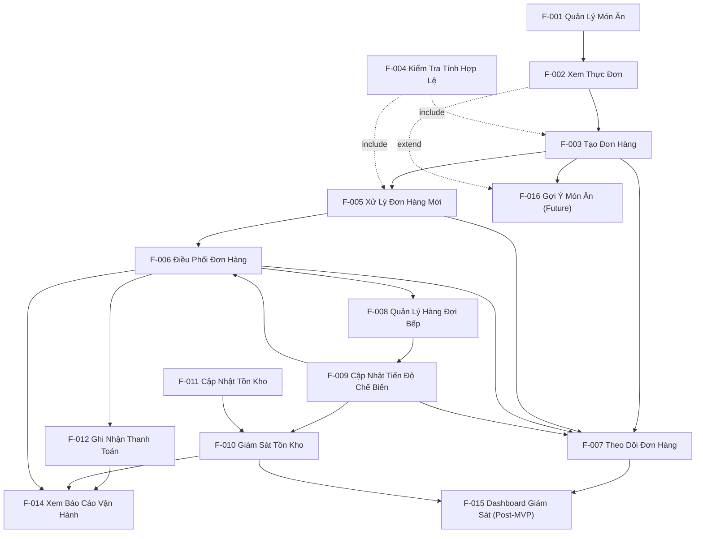

# Phân Rã Tính Năng (Feature Breakdown)

*Tài liệu tham chiếu: `docs/requirements/01-project-vision.md`, `docs/requirements/02-actor-analysis.md`, `docs/requirements/03-user-flows.md`, `docs/requirements/04-use-cases.md`, `docs/requirements/05-system-model.md`*

## 1. Tổng Quan

**Mục đích của tài liệu này** là chuyển hoá các Khu vực Hệ thống (System Area) và Thành phần Logic (Logical Component) trong `05-system-model.md` thành các **Tính năng (Feature)** và **Tính năng con (Sub-feature)** cụ thể — những năng lực sản phẩm có giá trị nghiệp vụ rõ ràng, có thể dùng làm đầu vào cho việc lập kế hoạch dự án, MVP, PRD, và phân rã công việc phát triển.

**Mối quan hệ với Use Case Analysis:** Mỗi Feature đều bắt nguồn từ một hoặc nhiều Use Case trong `04-use-cases.md`. Không có Feature nào được tạo ra "1 Use Case = 1 Feature" một cách máy móc — một số Feature gộp nhiều Use Case liên quan chặt chẽ (ví dụ F-005 gộp UC-005/006/007).

**Mối quan hệ với System Model:** Mỗi Feature thuộc về đúng một Logical Component và System Area đã xác định trong `05-system-model.md`, đảm bảo tính nhất quán xuyên suốt các tầng logic.

**Mối quan hệ với Bước 7 — Project Plan:** Tài liệu này là đầu vào chính để lập kế hoạch dự án, xác định thứ tự triển khai, và phân bổ công việc phát triển theo từng Feature/Sub-feature.

**Hệ thống ID sử dụng:** ID phân cấp — `F-XXX` cho Feature, `F-XXX.N` cho Sub-feature (ví dụ: F-003.1, F-003.2).

## 2. Cấu Trúc Phân Cấp Tính Năng

```text
SA-001 Menu Management
  └── C-001 Quản lý Danh mục Món ăn
        └── F-001 Quản Lý Món Ăn
              ├── F-001.1 Thêm Món Ăn Mới
              ├── F-001.2 Chỉnh Sửa Thông Tin Món Ăn
              ├── F-001.3 Xoá Món Ăn
              └── F-001.4 Cập Nhật Trạng Thái Còn/Hết Hàng
  └── C-002 Hiển thị Thực đơn
        └── F-002 Xem Thực Đơn
              ├── F-002.1 Xem Danh Sách Món Ăn
              └── F-002.2 Xem Trạng Thái Còn/Hết Hàng

SA-002 Order Management
  └── C-003 Khởi tạo Đơn hàng
        └── F-003 Tạo Đơn Hàng
              ├── F-003.1 Chọn Món & Số Lượng
              └── F-003.2 Xác Nhận Đặt Món
  └── C-004 Kiểm tra Tính hợp lệ Đơn hàng
        └── F-004 Kiểm Tra Tính Hợp Lệ Đơn Hàng
  └── C-005 Tiếp nhận & Xác nhận Đơn hàng
        └── F-005 Xử Lý Đơn Hàng Mới
              ├── F-005.1 Xem Danh Sách Đơn Hàng Mới
              ├── F-005.2 Xác Nhận Đơn Hàng
              └── F-005.3 Từ Chối Đơn Hàng
  └── C-006 Điều phối Hoàn tất Đơn hàng
        └── F-006 Điều Phối Đơn Hàng Đến Bếp & Hoàn Tất
              ├── F-006.1 Chuyển Đơn Đến Hàng Đợi Bếp
              └── F-006.2 Cập Nhật Trạng Thái Giao Món
  └── C-007 Theo dõi Trạng thái Đơn hàng
        └── F-007 Theo Dõi Đơn Hàng
              ├── F-007.1 Xem Trạng Thái Đơn Hàng
              └── F-007.2 Huỷ Đơn Hàng

SA-003 Kitchen Operations
  └── C-008 Quản lý Hàng đợi Bếp
        └── F-008 Quản Lý Hàng Đợi Bếp
              ├── F-008.1 Xem Hàng Đợi Theo Thứ Tự Ưu Tiên
              └── F-008.2 Bắt Đầu Chế Biến Đơn
  └── C-009 Theo dõi Chế biến Món ăn
        └── F-009 Cập Nhật Tiến Độ Chế Biến
              ├── F-009.1 Đánh Dấu Món Hoàn Thành
              └── F-009.2 Báo Cáo Thiếu Nguyên Liệu

SA-004 Inventory Management
  └── C-010 Giám sát Tồn kho
        └── F-010 Giám Sát Tồn Kho
              ├── F-010.1 Xem Mức Tồn Kho Hiện Tại
              └── F-010.2 Nhận Cảnh Báo Tồn Kho Thấp
  └── C-011 Cập nhật & Nhập kho
        └── F-011 Cập Nhật Tồn Kho
              ├── F-011.1 Cập Nhật Số Lượng Sau Sử Dụng
              └── F-011.2 Ghi Nhận Nhập Hàng

SA-005 Payment
  └── C-012 Ghi nhận Thanh toán
        └── F-012 Ghi Nhận Thanh Toán
              ├── F-012.1 Tổng Hợp Hoá Đơn
              ├── F-012.2 Ghi Nhận Giao Dịch Thanh Toán
              └── F-012.3 Đóng Đơn Hàng

SA-006 Employee Management
  └── C-013 Quản lý Hồ sơ Nhân viên
        └── F-013 Quản Lý Nhân Viên
              ├── F-013.1 Thêm Nhân Viên
              ├── F-013.2 Chỉnh Sửa Thông Tin/Vai Trò Nhân Viên
              └── F-013.3 Xoá Nhân Viên

SA-007 Reporting & Monitoring
  └── C-014 Báo cáo Vận hành
        └── F-014 Xem Báo Cáo Vận Hành
              ├── F-014.1 Báo Cáo Doanh Thu
              ├── F-014.2 Báo Cáo Số Lượng Đơn Hàng
              ├── F-014.3 Báo Cáo Tồn Kho
              └── F-014.4 Lọc Báo Cáo Theo Thời Gian
  └── C-015 Dashboard Giám sát Thời gian thực
        └── F-015 Dashboard Giám Sát Thời Gian Thực
              ├── F-015.1 Xem Trạng Thái Đơn Hàng Thời Gian Thực
              └── F-015.2 Xem Tồn Kho Thời Gian Thực

SA-008 AI Recommendation (Future/Suggested)
  └── C-016 Bộ máy Gợi ý
        └── F-016 Gợi Ý Món Ăn Cá Nhân Hoá
              ├── F-016.1 Phân Tích Lịch Sử Đặt Món
              └── F-016.2 Hiển Thị Danh Sách Gợi Ý
```

## 3. Danh Mục Tính Năng (Feature Catalog)

| Feature ID | Feature | System Area | Component | Primary Actor | Priority | MVP Status |
|---|---|---|---|---|---|---|
| F-001 | Quản Lý Món Ăn | SA-001 | C-001 | Quản lý | Must Have | Required for MVP |
| F-002 | Xem Thực Đơn | SA-001 | C-002 | Khách hàng | Must Have | Required for MVP |
| F-003 | Tạo Đơn Hàng | SA-002 | C-003 | Khách hàng | Must Have | Required for MVP |
| F-004 | Kiểm Tra Tính Hợp Lệ Đơn Hàng | SA-002 | C-004 | *(Hỗ trợ nội bộ)* | Must Have | Required for MVP |
| F-005 | Xử Lý Đơn Hàng Mới | SA-002 | C-005 | Nhân viên Order | Must Have | Required for MVP |
| F-006 | Điều Phối Đơn Hàng Đến Bếp & Hoàn Tất | SA-002 | C-006 | Nhân viên Order | Must Have | Required for MVP |
| F-007 | Theo Dõi Đơn Hàng | SA-002 | C-007 | Khách hàng | Must Have | Required for MVP |
| F-008 | Quản Lý Hàng Đợi Bếp | SA-003 | C-008 | Nhân viên Bếp | Must Have | Required for MVP |
| F-009 | Cập Nhật Tiến Độ Chế Biến | SA-003 | C-009 | Nhân viên Bếp | Must Have | Required for MVP |
| F-010 | Giám Sát Tồn Kho | SA-004 | C-010 | Nhân viên Kho | Must Have | Required for MVP |
| F-011 | Cập Nhật Tồn Kho | SA-004 | C-011 | Nhân viên Kho | Must Have | Required for MVP |
| F-012 | Ghi Nhận Thanh Toán | SA-005 | C-012 | Nhân viên Order | Must Have | Required for MVP |
| F-013 | Quản Lý Nhân Viên | SA-006 | C-013 | Quản lý | Must Have | Required for MVP |
| F-014 | Xem Báo Cáo Vận Hành | SA-007 | C-014 | Quản lý | Must Have | Required for MVP |
| F-015 | Dashboard Giám Sát Thời Gian Thực | SA-007 | C-015 | Quản lý | Should Have | Post-MVP |
| F-016 | Gợi Ý Món Ăn Cá Nhân Hoá | SA-008 | C-016 | Khách hàng | Could Have | Future *(Suggested)* |

## 4. Chi Tiết Tính Năng

### SA-001 — Menu Management

#### Component: C-001 Quản lý Danh mục Món ăn

### F-001 — Quản Lý Món Ăn

**Description:** Cho phép Quản lý duy trì danh mục món ăn của nhà hàng, bao gồm thêm, sửa, xoá món và cập nhật trạng thái còn/hết hàng.
**System Area:** SA-001
**Logical Component:** C-001
**Primary Actors:** Quản lý
**Supporting Actors:** Không có
**Related User Flows:** MG-01
**Related Use Cases:** UC-019
**Priority:** Must Have
**MVP Status:** Required for MVP
**Dependencies:** Không có; là điều kiện tiên quyết cho F-002.

**Sub-features:**

| ID | Name | Description | Related Use Case | Priority | Dependency |
|---|---|---|---|---|---|
| F-001.1 | Thêm Món Ăn Mới | Tạo một món ăn mới với tên, mô tả, giá | UC-019 | Must Have | Không có |
| F-001.2 | Chỉnh Sửa Thông Tin Món Ăn | Cập nhật tên, mô tả, giá của món đã có | UC-019 | Must Have | F-001.1 |
| F-001.3 | Xoá Món Ăn | Loại bỏ một món khỏi thực đơn | UC-019 | Must Have | F-001.1 |
| F-001.4 | Cập Nhật Trạng Thái Còn/Hết Hàng | Đánh dấu món ăn còn hàng hoặc hết hàng | UC-019 | Must Have | F-001.1 |

---

#### Component: C-002 Hiển thị Thực đơn

### F-002 — Xem Thực Đơn

**Description:** Hiển thị danh sách món ăn hiện có cùng trạng thái còn/hết hàng cho khách hàng.
**System Area:** SA-001
**Logical Component:** C-002
**Primary Actors:** Khách hàng
**Supporting Actors:** Không có
**Related User Flows:** CU-01
**Related Use Cases:** UC-001
**Priority:** Must Have
**MVP Status:** Required for MVP
**Dependencies:** Phụ thuộc F-001 (dữ liệu món ăn phải tồn tại).

**Sub-features:**

| ID | Name | Description | Related Use Case | Priority | Dependency |
|---|---|---|---|---|---|
| F-002.1 | Xem Danh Sách Món Ăn | Hiển thị toàn bộ món ăn hiện có | UC-001 | Must Have | F-001 |
| F-002.2 | Xem Trạng Thái Còn/Hết Hàng | Hiển thị rõ trạng thái từng món | UC-001 | Must Have | F-001.4 |

---

### SA-002 — Order Management

#### Component: C-003 Khởi tạo Đơn hàng

### F-003 — Tạo Đơn Hàng

**Description:** Cho phép khách hàng chọn món, xác định số lượng, và tạo một đơn hàng mới.
**System Area:** SA-002
**Logical Component:** C-003
**Primary Actors:** Khách hàng
**Supporting Actors:** Không có
**Related User Flows:** CU-01
**Related Use Cases:** UC-002
**Priority:** Must Have
**MVP Status:** Required for MVP
**Dependencies:** Phụ thuộc F-002 (phải xem được thực đơn); include F-004.

**Sub-features:**

| ID | Name | Description | Related Use Case | Priority | Dependency |
|---|---|---|---|---|---|
| F-003.1 | Chọn Món & Số Lượng | Khách hàng chọn món và nhập số lượng mong muốn | UC-002 | Must Have | F-002 |
| F-003.2 | Xác Nhận Đặt Món | Khách hàng xác nhận để tạo đơn hàng chính thức | UC-002 | Must Have | F-003.1, F-004 |

---

#### Component: C-004 Kiểm tra Tính hợp lệ Đơn hàng

### F-004 — Kiểm Tra Tính Hợp Lệ Đơn Hàng

**Description:** Xác minh các món trong đơn hàng đều còn khả dụng (còn hàng) tại thời điểm tạo hoặc xác nhận đơn. Đây là tính năng hỗ trợ dùng chung, không có giao diện riêng cho actor.
**System Area:** SA-002
**Logical Component:** C-004
**Primary Actors:** *(Không có — được gọi nội bộ bởi F-003 và F-005)*
**Supporting Actors:** Không có
**Related User Flows:** CU-01, OS-01
**Related Use Cases:** UC-023
**Priority:** Must Have
**MVP Status:** Required for MVP
**Dependencies:** Phụ thuộc dữ liệu từ F-001/F-002.

*(Không tách sub-feature vì phạm vi đã đủ đơn giản và tập trung.)*

---

#### Component: C-005 Tiếp nhận & Xác nhận Đơn hàng

### F-005 — Xử Lý Đơn Hàng Mới

**Description:** Cho phép Nhân viên Order xem, xác nhận, hoặc từ chối các đơn hàng mới từ khách hàng.
**System Area:** SA-002
**Logical Component:** C-005
**Primary Actors:** Nhân viên Order
**Supporting Actors:** Khách hàng (nhận kết quả)
**Related User Flows:** OS-01
**Related Use Cases:** UC-005, UC-006, UC-007
**Priority:** Must Have
**MVP Status:** Required for MVP
**Dependencies:** Phụ thuộc F-003; include F-004.

**Sub-features:**

| ID | Name | Description | Related Use Case | Priority | Dependency |
|---|---|---|---|---|---|
| F-005.1 | Xem Danh Sách Đơn Hàng Mới | Hiển thị các đơn hàng đang chờ xử lý | UC-005 | Must Have | F-003 |
| F-005.2 | Xác Nhận Đơn Hàng | Chuyển đơn hợp lệ sang trạng thái đã xác nhận | UC-006 | Must Have | F-005.1, F-004 |
| F-005.3 | Từ Chối Đơn Hàng | Từ chối đơn không thể xử lý kèm lý do | UC-007 | Must Have | F-005.1 |

---

#### Component: C-006 Điều phối Hoàn tất Đơn hàng

### F-006 — Điều Phối Đơn Hàng Đến Bếp & Hoàn Tất

**Description:** Chuyển đơn đã xác nhận vào hàng đợi bếp và cập nhật trạng thái khi món đã được giao cho khách hàng.
**System Area:** SA-002
**Logical Component:** C-006
**Primary Actors:** Nhân viên Order
**Supporting Actors:** Nhân viên Bếp
**Related User Flows:** OS-02, OS-03
**Related Use Cases:** UC-008, UC-009
**Priority:** Must Have
**MVP Status:** Required for MVP
**Dependencies:** Phụ thuộc F-005.2 (đơn đã xác nhận); phụ thuộc F-009 (bếp báo hoàn thành).

**Sub-features:**

| ID | Name | Description | Related Use Case | Priority | Dependency |
|---|---|---|---|---|---|
| F-006.1 | Chuyển Đơn Đến Hàng Đợi Bếp | Đưa đơn đã xác nhận vào hàng đợi chế biến | UC-008 | Must Have | F-005.2 |
| F-006.2 | Cập Nhật Trạng Thái Giao Món | Đánh dấu đơn đã được giao món cho khách hàng | UC-009 | Must Have | F-009.1 |

---

#### Component: C-007 Theo dõi Trạng thái Đơn hàng

### F-007 — Theo Dõi Đơn Hàng

**Description:** Cho phép khách hàng xem trạng thái đơn hàng của mình và huỷ đơn khi còn hợp lệ.
**System Area:** SA-002
**Logical Component:** C-007
**Primary Actors:** Khách hàng
**Supporting Actors:** Nhân viên Order
**Related User Flows:** CU-02
**Related Use Cases:** UC-003, UC-004
**Priority:** Must Have
**MVP Status:** Required for MVP
**Dependencies:** Phụ thuộc trạng thái từ F-003, F-005, F-006, F-009.

**Sub-features:**

| ID | Name | Description | Related Use Case | Priority | Dependency |
|---|---|---|---|---|---|
| F-007.1 | Xem Trạng Thái Đơn Hàng | Hiển thị trạng thái hiện tại của đơn hàng | UC-003 | Must Have | F-003, F-005, F-006, F-009 |
| F-007.2 | Huỷ Đơn Hàng | Cho phép huỷ đơn khi còn ở trạng thái cho phép | UC-004 | Should Have | F-007.1 |

---

### SA-003 — Kitchen Operations

#### Component: C-008 Quản lý Hàng đợi Bếp

### F-008 — Quản Lý Hàng Đợi Bếp

**Description:** Sắp xếp và hiển thị các đơn hàng cần chế biến theo thứ tự ưu tiên, cho phép Nhân viên Bếp bắt đầu xử lý.
**System Area:** SA-003
**Logical Component:** C-008
**Primary Actors:** Nhân viên Bếp
**Supporting Actors:** Không có
**Related User Flows:** KS-01
**Related Use Cases:** UC-011, UC-012
**Priority:** Must Have
**MVP Status:** Required for MVP
**Dependencies:** Phụ thuộc F-006.1.

**Sub-features:**

| ID | Name | Description | Related Use Case | Priority | Dependency |
|---|---|---|---|---|---|
| F-008.1 | Xem Hàng Đợi Theo Thứ Tự Ưu Tiên | Hiển thị đơn hàng cần chế biến theo thứ tự | UC-011 | Must Have | F-006.1 |
| F-008.2 | Bắt Đầu Chế Biến Đơn | Đánh dấu một đơn bắt đầu được chế biến | UC-012 | Must Have | F-008.1 |

---

#### Component: C-009 Theo dõi Chế biến Món ăn

### F-009 — Cập Nhật Tiến Độ Chế Biến

**Description:** Cho phép Nhân viên Bếp đánh dấu món ăn đã hoàn thành hoặc báo cáo tình trạng thiếu nguyên liệu.
**System Area:** SA-003
**Logical Component:** C-009
**Primary Actors:** Nhân viên Bếp
**Supporting Actors:** Nhân viên Order, Nhân viên Kho
**Related User Flows:** KS-02
**Related Use Cases:** UC-013, UC-014
**Priority:** Must Have
**MVP Status:** Required for MVP
**Dependencies:** Phụ thuộc F-008.2.

**Sub-features:**

| ID | Name | Description | Related Use Case | Priority | Dependency |
|---|---|---|---|---|---|
| F-009.1 | Đánh Dấu Món Hoàn Thành | Cập nhật trạng thái món/đơn thành hoàn thành | UC-013 | Must Have | F-008.2 |
| F-009.2 | Báo Cáo Thiếu Nguyên Liệu | Thông báo cho Nhân viên Kho và Order khi thiếu nguyên liệu | UC-014 | Must Have | F-008.2 |

---

### SA-004 — Inventory Management

#### Component: C-010 Giám sát Tồn kho

### F-010 — Giám Sát Tồn Kho

**Description:** Hiển thị mức tồn kho hiện tại và cảnh báo khi một nguyên liệu xuống dưới ngưỡng quy định.
**System Area:** SA-004
**Logical Component:** C-010
**Primary Actors:** Nhân viên Kho
**Supporting Actors:** Quản lý
**Related User Flows:** WH-01, WH-02
**Related Use Cases:** UC-015, UC-017
**Priority:** Must Have
**MVP Status:** Required for MVP
**Dependencies:** Phụ thuộc F-011 (dữ liệu tồn kho được cập nhật); phụ thuộc F-009.2 (báo cáo thiếu nguyên liệu).

**Sub-features:**

| ID | Name | Description | Related Use Case | Priority | Dependency |
|---|---|---|---|---|---|
| F-010.1 | Xem Mức Tồn Kho Hiện Tại | Hiển thị số lượng từng nguyên liệu | UC-015 | Must Have | F-011 |
| F-010.2 | Nhận Cảnh Báo Tồn Kho Thấp | Cảnh báo tự động khi tồn kho dưới ngưỡng | UC-017 | Must Have | F-010.1, F-009.2 |

---

#### Component: C-011 Cập nhật & Nhập kho

### F-011 — Cập Nhật Tồn Kho

**Description:** Cho phép Nhân viên Kho cập nhật số lượng nguyên liệu sau khi sử dụng hoặc khi nhập thêm hàng.
**System Area:** SA-004
**Logical Component:** C-011
**Primary Actors:** Nhân viên Kho
**Supporting Actors:** Không có
**Related User Flows:** WH-01, WH-02
**Related Use Cases:** UC-016, UC-018
**Priority:** Must Have
**MVP Status:** Required for MVP
**Dependencies:** Không có.

**Sub-features:**

| ID | Name | Description | Related Use Case | Priority | Dependency |
|---|---|---|---|---|---|
| F-011.1 | Cập Nhật Số Lượng Sau Sử Dụng | Điều chỉnh số lượng khi nguyên liệu được tiêu thụ | UC-016 | Must Have | Không có |
| F-011.2 | Ghi Nhận Nhập Hàng | Ghi nhận số lượng nguyên liệu mới nhập vào kho | UC-018 | Must Have | Không có |

---

### SA-005 — Payment

#### Component: C-012 Ghi nhận Thanh toán

### F-012 — Ghi Nhận Thanh Toán

**Description:** Tổng hợp hoá đơn, ghi nhận giao dịch thanh toán, và đóng đơn hàng.
**System Area:** SA-005
**Logical Component:** C-012
**Primary Actors:** Nhân viên Order
**Supporting Actors:** Khách hàng
**Related User Flows:** OS-03, CU-03
**Related Use Cases:** UC-010
**Priority:** Must Have
**MVP Status:** Required for MVP
**Dependencies:** Phụ thuộc F-006.2 (đơn đã giao món).

**Sub-features:**

| ID | Name | Description | Related Use Case | Priority | Dependency |
|---|---|---|---|---|---|
| F-012.1 | Tổng Hợp Hoá Đơn | Tính tổng giá trị đơn hàng cần thanh toán | UC-010 | Must Have | F-006.2 |
| F-012.2 | Ghi Nhận Giao Dịch Thanh Toán | Lưu lại thông tin giao dịch đã thực hiện | UC-010 | Must Have | F-012.1 |
| F-012.3 | Đóng Đơn Hàng | Cập nhật trạng thái đơn thành hoàn tất sau khi thanh toán | UC-010 | Must Have | F-012.2 |

---

### SA-006 — Employee Management

#### Component: C-013 Quản lý Hồ sơ Nhân viên

### F-013 — Quản Lý Nhân Viên

**Description:** Cho phép Quản lý thêm, sửa, xoá thông tin và vai trò của nhân viên.
**System Area:** SA-006
**Logical Component:** C-013
**Primary Actors:** Quản lý
**Supporting Actors:** Không có
**Related User Flows:** MG-02
**Related Use Cases:** UC-020
**Priority:** Must Have
**MVP Status:** Required for MVP
**Dependencies:** Không có.

**Sub-features:**

| ID | Name | Description | Related Use Case | Priority | Dependency |
|---|---|---|---|---|---|
| F-013.1 | Thêm Nhân Viên | Tạo hồ sơ nhân viên mới kèm vai trò | UC-020 | Must Have | Không có |
| F-013.2 | Chỉnh Sửa Thông Tin/Vai Trò Nhân Viên | Cập nhật thông tin hoặc vai trò của nhân viên | UC-020 | Must Have | F-013.1 |
| F-013.3 | Xoá Nhân Viên | Loại bỏ hồ sơ nhân viên khỏi hệ thống | UC-020 | Must Have | F-013.1 |

---

### SA-007 — Reporting & Monitoring

#### Component: C-014 Báo cáo Vận hành

### F-014 — Xem Báo Cáo Vận Hành

**Description:** Tổng hợp và hiển thị báo cáo doanh thu, số lượng đơn hàng, và tình trạng tồn kho cho Quản lý.
**System Area:** SA-007
**Logical Component:** C-014
**Primary Actors:** Quản lý
**Supporting Actors:** Không có
**Related User Flows:** MG-03
**Related Use Cases:** UC-021
**Priority:** Must Have
**MVP Status:** Required for MVP
**Dependencies:** Phụ thuộc F-012 (dữ liệu thanh toán), F-010 (dữ liệu tồn kho).

**Sub-features:**

| ID | Name | Description | Related Use Case | Priority | Dependency |
|---|---|---|---|---|---|
| F-014.1 | Báo Cáo Doanh Thu | Tổng hợp doanh thu theo khoảng thời gian | UC-021 | Must Have | F-012 |
| F-014.2 | Báo Cáo Số Lượng Đơn Hàng | Thống kê số lượng đơn hàng đã xử lý | UC-021 | Must Have | F-006 |
| F-014.3 | Báo Cáo Tồn Kho | Tổng hợp tình trạng tồn kho hiện tại | UC-021 | Must Have | F-010 |
| F-014.4 | Lọc Báo Cáo Theo Thời Gian | Cho phép chọn khoảng thời gian để xem báo cáo | UC-021 | Should Have | F-014.1, F-014.2, F-014.3 |

---

#### Component: C-015 Dashboard Giám sát Thời gian thực

### F-015 — Dashboard Giám Sát Thời Gian Thực

**Description:** Hiển thị tình trạng đơn hàng và tồn kho hiện tại theo thời gian thực để hỗ trợ giám sát vận hành.
**System Area:** SA-007
**Logical Component:** C-015
**Primary Actors:** Quản lý
**Supporting Actors:** Không có
**Related User Flows:** MG-03
**Related Use Cases:** UC-022
**Priority:** Should Have
**MVP Status:** Post-MVP
**Dependencies:** Phụ thuộc F-007 (trạng thái đơn hàng), F-010 (tồn kho).

**Sub-features:**

| ID | Name | Description | Related Use Case | Priority | Dependency |
|---|---|---|---|---|---|
| F-015.1 | Xem Trạng Thái Đơn Hàng Thời Gian Thực | Hiển thị tình trạng các đơn đang xử lý | UC-022 | Should Have | F-007 |
| F-015.2 | Xem Tồn Kho Thời Gian Thực | Hiển thị mức tồn kho hiện tại trên dashboard | UC-022 | Should Have | F-010 |

---

### SA-008 — AI Recommendation *(Future/Suggested)*

#### Component: C-016 Bộ máy Gợi ý

### F-016 — Gợi Ý Món Ăn Cá Nhân Hoá

**Description:** Phân tích lịch sử đặt món của khách hàng và hiển thị danh sách món ăn được gợi ý phù hợp với sở thích cá nhân.
**System Area:** SA-008
**Logical Component:** C-016
**Primary Actors:** Khách hàng
**Supporting Actors:** Không có
**Related User Flows:** AI-01
**Related Use Cases:** UC-024
**Priority:** Could Have
**MVP Status:** Future *(Suggested — theo Project Vision Mục 8, triển khai sau khi hệ thống cốt lõi hoàn thiện)*
**Dependencies:** Phụ thuộc F-003 (dữ liệu lịch sử đặt món); extend của F-002.

**Sub-features:**

| ID | Name | Description | Related Use Case | Priority | Dependency |
|---|---|---|---|---|---|
| F-016.1 | Phân Tích Lịch Sử Đặt Món | Phân tích các đơn hàng trước đó của khách hàng (không mô tả thuật toán) | UC-024 | Could Have | F-003 |
| F-016.2 | Hiển Thị Danh Sách Gợi Ý | Hiển thị món ăn được gợi ý trên màn hình thực đơn | UC-024 | Could Have | F-016.1, F-002 |

## 5. Ma Trận Tính Năng Theo Actor

| Feature | Khách hàng | Nhân viên Order | Nhân viên Bếp | Nhân viên Kho | Quản lý |
|---|---:|---:|---:|---:|---:|
| F-001 Quản Lý Món Ăn | | | | | ✓ |
| F-002 Xem Thực Đơn | ✓ | | | | |
| F-003 Tạo Đơn Hàng | ✓ | | | | |
| F-004 Kiểm Tra Tính Hợp Lệ Đơn Hàng | *(nội bộ)* | *(nội bộ)* | | | |
| F-005 Xử Lý Đơn Hàng Mới | | ✓ | | | |
| F-006 Điều Phối Đơn Hàng | | ✓ | | | |
| F-007 Theo Dõi Đơn Hàng | ✓ | | | | |
| F-008 Quản Lý Hàng Đợi Bếp | | | ✓ | | |
| F-009 Cập Nhật Tiến Độ Chế Biến | | | ✓ | | |
| F-010 Giám Sát Tồn Kho | | | | ✓ | |
| F-011 Cập Nhật Tồn Kho | | | | ✓ | |
| F-012 Ghi Nhận Thanh Toán | | ✓ | | | |
| F-013 Quản Lý Nhân Viên | | | | | ✓ |
| F-014 Xem Báo Cáo Vận Hành | | | | | ✓ |
| F-015 Dashboard Giám Sát Thời Gian Thực | | | | | ✓ |
| F-016 Gợi Ý Món Ăn Cá Nhân Hoá *(Future)* | ✓ | | | | |

## 6. Ma Trận Use Case–Tính Năng

| Use Case | Supporting Features | Coverage Status |
|---|---|---|
| UC-001 | F-002 | Complete |
| UC-002 | F-003, F-004 | Complete |
| UC-003 | F-007.1 | Complete |
| UC-004 | F-007.2 | Complete |
| UC-005 | F-005.1 | Complete |
| UC-006 | F-005.2, F-004 | Complete |
| UC-007 | F-005.3 | Complete |
| UC-008 | F-006.1 | Complete |
| UC-009 | F-006.2 | Complete |
| UC-010 | F-012 | Complete |
| UC-011 | F-008.1 | Complete |
| UC-012 | F-008.2 | Complete |
| UC-013 | F-009.1 | Complete |
| UC-014 | F-009.2 | Complete |
| UC-015 | F-010.1 | Complete |
| UC-016 | F-011.1 | Complete |
| UC-017 | F-010.2 | Complete |
| UC-018 | F-011.2 | Complete |
| UC-019 | F-001 | Complete |
| UC-020 | F-013 | Complete |
| UC-021 | F-014 | Complete |
| UC-022 | F-015 | Partial — Feature ở trạng thái Post-MVP; chức năng giám sát cơ bản đã được đáp ứng một phần bởi F-007/F-010, nhưng dashboard hợp nhất thời gian thực chưa triển khai trong MVP |
| UC-023 | F-004 | Complete |
| UC-024 | F-016 | Partial — Feature ở trạng thái Future/Suggested; chỉ mô tả tương tác người dùng, chưa có cơ chế nhận diện khách hàng qua nhiều lần đặt món (phụ thuộc câu hỏi mở về tài khoản khách hàng) |

## 7. Bản Đồ Phụ Thuộc Tính Năng

| Feature | Depends On | Dependency Type | Reason |
|---|---|---|---|
| F-002 | F-001 | Data dependency | Thực đơn hiển thị phải dựa trên dữ liệu món ăn đã được quản lý |
| F-003 | F-002, F-004 | Functional + Include | Cần xem thực đơn trước khi đặt; luôn kiểm tra tính hợp lệ khi tạo đơn |
| F-005 | F-003, F-004 | Functional + Include | Xử lý đơn hàng mới chỉ khả dụng khi đơn đã được tạo; luôn kiểm tra lại tính hợp lệ |
| F-006 | F-005, F-009 | Sequential | Chỉ điều phối đơn đã xác nhận; cần tín hiệu hoàn thành từ bếp để cập nhật trạng thái giao món |
| F-007 | F-003, F-005, F-006, F-009 | Data dependency | Trạng thái hiển thị cho khách hàng tổng hợp từ nhiều nguồn |
| F-008 | F-006 | Sequential | Hàng đợi bếp chỉ nhận đơn đã được điều phối |
| F-009 | F-008 | Sequential | Chỉ cập nhật tiến độ cho đơn đã bắt đầu chế biến |
| F-010 | F-011, F-009 | Data dependency | Giám sát tồn kho dựa trên dữ liệu cập nhật và báo cáo tiêu thụ |
| F-012 | F-006 | Sequential | Chỉ ghi nhận thanh toán khi món đã được giao cho khách hàng |
| F-014 | F-012, F-010, F-006 | Data dependency | Báo cáo tổng hợp dữ liệu từ thanh toán, tồn kho, và đơn hàng |
| F-015 | F-007, F-010 | Data dependency | Dashboard hiển thị dữ liệu thời gian thực từ đơn hàng và tồn kho |
| F-016 | F-003, F-002 | Data dependency + Extend | Gợi ý cần lịch sử đơn hàng; mở rộng trải nghiệm xem thực đơn |



## 8. Tập Tính Năng MVP

| Feature | Priority | Reason |
|---|---|---|
| F-001 Quản Lý Món Ăn | Must Have | Điều kiện tiên quyết để vận hành đặt món |
| F-002 Xem Thực Đơn | Must Have | Điều kiện tiên quyết để khách hàng đặt món |
| F-003 Tạo Đơn Hàng | Must Have | Khởi đầu toàn bộ vòng đời vận hành |
| F-004 Kiểm Tra Tính Hợp Lệ Đơn Hàng | Must Have | Đảm bảo tính đúng đắn của dữ liệu đơn hàng |
| F-005 Xử Lý Đơn Hàng Mới | Must Have | Bắt buộc để đơn hàng được xử lý |
| F-006 Điều Phối Đơn Hàng | Must Have | Kết nối Order và Kitchen — cốt lõi của vận hành |
| F-007 Theo Dõi Đơn Hàng (F-007.1) | Must Have | Cần thiết cho tất cả actor liên quan để biết tiến độ |
| F-008 Quản Lý Hàng Đợi Bếp | Must Have | Bắt buộc để bếp hoạt động |
| F-009 Cập Nhật Tiến Độ Chế Biến | Must Have | Bắt buộc để hoàn thành vòng đời đơn hàng |
| F-010 Giám Sát Tồn Kho | Must Have | Giải quyết trực tiếp vấn đề "inventory management" |
| F-011 Cập Nhật Tồn Kho | Must Have | Bắt buộc để duy trì dữ liệu tồn kho chính xác |
| F-012 Ghi Nhận Thanh Toán | Must Have | Bắt buộc để đóng đơn hàng |
| F-013 Quản Lý Nhân Viên | Must Have | Cần thiết cho quản lý nhân sự cơ bản |
| F-014 Xem Báo Cáo Vận Hành | Must Have | Giải quyết trực tiếp vấn đề "reporting" |

**Quy trình MVP end-to-end được hỗ trợ đầy đủ:**

```text
Quản lý thiết lập thực đơn (F-001)
        ↓
Khách hàng xem thực đơn và tạo đơn (F-002, F-003, F-004)
        ↓
Nhân viên Order xử lý đơn (F-005)
        ↓
Đơn được chuyển đến bếp (F-006.1)
        ↓
Nhân viên Bếp chế biến (F-008, F-009)
        ↓
Đơn được giao món và ghi nhận thanh toán (F-006.2, F-012)
        ↓
Tồn kho được cập nhật và giám sát (F-011, F-010)
        ↓
Quản lý xem báo cáo tổng hợp (F-014)
```

Quy trình này bao phủ đầy đủ vòng đời vận hành cốt lõi đã mô tả trong Project Vision và User Flow Analysis (E2E-01, E2E-02), xác nhận rằng tập tính năng MVP là khả thi và hoàn chỉnh.

*(Lưu ý: F-007.2 Huỷ Đơn Hàng và F-013 nằm trong nhóm Must Have/Required for MVP theo bảng Mục 3, nhưng F-007.2 cụ thể ở mức Should Have theo Use Case Analysis — được giữ nguyên trong MVP vì chi phí triển khai thấp và là một phần tự nhiên của F-007.)*

## 9. Tính Năng Post-MVP

| Feature | Reason for Post-MVP Status |
|---|---|
| F-015 Dashboard Giám Sát Thời Gian Thực | Bổ sung giá trị giám sát hợp nhất, nhưng F-007 (theo dõi đơn hàng) và F-010 (giám sát tồn kho) đã cung cấp đủ thông tin cần thiết ở mức cơ bản cho MVP; nhất quán với UC-022 = Should Have trong Use Case Analysis |
| F-014.4 Lọc Báo Cáo Theo Thời Gian | Là cải tiến của F-014 (Must Have) chứ không phải điều kiện bắt buộc để có báo cáo cơ bản |

## 10. Tính Năng Tương Lai (Future)

| Feature | Potential Value |
|---|---|
| F-016 Gợi Ý Món Ăn Cá Nhân Hoá | Cải thiện trải nghiệm đặt món và có thể tăng doanh thu thông qua gợi ý phù hợp sở thích, theo đúng định hướng đã nêu trong Project Vision (Mục 8) — nhưng phụ thuộc vào các quyết định chưa được xác nhận (ví dụ: cơ chế nhận diện khách hàng) |

## 11. Tính Năng AI Trong Sản Phẩm

| Feature | Classification | Related Actor | Purpose |
|---|---|---|---|
| F-016 Gợi Ý Món Ăn Cá Nhân Hoá | **Suggested / Future** | Khách hàng | Gợi ý món ăn phù hợp với sở thích cá nhân dựa trên lịch sử đặt món, nhằm cải thiện trải nghiệm đặt món; **không thuộc phạm vi MVP**, sẽ được xem xét triển khai sau khi hệ thống cốt lõi hoàn thiện |

*(Không có tính năng AI nào khác được xác nhận trong các tài liệu nguồn. AI được sử dụng trong quá trình phát triển phần mềm — như đã mô tả ở Project Vision Mục 7 — nhưng đó là công cụ hỗ trợ đội ngũ phát triển, không phải một Feature của sản phẩm và do đó không xuất hiện trong bảng trên.)*

## 12. Ma Trận Truy Vết Tính Năng

| Feature | Actor | User Flow | Use Case | System Area | Component |
|---|---|---|---|---|---|
| F-001 | Quản lý | MG-01 | UC-019 | SA-001 | C-001 |
| F-002 | Khách hàng | CU-01 | UC-001 | SA-001 | C-002 |
| F-003 | Khách hàng | CU-01 | UC-002 | SA-002 | C-003 |
| F-004 | *(Hỗ trợ)* | CU-01, OS-01 | UC-023 | SA-002 | C-004 |
| F-005 | Nhân viên Order | OS-01 | UC-005, UC-006, UC-007 | SA-002 | C-005 |
| F-006 | Nhân viên Order | OS-02, OS-03 | UC-008, UC-009 | SA-002 | C-006 |
| F-007 | Khách hàng | CU-02 | UC-003, UC-004 | SA-002 | C-007 |
| F-008 | Nhân viên Bếp | KS-01 | UC-011, UC-012 | SA-003 | C-008 |
| F-009 | Nhân viên Bếp | KS-02 | UC-013, UC-014 | SA-003 | C-009 |
| F-010 | Nhân viên Kho | WH-01, WH-02 | UC-015, UC-017 | SA-004 | C-010 |
| F-011 | Nhân viên Kho | WH-01, WH-02 | UC-016, UC-018 | SA-004 | C-011 |
| F-012 | Nhân viên Order | OS-03, CU-03 | UC-010 | SA-005 | C-012 |
| F-013 | Quản lý | MG-02 | UC-020 | SA-006 | C-013 |
| F-014 | Quản lý | MG-03 | UC-021 | SA-007 | C-014 |
| F-015 | Quản lý | MG-03 | UC-022 | SA-007 | C-015 |
| F-016 | Khách hàng | AI-01 | UC-024 | SA-008 | C-016 |

## 13. Phân Tích Độ Bao Phủ Tính Năng

- **Use Case có độ bao phủ hoàn chỉnh (Complete):** 22/24 Use Case (UC-001 đến UC-021, UC-023) đều có ít nhất một Feature hỗ trợ đầy đủ hành vi đã mô tả.
- **Use Case có độ bao phủ một phần (Partial):** 2/24 Use Case:
  - **UC-022** (Giám sát Đơn hàng & Tồn kho) — được hỗ trợ bởi F-015, nhưng F-015 ở trạng thái Post-MVP; trong giai đoạn MVP, nhu cầu này được đáp ứng một phần thông qua F-007 và F-010 ở mức cơ bản (không hợp nhất thành dashboard).
  - **UC-024** (Gợi ý Món ăn AI) — được hỗ trợ bởi F-016, nhưng F-016 ở trạng thái Future/Suggested và phụ thuộc vào một quyết định nghiệp vụ chưa được xác nhận (cơ chế nhận diện khách hàng).
- **Chức năng còn thiếu (Missing):** Không phát hiện Use Case nào hoàn toàn thiếu Feature hỗ trợ.
- **Chức năng trùng lặp (Duplicate):** Không phát hiện Feature trùng lặp — mỗi Feature có trách nhiệm và phạm vi Use Case riêng biệt, không chồng lấn.
- **Feature không có nguồn gốc yêu cầu rõ ràng:** Không có — tất cả 16 Feature đều truy vết được về ít nhất một Use Case cụ thể (xem Mục 12).

## 14. Câu Hỏi Còn Bỏ Ngỏ

| Question | Related Feature | Why it matters | Possible options | Recommended option |
|---|---|---|---|---|
| Phương thức thanh toán cụ thể là gì? | F-012 | Ảnh hưởng đến phạm vi và luồng chi tiết của F-012.2 | (a) Chỉ tiền mặt; (b) Tiền mặt + thẻ; (c) Đa phương thức | Không đề xuất — cần xác nhận từ dự án |
| Ngưỡng "tồn kho thấp" do ai/thế nào thiết lập? | F-010.2 | Ảnh hưởng đến việc F-010.2 cần thêm một tính năng cấu hình ngưỡng hay không | (a) Ngưỡng cố định; (b) Ngưỡng do Nhân viên Kho/Quản lý cấu hình theo từng nguyên liệu | Đề xuất (b), cần bổ sung Sub-feature cấu hình nếu được xác nhận |
| F-006.1 (Chuyển đơn đến hàng đợi bếp) là tự động hay cần thao tác thủ công của Nhân viên Order? | F-006.1 | Ảnh hưởng đến việc đây có phải một hành động rõ ràng của người dùng hay một quy tắc tự động của hệ thống | (a) Tự động ngay khi xác nhận; (b) Thao tác thủ công | Đề xuất (a) để giảm thao tác thừa, cần xác nhận |
| Khách hàng có cần tài khoản để hỗ trợ F-007 (theo dõi đơn) và F-016 (gợi ý) hoạt động đầy đủ? | F-007, F-016 | F-016 phụ thuộc vào việc nhận diện khách hàng qua nhiều lần đặt món | (a) Bắt buộc tài khoản; (b) Hỗ trợ khách vãng lai (F-016 sẽ không khả dụng) | Đã ghi nhận từ các tài liệu trước — giữ nguyên trạng thái mở |
| F-013 Quản Lý Nhân Viên có cần mở rộng để hỗ trợ lịch làm việc/lương không? | F-013 | Ảnh hưởng đến việc có cần thêm Sub-feature mới ngoài phạm vi hiện tại | (a) Giữ nguyên phạm vi hiện tại (thông tin cơ bản + vai trò); (b) Mở rộng thêm lịch làm việc/lương | Không đề xuất — cần quyết định từ dự án, hiện giữ (a) theo đúng phạm vi đã xác nhận |

## 15. Kiểm Tra Tính Nhất Quán (Consistency Check)

1. [x] Tất cả System Area đều được thể hiện (SA-001 đến SA-008).
2. [x] Tất cả Component chính đều được thể hiện (C-001 đến C-016).
3. [x] Tất cả Use Case quan trọng đều có Feature hỗ trợ (xem Mục 6 và Mục 13).
4. [x] Các Feature có ID duy nhất (F-001 đến F-016, với Sub-feature dạng F-XXX.N).
5. [x] Mỗi Feature có phạm vi ý nghĩa nghiệp vụ rõ ràng, không phải micro-feature vô nghĩa.
6. [x] Không có Feature trùng lặp (xem Mục 13).
7. [x] Các phụ thuộc hợp lý, không có vòng lặp (xem Mục 7).
8. [x] Phạm vi MVP thực tế và hỗ trợ đầy đủ một quy trình end-to-end (xem Mục 8).
9. [x] Feature AI được phân loại rõ ràng là Suggested/Future (xem Mục 11).
10. [x] Các Feature đều có thể truy vết về tài liệu trước đó (xem Mục 12).
11. [x] Không có chi tiết triển khai kỹ thuật nào được đưa vào tài liệu.
12. [x] Tài liệu phù hợp để làm đầu vào cho Bước 7 — Project Plan.