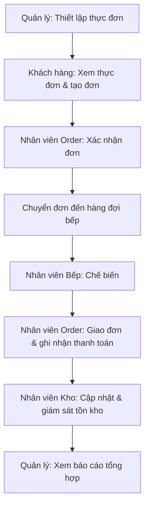
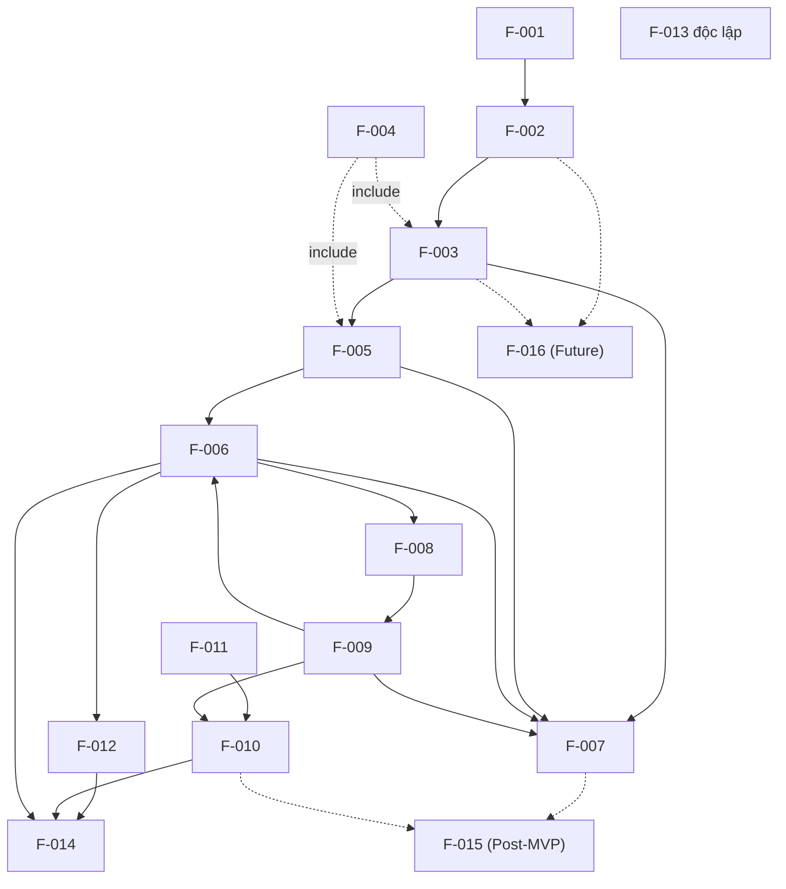
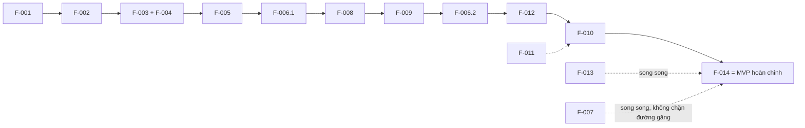

# Kế Hoạch Dự Án (Project Plan)

*Tài liệu tham chiếu: `docs/requirements/01-project-vision.md`, `docs/requirements/02-actor-analysis.md`, `docs/requirements/03-user-flows.md`, `docs/requirements/04-use-cases.md`, `docs/requirements/05-system-model.md`, `docs/requirements/06-feature-breakdown.md`*

## 1. Tổng Quan Dự Án

**Mục tiêu dự án:** Xây dựng một Hệ thống Quản lý Nhà hàng kết nối năm actor cốt lõi (Khách hàng, Nhân viên Order, Nhân viên Bếp, Nhân viên Kho, Quản lý) nhằm cải thiện hiệu quả, độ chính xác, và sự phối hợp trong vận hành nhà hàng.

**Phạm vi dự án:** Bao gồm 8 khu vực hệ thống (Menu Management, Order Management, Kitchen Operations, Inventory Management, Payment, Employee Management, Reporting & Monitoring, và AI Recommendation ở mức tương lai), được chuyển hoá thành 16 Feature cụ thể trong `06-feature-breakdown.md`.

**Actor chính:** Khách hàng, Nhân viên Order, Nhân viên Bếp, Nhân viên Kho, Quản lý.

**Mục đích của tài liệu này** là chuyển hoá tập Feature đã được ưu tiên hoá thành một **kế hoạch triển khai theo giai đoạn (phased delivery plan)** — xác định thứ tự xây dựng, các cột mốc (milestone), tiêu chí hoàn thành, rủi ro, và cách AI hỗ trợ quá trình phát triển. Tài liệu này là đầu vào chính cho **Bước 8 — PRD Generation**.

Đây là một **kế hoạch phát triển sản phẩm/tính năng**, **không phải** kế hoạch mã nguồn, thiết kế API, lược đồ cơ sở dữ liệu, hay kiến trúc kỹ thuật.

## 2. Nguyên Tắc Lập Kế Hoạch

- **Dựa trên yêu cầu (Requirement-driven):** Mọi giai đoạn và Feature đều bắt nguồn trực tiếp từ `06-feature-breakdown.md` — không có tính năng mới nào được thêm vào ở giai đoạn này.
- **Sắp xếp theo phụ thuộc (Dependency-driven):** Thứ tự các giai đoạn tuân theo Bản đồ Phụ thuộc Tính năng (Feature Dependency Map) đã xác định trước đó, đảm bảo không có Feature nào được xây dựng trước tiền đề của nó.
- **Ưu tiên MVP trước (MVP-first):** Các Feature "Required for MVP" được ưu tiên xếp vào các giai đoạn đầu; Feature Post-MVP và Future được tách riêng.
- **Bàn giao tăng dần (Incremental delivery):** Mỗi giai đoạn tạo ra một phần giá trị có thể quan sát/demo được, thay vì chờ đến cuối dự án mới có sản phẩm hoạt động.
- **Phát triển có hỗ trợ AI, có con người đánh giá (AI-assisted, human-reviewed):** AI được dùng để hỗ trợ phân tích, lập kế hoạch, tạo task, và kiểm thử trong suốt dự án, nhưng **mọi đầu ra của AI đều cần con người xem xét trước khi chấp nhận** — không có giai đoạn nào bỏ qua bước đánh giá của con người.

## 3. Phân Loại Phạm Vi

### 3.1 Phạm Vi Đã Xác Nhận (Confirmed Scope)

- 5 actor: Khách hàng, Nhân viên Order, Nhân viên Bếp, Nhân viên Kho, Quản lý.
- 8 khu vực chức năng cốt lõi theo Project Vision: Menu, Employee, Order, Kitchen, Inventory Management, Customer Management (ở mức cơ bản), Payment, Reporting.
- 14 Feature "Required for MVP" (F-001 đến F-014).

### 3.2 Phạm Vi Suy Luận (Derived Scope)

- Các quy tắc kinh doanh (Business Rules) như BR-001 đến BR-010 trong `04-use-cases.md`, được suy luận hợp lý từ các vấn đề đã nêu trong Project Vision nhưng chưa được xác nhận chi tiết bởi dự án (ví dụ: điều kiện chính xác để huỷ đơn hàng).
- F-007.2 Huỷ Đơn Hàng — thuộc Should Have theo Use Case Analysis nhưng được đưa vào MVP vì chi phí triển khai thấp và là phần mở rộng tự nhiên của F-007.1.

### 3.3 Phạm Vi Đề Xuất (Suggested Scope)

- F-015 Dashboard Giám Sát Thời Gian Thực — Post-MVP, bổ sung giá trị nhưng không bắt buộc để chứng minh giá trị cốt lõi của dự án.
- BR-005 (lý do từ chối đơn hàng phải thông báo khách hàng) — được gắn nhãn Suggested trong Use Case Analysis, chưa được xác nhận rõ ràng.

### 3.4 Phạm Vi Tương Lai (Future Scope)

- **F-016 Gợi Ý Món Ăn Cá Nhân Hoá (AI Recommendation)** — theo đúng Project Vision (Mục 8), đây là tính năng "có thể được bổ sung sau khi hệ thống cốt lõi hoàn thiện". **Không được đưa vào bất kỳ giai đoạn MVP nào trong kế hoạch này.**

> Kế hoạch này **không** tự ý chuyển bất kỳ mục nào ở Mục 3.3/3.4 thành phạm vi MVP đã xác nhận.

## 4. Hành Trình Sản Phẩm Cốt Lõi (Core Product Journey)

Hành trình tối thiểu chứng minh giá trị cốt lõi của hệ thống, được suy ra từ luồng E2E-01/E2E-02 trong `03-user-flows.md` và tập Feature MVP trong `06-feature-breakdown.md`:

```text
Quản lý thiết lập thực đơn (F-001)
        ↓
Khách hàng xem thực đơn và tạo đơn hàng (F-002, F-003, F-004)
        ↓
Nhân viên Order xác nhận đơn (F-005)
        ↓
Đơn được chuyển đến hàng đợi bếp (F-006.1)
        ↓
Nhân viên Bếp chế biến món ăn (F-008, F-009)
        ↓
Đơn được giao và ghi nhận thanh toán (F-006.2, F-012)
        ↓
Tồn kho được cập nhật và giám sát (F-011, F-010)
        ↓
Quản lý xem báo cáo tổng hợp (F-014)
```



Hành trình này bao phủ toàn bộ 5 actor và toàn bộ vòng đời một đơn hàng — từ thiết lập dữ liệu ban đầu đến báo cáo cuối cùng — và được dùng làm căn cứ chính để xác định phạm vi MVP.

## 5. Phạm Vi MVP

| Feature | Priority | MVP Status | Reason |
|---|---|---|---|
| F-001 Quản Lý Món Ăn | Must Have | Required for MVP | Điều kiện tiên quyết của toàn bộ hành trình cốt lõi |
| F-002 Xem Thực Đơn | Must Have | Required for MVP | Điều kiện tiên quyết để khách hàng đặt món |
| F-003 Tạo Đơn Hàng | Must Have | Required for MVP | Khởi đầu vòng đời vận hành |
| F-004 Kiểm Tra Tính Hợp Lệ Đơn Hàng | Must Have | Required for MVP | Đảm bảo tính đúng đắn dữ liệu đơn hàng |
| F-005 Xử Lý Đơn Hàng Mới | Must Have | Required for MVP | Bắt buộc để đơn hàng được xử lý |
| F-006 Điều Phối Đơn Hàng Đến Bếp & Hoàn Tất | Must Have | Required for MVP | Kết nối Order và Kitchen |
| F-007 Theo Dõi Đơn Hàng | Must Have | Required for MVP | Cần thiết để khách hàng biết tiến độ đơn |
| F-008 Quản Lý Hàng Đợi Bếp | Must Have | Required for MVP | Bắt buộc để bếp hoạt động |
| F-009 Cập Nhật Tiến Độ Chế Biến | Must Have | Required for MVP | Bắt buộc để hoàn thành vòng đời đơn hàng |
| F-010 Giám Sát Tồn Kho | Must Have | Required for MVP | Giải quyết vấn đề "inventory management" |
| F-011 Cập Nhật Tồn Kho | Must Have | Required for MVP | Duy trì dữ liệu tồn kho chính xác |
| F-012 Ghi Nhận Thanh Toán | Must Have | Required for MVP | Bắt buộc để đóng đơn hàng |
| F-013 Quản Lý Nhân Viên | Must Have | Required for MVP | Cần thiết cho quản lý nhân sự cơ bản |
| F-014 Xem Báo Cáo Vận Hành | Must Have | Required for MVP | Giải quyết vấn đề "reporting" |

**Vì sao tập Feature này là MVP:** Bộ 14 Feature trên là tập hợp **tối thiểu nhưng đầy đủ** để chứng minh mục tiêu chính của dự án — kết nối cả 5 actor trong một vòng đời vận hành hoàn chỉnh (đặt món → xử lý → chế biến → thanh toán → tồn kho → báo cáo). Không có Feature "Must Have" nào bị bỏ sót khỏi MVP, và không có Feature Should/Could Have nào (ngoại trừ F-007.2, đã giải thích ở Mục 3.2) được thêm vào một cách không cần thiết — điều này giữ MVP thực tế cho một dự án sinh viên, đúng theo nguyên tắc "MVP-first" và tránh mở rộng phạm vi.

## 6. Phân Tích Phụ Thuộc Tính Năng

| Feature | Depends On | Dependency Type | Impact |
|---|---|---|---|
| F-002 | F-001 | Data | Không thể hiển thị thực đơn nếu chưa có dữ liệu món ăn |
| F-003 | F-002, F-004 | Functional + Include | Không thể tạo đơn nếu chưa xem được thực đơn và chưa có cơ chế kiểm tra hợp lệ |
| F-005 | F-003, F-004 | Functional + Include | Không có gì để xử lý nếu chưa có đơn hàng được tạo |
| F-006 | F-005, F-009 | Sequential | Chỉ điều phối đơn đã xác nhận; cần tín hiệu hoàn thành từ bếp |
| F-007 | F-003, F-005, F-006, F-009 | Data | Trạng thái hiển thị tổng hợp từ nhiều nguồn — là Feature có độ trễ phụ thuộc cao nhất |
| F-008 | F-006 | Sequential | Hàng đợi bếp chỉ nhận đơn đã được điều phối |
| F-009 | F-008 | Sequential | Chỉ cập nhật tiến độ cho đơn đã bắt đầu chế biến |
| F-010 | F-011, F-009 | Data | Giám sát tồn kho cần dữ liệu cập nhật và báo cáo tiêu thụ |
| F-012 | F-006 | Sequential | Chỉ ghi nhận thanh toán khi đơn đã được giao |
| F-014 | F-012, F-010, F-006 | Data | Báo cáo tổng hợp là điểm cuối, phụ thuộc nhiều Feature khác nhất |
| F-013 | Không có | Độc lập | Có thể triển khai song song với các Feature khác |
| F-015 *(Post-MVP)* | F-007, F-010 | Data | Không nằm trong critical path của MVP |
| F-016 *(Future)* | F-002, F-003 | Data + Extend | Không nằm trong critical path của MVP |



## 7. Các Giai Đoạn Phát Triển (Development Phases)

### Phase 1 — Nền Tảng Dữ Liệu (Foundation Data)

**Objective:** Thiết lập dữ liệu nền tảng cần thiết trước khi bất kỳ luồng vận hành nào có thể bắt đầu.
**Included Features:** F-001 Quản Lý Món Ăn, F-002 Xem Thực Đơn, F-013 Quản Lý Nhân Viên.
**Related System Areas:** SA-001 Menu Management, SA-006 Employee Management.
**Related Actors:** Quản lý, Khách hàng.
**Dependencies:** Không có (giai đoạn khởi đầu).
**Deliverables:** Quản lý có thể thiết lập và cập nhật thực đơn; khách hàng có thể xem thực đơn; Quản lý có thể quản lý hồ sơ nhân viên.
**Completion Criteria:** UC-001, UC-019, UC-020 có thể thực hiện đầy đủ theo main success flow đã định nghĩa.

---

### Phase 2 — Luồng Đặt Món Cốt Lõi (Core Ordering Flow)

**Objective:** Cho phép khách hàng đặt món và Nhân viên Order xử lý đơn hàng mới.
**Included Features:** F-003 Tạo Đơn Hàng, F-004 Kiểm Tra Tính Hợp Lệ Đơn Hàng, F-005 Xử Lý Đơn Hàng Mới.
**Related System Areas:** SA-002 Order Management (một phần).
**Related Actors:** Khách hàng, Nhân viên Order.
**Dependencies:** Phụ thuộc Phase 1 (cần thực đơn tồn tại).
**Deliverables:** Khách hàng có thể tạo đơn hàng hợp lệ; Nhân viên Order có thể xem, xác nhận, hoặc từ chối đơn.
**Completion Criteria:** UC-002, UC-005, UC-006, UC-007, UC-023 có thể thực hiện đầy đủ, bao gồm cả luồng ngoại lệ (món hết hàng).

---

### Phase 3 — Vận Hành Bếp & Theo Dõi Đơn Hàng (Kitchen Operations & Order Tracking)

**Objective:** Hoàn thiện vòng đời đơn hàng qua bếp và cho phép khách hàng theo dõi tiến độ.
**Included Features:** F-006 Điều Phối Đơn Hàng Đến Bếp & Hoàn Tất, F-008 Quản Lý Hàng Đợi Bếp, F-009 Cập Nhật Tiến Độ Chế Biến, F-007 Theo Dõi Đơn Hàng.
**Related System Areas:** SA-002 Order Management (phần còn lại), SA-003 Kitchen Operations.
**Related Actors:** Nhân viên Order, Nhân viên Bếp, Khách hàng.
**Dependencies:** Phụ thuộc Phase 2 (cần đơn hàng đã xác nhận).
**Deliverables:** Đơn hàng được chuyển đến bếp, chế biến, và cập nhật trạng thái đến khi giao cho khách hàng; khách hàng thấy được trạng thái theo thời gian thực (ở mức cơ bản); có cơ chế báo cáo thiếu nguyên liệu.
**Completion Criteria:** UC-008, UC-009, UC-011, UC-012, UC-013, UC-014, UC-003, UC-004 có thể thực hiện đầy đủ.

---

### Phase 4 — Thanh Toán & Quản Lý Tồn Kho (Payment & Inventory Management)

**Objective:** Đóng vòng đời đơn hàng bằng thanh toán và duy trì dữ liệu tồn kho chính xác.
**Included Features:** F-012 Ghi Nhận Thanh Toán, F-011 Cập Nhật Tồn Kho, F-010 Giám Sát Tồn Kho.
**Related System Areas:** SA-005 Payment, SA-004 Inventory Management.
**Related Actors:** Nhân viên Order, Khách hàng, Nhân viên Kho.
**Dependencies:** Phụ thuộc Phase 3 (đơn hàng phải đã được giao; nguyên liệu phải được tiêu thụ để có dữ liệu cập nhật).
**Deliverables:** Đơn hàng được đóng sau khi thanh toán; tồn kho được cập nhật và cảnh báo khi thấp.
**Completion Criteria:** UC-010, UC-015, UC-016, UC-017, UC-018 có thể thực hiện đầy đủ.

---

### Phase 5 — Báo Cáo Vận Hành & Hoàn Thiện MVP (Operational Reporting & MVP Completion)

**Objective:** Cung cấp cho Quản lý cái nhìn tổng hợp để hoàn thiện toàn bộ hành trình sản phẩm cốt lõi.
**Included Features:** F-014 Xem Báo Cáo Vận Hành.
**Related System Areas:** SA-007 Reporting & Monitoring (một phần).
**Related Actors:** Quản lý.
**Dependencies:** Phụ thuộc Phase 2, 3, 4 (cần dữ liệu đơn hàng, tồn kho, và thanh toán để tổng hợp).
**Deliverables:** Quản lý xem được báo cáo doanh thu, số lượng đơn hàng, và tồn kho.
**Completion Criteria:** UC-021 có thể thực hiện đầy đủ; **kết thúc Phase 5 = MVP hoàn chỉnh, hỗ trợ đầy đủ hành trình sản phẩm cốt lõi ở Mục 4.**

---

### Phase 6 — Nâng Cao Sau MVP (Post-MVP Enhancement)

**Objective:** Bổ sung khả năng giám sát hợp nhất theo thời gian thực cho Quản lý.
**Included Features:** F-015 Dashboard Giám Sát Thời Gian Thực.
**Related System Areas:** SA-007 Reporting & Monitoring (phần còn lại).
**Related Actors:** Quản lý.
**Dependencies:** Phụ thuộc Phase 3 (F-007) và Phase 4 (F-010); chỉ nên bắt đầu sau khi MVP đã hoàn chỉnh và được đánh giá.
**Deliverables:** Dashboard hiển thị tình trạng đơn hàng và tồn kho theo thời gian thực.
**Completion Criteria:** UC-022 có thể thực hiện đầy đủ.

---

### Phase 7 — Tính Năng Tương Lai (Future Enhancement)

**Objective:** Xem xét bổ sung tính năng gợi ý món ăn cá nhân hoá bằng AI.
**Included Features:** F-016 Gợi Ý Món Ăn Cá Nhân Hoá.
**Related System Areas:** SA-008 AI Recommendation.
**Related Actors:** Khách hàng.
**Dependencies:** Phụ thuộc dữ liệu lịch sử đơn hàng (Phase 2); phụ thuộc quyết định nghiệp vụ chưa được xác nhận (cơ chế nhận diện khách hàng — xem Mục 17).
**Deliverables:** *(Chưa xác định — thuộc phạm vi Suggested/Future, chỉ được lên kế hoạch nếu dự án quyết định mở rộng sau MVP và Post-MVP.)*
**Completion Criteria:** *(Chưa xác định ở giai đoạn này.)*

## 8. Ánh Xạ Tính Năng Theo Giai Đoạn

| Feature | Phase | Priority | MVP Status | Dependencies | Reason |
|---|---|---|---|---|---|
| F-001 | Phase 1 | Must Have | Required for MVP | Không có | Nền tảng dữ liệu món ăn |
| F-013 | Phase 1 | Must Have | Required for MVP | Không có | Độc lập, có thể triển khai song song |
| F-002 | Phase 1 | Must Have | Required for MVP | F-001 | Cần dữ liệu món ăn trước |
| F-003 | Phase 2 | Must Have | Required for MVP | F-002, F-004 | Cần thực đơn hiển thị được |
| F-004 | Phase 2 | Must Have | Required for MVP | F-001, F-002 | Hỗ trợ tạo và xác nhận đơn |
| F-005 | Phase 2 | Must Have | Required for MVP | F-003, F-004 | Cần đơn hàng được tạo trước |
| F-006 | Phase 3 | Must Have | Required for MVP | F-005 | Cần đơn đã xác nhận |
| F-008 | Phase 3 | Must Have | Required for MVP | F-006 | Cần đơn được điều phối đến bếp |
| F-009 | Phase 3 | Must Have | Required for MVP | F-008 | Cần đơn trong hàng đợi bếp |
| F-007 | Phase 3 | Must Have | Required for MVP | F-003, F-005, F-006, F-009 | Tổng hợp trạng thái từ nhiều nguồn, hoàn thiện cùng luồng bếp |
| F-012 | Phase 4 | Must Have | Required for MVP | F-006 | Cần đơn đã giao |
| F-011 | Phase 4 | Must Have | Required for MVP | Không có | Có thể song song, nhưng đặt cùng phase với giám sát để có ý nghĩa demo |
| F-010 | Phase 4 | Must Have | Required for MVP | F-011, F-009 | Cần dữ liệu cập nhật và tiêu thụ |
| F-014 | Phase 5 | Must Have | Required for MVP | F-012, F-010, F-006 | Điểm tổng hợp cuối cùng của MVP |
| F-015 | Phase 6 | Should Have | Post-MVP | F-007, F-010 | Không thuộc critical path MVP |
| F-016 | Phase 7 | Could Have | Future | F-002, F-003 | Suggested/Future theo Project Vision |

## 9. Các Cột Mốc Dự Án (Milestones)

| Milestone | Phase | Objective | Deliverables | Completion Criteria |
|---|---|---|---|---|
| M1 — Nền tảng dữ liệu sẵn sàng | Phase 1 | Có dữ liệu thực đơn và nhân sự cơ bản | Thực đơn hiển thị được; hồ sơ nhân viên quản lý được | UC-001, UC-019, UC-020 hoàn thành |
| M2 — Luồng đặt món hoạt động | Phase 2 | Khách hàng đặt được món; Order Staff xử lý được đơn | Đơn hàng được tạo, xác nhận, hoặc từ chối | UC-002, UC-005 đến UC-007, UC-023 hoàn thành |
| M3 — Vòng đời đơn hàng qua bếp hoàn chỉnh | Phase 3 | Đơn hàng được chế biến và theo dõi đến khi giao | Đơn hoàn tất chế biến; khách hàng theo dõi được trạng thái | UC-003, UC-004, UC-008, UC-009, UC-011 đến UC-014 hoàn thành |
| M4 — Vận hành tài chính & tồn kho hoàn chỉnh | Phase 4 | Đơn hàng được thanh toán; tồn kho được duy trì chính xác | Giao dịch được ghi nhận; tồn kho cập nhật và cảnh báo | UC-010, UC-015 đến UC-018 hoàn thành |
| M5 — MVP hoàn chỉnh, sẵn sàng kiểm thử | Phase 5 | Toàn bộ hành trình sản phẩm cốt lõi khả dụng | Báo cáo vận hành khả dụng cho Quản lý; toàn bộ MVP có thể demo end-to-end | UC-021 hoàn thành; hành trình ở Mục 4 chạy được từ đầu đến cuối |
| M6 — Nâng cao Post-MVP hoàn tất | Phase 6 | Bổ sung dashboard giám sát thời gian thực | Dashboard khả dụng cho Quản lý | UC-022 hoàn thành |
| M7 — Đánh giá tính năng tương lai | Phase 7 | Xem xét khả năng bổ sung gợi ý AI | *(Tuỳ theo quyết định dự án)* | *(Chưa xác định — phụ thuộc câu hỏi mở)* |

## 10. Đường Găng (Critical Path)

Đường găng của MVP là chuỗi Feature bắt buộc phải hoàn thành tuần tự để có được hành trình sản phẩm cốt lõi end-to-end:

```text
F-001 (Quản lý món ăn)
        ↓
F-002 (Xem thực đơn)
        ↓
F-003 + F-004 (Tạo đơn hàng + Kiểm tra hợp lệ)
        ↓
F-005 (Xử lý đơn hàng mới)
        ↓
F-006.1 (Chuyển đơn đến bếp)
        ↓
F-008 (Hàng đợi bếp)
        ↓
F-009 (Cập nhật tiến độ chế biến)
        ↓
F-006.2 (Cập nhật giao hàng)
        ↓
F-012 (Ghi nhận thanh toán)
        ↓
F-010 (Giám sát tồn kho, cần F-011 chạy song song)
        ↓
F-014 (Báo cáo vận hành) → MVP hoàn chỉnh
```



*(F-011 Cập nhật Tồn kho, F-013 Quản lý Nhân viên, và F-007 Theo dõi Đơn hàng không nằm trực tiếp trên đường găng vì có thể triển khai song song, nhưng vẫn là Feature "Required for MVP".)*

## 11. Sản Phẩm Bàn Giao Theo Giai Đoạn

| Phase | Deliverable | Purpose |
|---|---|---|
| Phase 1 | Thực đơn quản lý được; hồ sơ nhân viên quản lý được | Thiết lập dữ liệu nền tảng cho toàn bộ hệ thống |
| Phase 2 | Đơn hàng có thể được tạo, xác nhận, hoặc từ chối | Kích hoạt luồng vận hành cốt lõi đầu tiên |
| Phase 3 | Đơn hàng được chế biến và giao; khách hàng theo dõi được | Hoàn thiện phần vận hành trung tâm của nhà hàng |
| Phase 4 | Đơn hàng được thanh toán; tồn kho được duy trì chính xác | Đóng vòng đời tài chính và vật tư của đơn hàng |
| Phase 5 | Báo cáo vận hành cho Quản lý | Hoàn chỉnh MVP, sẵn sàng để kiểm thử toàn diện |
| Phase 6 | Dashboard giám sát thời gian thực | Nâng cao trải nghiệm giám sát của Quản lý |
| Phase 7 | *(Chưa xác định)* | Xem xét mở rộng trải nghiệm cá nhân hoá cho khách hàng |

## 12. Tiêu Chí Chấp Nhận Theo Giai Đoạn

**Phase 1 hoàn thành khi:**
1. Quản lý có thể thêm, sửa, xoá món ăn và cập nhật trạng thái còn/hết hàng.
2. Khách hàng xem được thực đơn cập nhật ngay sau khi Quản lý thay đổi.
3. Quản lý có thể thêm, sửa, xoá hồ sơ nhân viên.
4. Không có lỗi nghiêm trọng nào chặn việc thiết lập dữ liệu ban đầu.

**Phase 2 hoàn thành khi:**
1. Khách hàng có thể tạo đơn hàng với một hoặc nhiều món.
2. Hệ thống từ chối thêm món hết hàng vào đơn (BR-001).
3. Nhân viên Order xem được danh sách đơn mới và có thể xác nhận hoặc từ chối kèm lý do.
4. Luồng CU-01 và OS-01 (bao gồm luồng ngoại lệ) có thể thực hiện trọn vẹn.

**Phase 3 hoàn thành khi:**
1. Đơn đã xác nhận xuất hiện trong hàng đợi bếp đúng thứ tự.
2. Nhân viên Bếp cập nhật được trạng thái chế biến và báo cáo thiếu nguyên liệu khi cần.
3. Khách hàng thấy được trạng thái đơn hàng cập nhật theo thời gian thực (ở mức cơ bản) và có thể huỷ đơn khi còn hợp lệ.
4. Luồng KS-01, KS-02, CU-02 có thể thực hiện trọn vẹn.

**Phase 4 hoàn thành khi:**
1. Nhân viên Order ghi nhận được thanh toán và đơn chuyển sang trạng thái hoàn tất.
2. Nhân viên Kho cập nhật được số lượng tồn kho sau khi sử dụng hoặc nhập hàng.
3. Hệ thống cảnh báo khi tồn kho xuống dưới ngưỡng.
4. Luồng OS-03, CU-03, WH-01, WH-02 có thể thực hiện trọn vẹn.

**Phase 5 hoàn thành khi:**
1. Quản lý xem được báo cáo doanh thu, số lượng đơn hàng, và tồn kho.
2. Toàn bộ hành trình sản phẩm cốt lõi (Mục 4) có thể thực hiện từ đầu đến cuối mà không có lỗi chặn nghiêm trọng.
3. Tất cả Use Case "Required for MVP" (22/24, xem `06-feature-breakdown.md` Mục 13) đều được hỗ trợ đầy đủ hoặc một phần theo đúng phân loại MVP.

**Phase 6 hoàn thành khi:**
1. Quản lý xem được dashboard hợp nhất trạng thái đơn hàng và tồn kho theo thời gian thực.
2. Dashboard không làm gián đoạn hoặc ảnh hưởng đến các chức năng MVP đã hoàn thành.

**Phase 7 hoàn thành khi:** *(Chưa xác định — phụ thuộc quyết định dự án về việc có triển khai tính năng này hay không, xem Mục 17.)*

## 13. Phân Tích Rủi Ro

| Risk ID | Risk | Probability | Impact | Mitigation |
|---|---|---|---|---|
| R-001 | Mở rộng phạm vi ngoài ý muốn (scope creep) — ví dụ tự ý triển khai F-016 hoặc F-015 sớm hơn kế hoạch | Medium | High | Tuân thủ nghiêm ngặt phân loại MVP/Post-MVP/Future đã xác nhận; mọi thay đổi phạm vi phải qua Review Checkpoint (Mục 15) |
| R-002 | Yêu cầu chưa rõ ràng ở một số điểm (phương thức thanh toán, ngưỡng tồn kho thấp, cơ chế huỷ đơn) có thể dẫn đến triển khai sai | High | Medium | Giải quyết các Câu hỏi Mở (Mục 17) trước khi bắt đầu Phase tương ứng (Phase 2 cho huỷ đơn, Phase 4 cho thanh toán/tồn kho) |
| R-003 | Vấn đề phụ thuộc bị bỏ sót giữa các Feature (ví dụ F-007 phụ thuộc 4 nguồn dữ liệu khác nhau) có thể gây chậm trễ nếu không được lập kế hoạch đồng bộ | Medium | Medium | Theo dõi sát Bản đồ Phụ thuộc (Mục 6) khi lập kế hoạch chi tiết từng Phase; xây dựng F-007 song song với Phase 3 thay vì chờ đến cuối |
| R-004 | Vòng đời MVP không hoàn chỉnh nếu một Phase bị bỏ dở giữa chừng (ví dụ hoàn thành Phase 1-3 nhưng bỏ qua Phase 4-5) | Low | High | Xác định rõ M5 (Mục 9) là mốc bắt buộc để coi dự án "hoàn chỉnh MVP"; không công bố sản phẩm hoàn chỉnh nếu chưa đạt M5 |
| R-005 | Sự không nhất quán trong yêu cầu do được tạo bởi AI qua nhiều giai đoạn phân tích (Vision → Actor → Flow → Use Case → System Model → Feature) | Medium | Medium | Đối chiếu chéo tài liệu tại mỗi Review Checkpoint (Mục 15); mỗi tài liệu mới đều tham chiếu và không được mâu thuẫn với tài liệu trước |
| R-006 | Trùng lặp chức năng giữa các Feature do ranh giới trách nhiệm chưa đủ rõ (ví dụ giữa F-007 và F-015) | Low | Low | Đã được rà soát ở `06-feature-breakdown.md` Mục 13 (không phát hiện trùng lặp); tiếp tục rà soát khi lập kế hoạch chi tiết từng Phase |
| R-007 | Thiếu tiêu chí chấp nhận chi tiết ở mức implementation (do tài liệu này chỉ dừng ở mức Phase) có thể gây hiểu lầm khi triển khai thực tế | Medium | Medium | Bổ sung tiêu chí chi tiết hơn ở giai đoạn PRD (Bước 8), dựa trên tiêu chí cấp Phase đã có ở Mục 12 |

## 14. Kế Hoạch Phát Triển Có Hỗ Trợ AI (AI-Assisted Development Plan)

| Project Activity | AI Assistance | Human Responsibility |
|---|---|---|
| Phân tích yêu cầu (đã thực hiện qua các tài liệu 01-06) | AI hỗ trợ tổng hợp, cấu trúc hoá, và phát hiện mâu thuẫn giữa các tài liệu | Con người xác nhận phạm vi, quyết định các câu hỏi mở, phê duyệt tài liệu cuối cùng |
| Lập kế hoạch tính năng (Feature Planning) | AI hỗ trợ phát hiện phụ thuộc giữa các Feature và đề xuất thứ tự xây dựng | Con người xác nhận thứ tự giai đoạn có phù hợp với nguồn lực và mục tiêu thực tế của nhóm hay không |
| Lập kế hoạch triển khai (Implementation Planning) | AI có thể hỗ trợ tạo phân rã công việc (task breakdown) chi tiết hơn từ các Phase/Feature trong tài liệu này | Con người rà soát và điều chỉnh task cho phù hợp với năng lực nhóm phát triển |
| Kiểm thử (Testing) | AI có thể hỗ trợ tạo kịch bản kiểm thử (test scenarios) dựa trên Use Case và Business Rules đã xác định | Con người xác minh kịch bản kiểm thử có bao phủ đúng yêu cầu nghiệp vụ, và thực hiện kiểm thử thực tế |
| Đánh giá & Rà soát (Review) | AI có thể hỗ trợ kiểm tra tính nhất quán giữa các tài liệu (Vision → ... → Project Plan) | Con người đưa ra quyết định cuối cùng về việc chấp nhận hay yêu cầu chỉnh sửa |
| Tài liệu hoá (Documentation) | AI hỗ trợ soạn thảo và cập nhật tài liệu dự án theo cấu trúc nhất quán | Con người phê duyệt nội dung trước khi tài liệu được xem là chính thức |

> **Lưu ý quan trọng:** AI có thể tăng tốc độ và tính nhất quán của quá trình phân tích, lập kế hoạch, và tài liệu hoá, nhưng **không đảm bảo tính đúng đắn tuyệt đối**. Mọi đầu ra do AI tạo ra trong dự án này — bao gồm cả sáu tài liệu đã hoàn thành (01 đến 06) và tài liệu này — đều cần được con người rà soát trước khi được xem là yêu cầu hoặc kế hoạch chính thức.

## 15. Các Điểm Kiểm Soát & Rà Soát Dự Án (Project Review Checkpoints)

| Checkpoint | What Is Reviewed | Expected Outcome |
|---|---|---|
| Rà soát Yêu cầu (Requirements Review) | Tính nhất quán giữa `01-project-vision.md` đến `04-use-cases.md` | Xác nhận yêu cầu và phạm vi trước khi tiếp tục mô hình hoá hệ thống |
| Rà soát Tính năng (Feature Review) | Tính đầy đủ và không trùng lặp của `06-feature-breakdown.md` so với Use Case | Xác nhận mọi Use Case quan trọng đều có Feature hỗ trợ, không có Feature thừa |
| Rà soát Phạm vi MVP (MVP Scope Review) | Tập Feature MVP ở Mục 5 của tài liệu này | Xác nhận MVP thực tế, khả thi, và chứng minh được giá trị cốt lõi của dự án |
| Rà soát Hoàn thành Giai đoạn (Phase Completion Review) | Tiêu chí chấp nhận của từng Phase (Mục 12) sau khi Phase đó hoàn tất | Quyết định cho phép chuyển sang Phase tiếp theo hoặc yêu cầu khắc phục |
| Rà soát Cuối cùng (Final Review) | Toàn bộ MVP so với hành trình sản phẩm cốt lõi (Mục 4) và Use Case Analysis | Xác nhận dự án sẵn sàng cho bước PRD Generation (Bước 8) |

## 16. Tóm Tắt Truy Vết (Traceability Summary)

| Phase | Features | Use Cases | User Flows | Actors |
|---|---|---|---|---|
| Phase 1 | F-001, F-002, F-013 | UC-001, UC-019, UC-020 | MG-01, CU-01, MG-02 | Quản lý, Khách hàng |
| Phase 2 | F-003, F-004, F-005 | UC-002, UC-005, UC-006, UC-007, UC-023 | CU-01, OS-01 | Khách hàng, Nhân viên Order |
| Phase 3 | F-006, F-007, F-008, F-009 | UC-003, UC-004, UC-008, UC-009, UC-011 đến UC-014 | CU-02, OS-02, OS-03 (một phần), KS-01, KS-02 | Khách hàng, Nhân viên Order, Nhân viên Bếp |
| Phase 4 | F-010, F-011, F-012 | UC-010, UC-015 đến UC-018 | OS-03, CU-03, WH-01, WH-02 | Nhân viên Order, Khách hàng, Nhân viên Kho |
| Phase 5 | F-014 | UC-021 | MG-03 | Quản lý |
| Phase 6 | F-015 | UC-022 | MG-03 | Quản lý |
| Phase 7 | F-016 | UC-024 | AI-01 | Khách hàng |

## 17. Câu Hỏi Còn Bỏ Ngỏ

| Question | Related Phase | Why it matters | Possible options | Recommended option |
|---|---|---|---|---|
| Phương thức thanh toán cụ thể là gì? | Phase 4 | Ảnh hưởng trực tiếp đến phạm vi chi tiết của F-012 trước khi Phase 4 bắt đầu | (a) Chỉ tiền mặt; (b) Tiền mặt + thẻ; (c) Đa phương thức | Không đề xuất — cần xác nhận trước khi bắt đầu Phase 4 |
| Ngưỡng "tồn kho thấp" do ai/thế nào thiết lập? | Phase 4 | Ảnh hưởng đến phạm vi chi tiết của F-010.2 | (a) Ngưỡng cố định; (b) Ngưỡng do Nhân viên Kho/Quản lý cấu hình | Đề xuất (b), cần xác nhận trước Phase 4 |
| Điều kiện chính xác để huỷ đơn hàng là gì? | Phase 2 | Ảnh hưởng đến phạm vi chi tiết của F-007.2 | (a) Chỉ khi "chờ xác nhận"; (b) Cho phép đến khi bắt đầu chế biến | Không đề xuất — cần quyết định nghiệp vụ trước Phase 2/3 |
| F-006.1 (chuyển đơn đến bếp) là tự động hay thủ công? | Phase 3 | Ảnh hưởng đến việc có cần thêm một bước thao tác rõ ràng cho Nhân viên Order hay không | (a) Tự động; (b) Thủ công | Đề xuất (a), cần xác nhận trước Phase 3 |
| Khách hàng có cần tài khoản để hỗ trợ F-016 hoạt động đầy đủ? | Phase 7 | F-016 phụ thuộc vào việc nhận diện khách hàng qua nhiều lần đặt món | (a) Bắt buộc tài khoản; (b) Không hỗ trợ khách vãng lai cho tính năng này | Giữ nguyên trạng thái mở — chỉ cần giải quyết nếu dự án quyết định triển khai Phase 7 |
| Dự án có đủ nguồn lực/thời gian để thực hiện cả Phase 6 và Phase 7, hay nên dừng lại ở MVP (Phase 1-5)? | Phase 6, Phase 7 | Ảnh hưởng đến việc lập kế hoạch thời gian thực tế cho một dự án sinh viên | (a) Chỉ thực hiện Phase 1-5 (MVP); (b) Thực hiện thêm Phase 6; (c) Thực hiện đầy đủ đến Phase 7 | Đề xuất (a) hoặc (b) để giữ tính thực tế; (c) chỉ nên cân nhắc nếu còn dư thời gian sau khi MVP được đánh giá thành công |

## 18. Lộ Trình Dự Án Tổng Thể (Final Project Roadmap)

```text
Tầm Nhìn Dự Án (01-project-vision.md)
        ↓
Phân Tích Actor & Nhu Cầu Người Dùng (02-actor-analysis.md)
        ↓
Phân Tích Luồng Người Dùng (03-user-flows.md)
        ↓
Phân Tích Use Case (04-use-cases.md)
        ↓
Mô Hình Hệ Thống (05-system-model.md)
        ↓
Phân Rã Tính Năng (06-feature-breakdown.md)
        ↓
Kế Hoạch Dự Án (07-project-plan.md) — Tài liệu hiện tại
        ↓
Phase 1 — Nền Tảng Dữ Liệu
        ↓
Phase 2 — Luồng Đặt Món Cốt Lõi
        ↓
Phase 3 — Vận Hành Bếp & Theo Dõi Đơn Hàng
        ↓
Phase 4 — Thanh Toán & Quản Lý Tồn Kho
        ↓
Phase 5 — Báo Cáo Vận Hành & Hoàn Thiện MVP
        ↓
MVP Hoàn Chỉnh (Milestone M5)
        ↓
Phase 6 — Nâng Cao Post-MVP (Dashboard Giám Sát)
        ↓
Phase 7 — Tính Năng Tương Lai (Gợi Ý Món Ăn AI) *(nếu được quyết định triển khai)*
        ↓
Bước 8 — PRD Generation
```

## 19. Kiểm Tra Tính Nhất Quán (Consistency Check)

1. [x] Phạm vi MVP hỗ trợ đúng mục tiêu chính của dự án (kết nối 5 actor trong một vòng đời vận hành hoàn chỉnh).
2. [x] MVP bao gồm một hành trình end-to-end có ý nghĩa (Mục 4).
3. [x] Các Feature được xếp vào giai đoạn hợp lý theo phụ thuộc (Mục 7, Mục 8).
4. [x] Các phụ thuộc được tôn trọng, không có phụ thuộc vòng tròn (Mục 6, Mục 10).
5. [x] Đường găng (critical path) đã được xác định rõ ràng (Mục 10).
6. [x] Mỗi giai đoạn chính đều có sản phẩm bàn giao (Mục 11).
7. [x] Mỗi giai đoạn chính đều có tiêu chí hoàn thành (Mục 12).
8. [x] Rủi ro dự án đã được xác định (Mục 13).
9. [x] Vai trò hỗ trợ của AI được xác định rõ ràng (Mục 14).
10. [x] Việc rà soát của con người vẫn là một phần bắt buộc của quy trình (Mục 14, Mục 15).
11. [x] Các giai đoạn dự án có thể truy vết về Feature (Mục 16).
12. [x] Các Feature vẫn truy vết được về yêu cầu trước đó (Mục 16, kế thừa từ `06-feature-breakdown.md`).
13. [x] Các tính năng Suggested/Future (F-015, F-016) không bị âm thầm chuyển thành phạm vi MVP đã xác nhận (Mục 3.3, 3.4, Mục 5).
14. [x] Kế hoạch phù hợp để làm đầu vào cho việc tạo PRD (Bước 8).