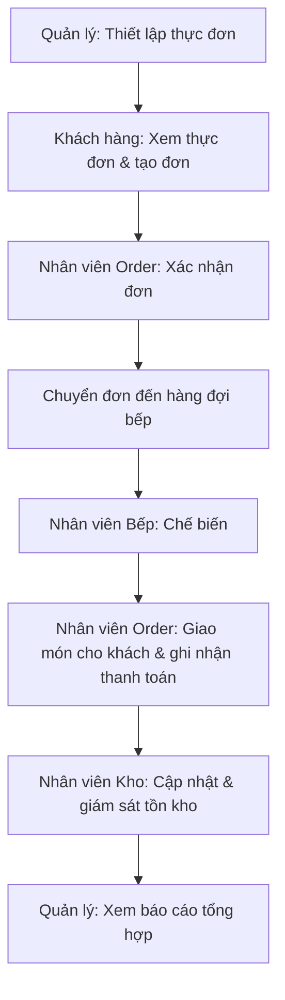

# Tài Liệu Yêu Cầu Sản Phẩm (Product Requirements Document — PRD)

*Tài liệu hợp nhất từ: `01-project-vision.md`, `02-actor-analysis.md`, `03-user-flows.md`, `04-use-cases.md`, `05-system-model.md`, `06-feature-breakdown.md`, `07-project-plan.md`*

## 1. Tổng Quan Sản Phẩm

### 1.1 Tên Sản Phẩm

**Hệ Thống Quản Lý Nhà Hàng** (Xây dựng hệ thống quản lí nhà hàng)

### 1.2 Mục Đích Sản Phẩm

Kết nối năm vai trò cốt lõi trong hoạt động của một nhà hàng — Khách hàng, Nhân viên Order, Nhân viên Bếp, Nhân viên Kho, và Quản lý — vào một nền tảng thống nhất, giúp thông tin luân chuyển thông suốt giữa các vai trò và các giai đoạn vận hành, thay vì dựa vào quy trình thủ công hoặc các công cụ rời rạc.

### 1.3 Phát Biểu Vấn Đề

Các nhà hàng vận hành thủ công hoặc dùng nhiều công cụ rời rạc thường gặp: đặt món chậm và dễ sai sót; đơn hàng bị thất lạc hoặc xử lý chậm; bếp không nhận đơn kịp thời hoặc không rõ thứ tự ưu tiên; tồn kho thiếu minh bạch dẫn đến thiếu hụt hoặc lãng phí; quản lý nhân sự và vận hành thiếu tập trung; báo cáo chậm và dễ sai sót; và thông tin không đồng bộ giữa các bộ phận.

### 1.4 Tầm Nhìn Sản Phẩm

Trở thành một hệ thống cốt lõi hỗ trợ trọn vẹn vòng đời vận hành nhà hàng — từ đặt món, xử lý đơn, chế biến, quản lý tồn kho, đến báo cáo — với mức độ phức tạp thực tế và khả thi cho một dự án sinh viên, đồng thời để ngỏ khả năng mở rộng bằng tính năng gợi ý món ăn cá nhân hoá (AI) trong tương lai.

## 2. Mục Tiêu Sản Phẩm

### 2.1 Mục Tiêu Chính (Primary Goals)

- Cải thiện hiệu quả, độ chính xác, và sự phối hợp trong vận hành nhà hàng bằng cách kết nối Khách hàng, nhân viên, và Quản lý qua một nền tảng thống nhất.
- Hỗ trợ trọn vẹn một vòng đời đơn hàng end-to-end: đặt món → xác nhận → chế biến → giao món cho khách → thanh toán → cập nhật tồn kho → báo cáo.

### 2.2 Mục Tiêu Phụ (Secondary Goals)

- Giảm sai sót thủ công trong việc ghi nhận và xử lý đơn hàng.
- Tăng khả năng hiển thị (visibility) của tồn kho để tránh thiếu hụt nguyên liệu.
- Cung cấp cho Quản lý dữ liệu tổng hợp kịp thời để ra quyết định vận hành.

### 2.3 Tiêu Chí Thành Công (Success Criteria)

- **Định tính (đã xác nhận):** Hành trình sản phẩm cốt lõi (Mục 5) có thể thực hiện từ đầu đến cuối mà không có lỗi chặn nghiêm trọng, tương ứng với việc đạt Milestone M5 trong `07-project-plan.md`.
- **Định lượng:** Chưa có chỉ số đo lường cụ thể (ví dụ: thời gian xử lý đơn hàng mục tiêu, tỷ lệ lỗi chấp nhận được) được xác nhận trong các tài liệu nguồn. **Đây là Câu hỏi Mở** — xem Mục 20 (OQ-01).

## 3. Người Dùng Mục Tiêu & Actor

| Actor | Role | Primary Goal | Main Interaction |
|---|---|---|---|
| Khách hàng | Người đặt món và sử dụng dịch vụ nhà hàng | Đặt món dễ dàng, nhanh chóng, và theo dõi được đơn hàng | Xem thực đơn, tạo đơn hàng, theo dõi/huỷ đơn |
| Nhân viên Order | Tiếp nhận và xử lý đơn hàng của khách hàng | Xử lý đơn chính xác, kịp thời | Xác nhận/từ chối đơn, chuyển đơn đến bếp, ghi nhận thanh toán |
| Nhân viên Bếp | Chế biến món ăn theo đơn hàng | Chế biến đúng nội dung, đúng thứ tự ưu tiên | Xem hàng đợi bếp, cập nhật trạng thái chế biến, báo cáo thiếu nguyên liệu |
| Nhân viên Kho | Quản lý nguyên liệu và vật tư | Duy trì tồn kho chính xác, tránh thiếu hụt | Xem/cập nhật tồn kho, xử lý cảnh báo và nhập hàng |
| Quản lý | Giám sát và điều hành nhà hàng | Ra quyết định dựa trên dữ liệu vận hành đầy đủ, kịp thời | Quản lý thực đơn/nhân sự, xem báo cáo và giám sát |

## 4. Phạm Vi Sản Phẩm

### 4.1 Trong Phạm Vi (In Scope)

Quản lý thực đơn, quản lý đơn hàng (tạo/xác nhận/theo dõi/huỷ), vận hành bếp, quản lý tồn kho cơ bản, ghi nhận thanh toán ở mức nghiệp vụ, quản lý nhân sự cơ bản, và báo cáo vận hành.

### 4.2 Ngoài Phạm Vi (Out of Scope)

Hỗ trợ đa nhà hàng/đa chi nhánh; logistics giao hàng và tích hợp bên giao hàng thứ ba; tích hợp cổng thanh toán nâng cao (nhiều nhà cung cấp); phân tích/BI nâng cao; chương trình khách hàng thân thiết; quản lý chuỗi cung ứng/nhà cung cấp nâng cao. *(Nguồn: `01-project-vision.md` Mục 5.2.)*

### 4.3 Phạm Vi MVP

14 Feature "Required for MVP": F-001 đến F-014 (xem chi tiết Mục 7 và Mục 12).

### 4.4 Phạm Vi Post-MVP

F-015 Dashboard Giám Sát Thời Gian Thực.

### 4.5 Phạm Vi Tương Lai (Future)

F-016 Gợi Ý Món Ăn Cá Nhân Hoá (AI) — theo Project Vision, "có thể được bổ sung sau khi hệ thống cốt lõi hoàn thiện"; **không được xem là phạm vi đã xác nhận**.

## 5. Hành Trình Sản Phẩm Cốt Lõi

```text
Quản lý thiết lập thực đơn
        ↓
Khách hàng xem thực đơn và tạo đơn hàng
        ↓
Nhân viên Order xác nhận đơn
        ↓
Đơn được chuyển đến hàng đợi bếp
        ↓
Nhân viên Bếp chế biến món ăn
        ↓
Món được giao cho khách và ghi nhận thanh toán
        ↓
Tồn kho được cập nhật và giám sát
        ↓
Quản lý xem báo cáo tổng hợp
```



## 6. Tổng Quan Năng Lực Hệ Thống

| System Area | Main Capability | Primary Actors |
|---|---|---|
| SA-001 Menu Management | Duy trì và hiển thị thực đơn | Quản lý, Khách hàng |
| SA-002 Order Management | Quản lý toàn bộ vòng đời đơn hàng | Khách hàng, Nhân viên Order, Nhân viên Bếp |
| SA-003 Kitchen Operations | Điều phối việc chế biến món ăn | Nhân viên Bếp, Nhân viên Order |
| SA-004 Inventory Management | Theo dõi và duy trì tồn kho nguyên liệu | Nhân viên Kho, Nhân viên Bếp, Quản lý |
| SA-005 Payment | Ghi nhận giao dịch và đóng đơn hàng | Nhân viên Order, Khách hàng |
| SA-006 Employee Management | Quản lý thông tin và vai trò nhân viên | Quản lý |
| SA-007 Reporting & Monitoring | Cung cấp báo cáo và giám sát vận hành | Quản lý |
| SA-008 AI Recommendation *(Future)* | Gợi ý món ăn cá nhân hoá | Khách hàng |

## 7. Tổng Quan Tính Năng

| Feature ID | Feature | Primary Actor | Priority | MVP Status |
|---|---|---|---|---|
| F-001 | Quản Lý Món Ăn | Quản lý | Must Have | Required for MVP |
| F-002 | Xem Thực Đơn | Khách hàng | Must Have | Required for MVP |
| F-003 | Tạo Đơn Hàng | Khách hàng | Must Have | Required for MVP |
| F-004 | Kiểm Tra Tính Hợp Lệ Đơn Hàng | *(Hỗ trợ nội bộ)* | Must Have | Required for MVP |
| F-005 | Xử Lý Đơn Hàng Mới | Nhân viên Order | Must Have | Required for MVP |
| F-006 | Điều Phối Đơn Hàng Đến Bếp & Hoàn Tất | Nhân viên Order | Must Have | Required for MVP |
| F-007 | Theo Dõi Đơn Hàng | Khách hàng | Must Have | Required for MVP |
| F-008 | Quản Lý Hàng Đợi Bếp | Nhân viên Bếp | Must Have | Required for MVP |
| F-009 | Cập Nhật Tiến Độ Chế Biến | Nhân viên Bếp | Must Have | Required for MVP |
| F-010 | Giám Sát Tồn Kho | Nhân viên Kho | Must Have | Required for MVP |
| F-011 | Cập Nhật Tồn Kho | Nhân viên Kho | Must Have | Required for MVP |
| F-012 | Ghi Nhận Thanh Toán | Nhân viên Order | Must Have | Required for MVP |
| F-013 | Quản Lý Nhân Viên | Quản lý | Must Have | Required for MVP |
| F-014 | Xem Báo Cáo Vận Hành | Quản lý | Must Have | Required for MVP |
| F-015 | Dashboard Giám Sát Thời Gian Thực | Quản lý | Should Have | Post-MVP |
| F-016 | Gợi Ý Món Ăn Cá Nhân Hoá | Khách hàng | Could Have | Future *(Suggested)* |

## 8. Yêu Cầu Chức Năng (Functional Requirements)

| Requirement ID | Requirement | Feature | Actor | Priority | MVP Status | Source |
|---|---|---|---|---|---|---|
| FR-001 | Hệ thống phải cho phép Quản lý thêm, sửa, xoá món ăn và cập nhật trạng thái còn/hết hàng | F-001 | Quản lý | Must Have | Required for MVP | Confirmed |
| FR-002 | Hệ thống phải hiển thị cho khách hàng danh sách món ăn hiện có kèm trạng thái còn/hết hàng | F-002 | Khách hàng | Must Have | Required for MVP | Confirmed |
| FR-003 | Hệ thống phải cho phép khách hàng chọn món, xác định số lượng, và tạo đơn hàng mới | F-003 | Khách hàng | Must Have | Required for MVP | Confirmed |
| FR-004 | Hệ thống phải kiểm tra tính hợp lệ (còn hàng) của các món trong đơn trước khi tạo hoặc xác nhận đơn | F-004 | *(Hỗ trợ)* | Must Have | Required for MVP | Derived |
| FR-005 | Hệ thống phải cho phép Nhân viên Order xem, xác nhận, hoặc từ chối đơn hàng mới kèm lý do khi từ chối | F-005 | Nhân viên Order | Must Have | Required for MVP | Confirmed |
| FR-006 | Hệ thống phải chuyển đơn đã xác nhận vào hàng đợi bếp và cập nhật trạng thái khi đơn được giao | F-006 | Nhân viên Order | Must Have | Required for MVP | Confirmed |
| FR-007 | Hệ thống phải hiển thị trạng thái đơn hàng cho khách hàng và cho phép huỷ đơn khi còn hợp lệ | F-007 | Khách hàng | Must Have | Required for MVP | Confirmed (huỷ đơn: Derived) |
| FR-008 | Hệ thống phải hiển thị hàng đợi bếp theo thứ tự ưu tiên và cho phép bắt đầu chế biến | F-008 | Nhân viên Bếp | Must Have | Required for MVP | Confirmed |
| FR-009 | Hệ thống phải cho phép đánh dấu món hoàn thành hoặc báo cáo thiếu nguyên liệu | F-009 | Nhân viên Bếp | Must Have | Required for MVP | Confirmed |
| FR-010 | Hệ thống phải hiển thị mức tồn kho hiện tại và cảnh báo khi xuống dưới ngưỡng quy định | F-010 | Nhân viên Kho | Must Have | Required for MVP | Confirmed (ngưỡng cụ thể: Derived) |
| FR-011 | Hệ thống phải cho phép cập nhật số lượng tồn kho sau khi sử dụng hoặc nhập hàng | F-011 | Nhân viên Kho | Must Have | Required for MVP | Confirmed |
| FR-012 | Hệ thống phải cho phép ghi nhận giao dịch thanh toán và đóng đơn hàng | F-012 | Nhân viên Order | Must Have | Required for MVP | Confirmed |
| FR-013 | Hệ thống phải cho phép Quản lý thêm, sửa, xoá thông tin và vai trò nhân viên | F-013 | Quản lý | Must Have | Required for MVP | Confirmed |
| FR-014 | Hệ thống phải cung cấp báo cáo tổng hợp về doanh thu, số lượng đơn hàng, và tồn kho | F-014 | Quản lý | Must Have | Required for MVP | Confirmed |
| FR-015 | Hệ thống nên cung cấp dashboard giám sát hợp nhất tình trạng đơn hàng và tồn kho theo thời gian thực | F-015 | Quản lý | Should Have | Post-MVP | Suggested |
| FR-016 | Hệ thống có thể gợi ý món ăn cá nhân hoá cho khách hàng dựa trên lịch sử đặt món | F-016 | Khách hàng | Could Have | Future | Suggested/Future |

## 9. Yêu Cầu Chi Tiết Theo Tính Năng Chính

### F-001 — Quản Lý Món Ăn

**Purpose:** Duy trì danh mục món ăn chính xác, cập nhật.
**Primary Actor:** Quản lý
**Related Actors:** Không có
**Related System Area:** SA-001
**Related Use Cases:** UC-019
**Functional Requirements:** FR-001
**Priority:** Must Have
**MVP Status:** Required for MVP
**Dependencies:** Là điều kiện tiên quyết cho F-002.

### F-002 — Xem Thực Đơn

**Purpose:** Cho phép khách hàng xem thực đơn hiện có.
**Primary Actor:** Khách hàng
**Related Actors:** Không có
**Related System Area:** SA-001
**Related Use Cases:** UC-001
**Functional Requirements:** FR-002
**Priority:** Must Have
**MVP Status:** Required for MVP
**Dependencies:** Phụ thuộc F-001.

### F-003 — Tạo Đơn Hàng

**Purpose:** Cho phép khách hàng tạo đơn hàng từ các món đã chọn.
**Primary Actor:** Khách hàng
**Related Actors:** Nhân viên Order (nhận đơn tiếp theo)
**Related System Area:** SA-002
**Related Use Cases:** UC-002
**Functional Requirements:** FR-003
**Priority:** Must Have
**MVP Status:** Required for MVP
**Dependencies:** Phụ thuộc F-002; include F-004.

### F-004 — Kiểm Tra Tính Hợp Lệ Đơn Hàng

**Purpose:** Đảm bảo đơn hàng không chứa món ăn không hợp lệ.
**Primary Actor:** *(Hỗ trợ nội bộ)*
**Related Actors:** Không có
**Related System Area:** SA-002
**Related Use Cases:** UC-023
**Functional Requirements:** FR-004
**Priority:** Must Have
**MVP Status:** Required for MVP
**Dependencies:** Được include bởi F-003 và F-005.

### F-005 — Xử Lý Đơn Hàng Mới

**Purpose:** Cho phép Nhân viên Order xem, xác nhận, hoặc từ chối đơn hàng.
**Primary Actor:** Nhân viên Order
**Related Actors:** Khách hàng
**Related System Area:** SA-002
**Related Use Cases:** UC-005, UC-006, UC-007
**Functional Requirements:** FR-005
**Priority:** Must Have
**MVP Status:** Required for MVP
**Dependencies:** Phụ thuộc F-003; include F-004.

### F-006 — Điều Phối Đơn Hàng Đến Bếp & Hoàn Tất

**Purpose:** Chuyển đơn đến bếp và cập nhật trạng thái giao món cho khách hàng.
**Primary Actor:** Nhân viên Order
**Related Actors:** Nhân viên Bếp
**Related System Area:** SA-002
**Related Use Cases:** UC-008, UC-009
**Functional Requirements:** FR-006
**Priority:** Must Have
**MVP Status:** Required for MVP
**Dependencies:** Phụ thuộc F-005; phụ thuộc F-009 (tín hiệu hoàn thành).

### F-007 — Theo Dõi Đơn Hàng

**Purpose:** Cho phép khách hàng theo dõi và huỷ đơn hàng.
**Primary Actor:** Khách hàng
**Related Actors:** Nhân viên Order
**Related System Area:** SA-002
**Related Use Cases:** UC-003, UC-004
**Functional Requirements:** FR-007
**Priority:** Must Have
**MVP Status:** Required for MVP
**Dependencies:** Phụ thuộc F-003, F-005, F-006, F-009.

### F-008 — Quản Lý Hàng Đợi Bếp

**Purpose:** Sắp xếp và hiển thị đơn hàng cần chế biến.
**Primary Actor:** Nhân viên Bếp
**Related Actors:** Không có
**Related System Area:** SA-003
**Related Use Cases:** UC-011, UC-012
**Functional Requirements:** FR-008
**Priority:** Must Have
**MVP Status:** Required for MVP
**Dependencies:** Phụ thuộc F-006 (đơn đã được giao món cho khách hàng).

### F-009 — Cập Nhật Tiến Độ Chế Biến

**Purpose:** Đánh dấu món hoàn thành hoặc báo cáo thiếu nguyên liệu.
**Primary Actor:** Nhân viên Bếp
**Related Actors:** Nhân viên Order, Nhân viên Kho
**Related System Area:** SA-003
**Related Use Cases:** UC-013, UC-014
**Functional Requirements:** FR-009
**Priority:** Must Have
**MVP Status:** Required for MVP
**Dependencies:** Phụ thuộc F-008.

### F-010 — Giám Sát Tồn Kho

**Purpose:** Hiển thị tồn kho và cảnh báo khi thấp.
**Primary Actor:** Nhân viên Kho
**Related Actors:** Quản lý
**Related System Area:** SA-004
**Related Use Cases:** UC-015, UC-017
**Functional Requirements:** FR-010
**Priority:** Must Have
**MVP Status:** Required for MVP
**Dependencies:** Phụ thuộc F-011, F-009.

### F-011 — Cập Nhật Tồn Kho

**Purpose:** Cập nhật số lượng nguyên liệu sau sử dụng hoặc nhập hàng.
**Primary Actor:** Nhân viên Kho
**Related Actors:** Không có
**Related System Area:** SA-004
**Related Use Cases:** UC-016, UC-018
**Functional Requirements:** FR-011
**Priority:** Must Have
**MVP Status:** Required for MVP
**Dependencies:** Không có.

### F-012 — Ghi Nhận Thanh Toán

**Purpose:** Ghi nhận giao dịch sau khi khách hàng thanh toán và đóng đơn hàng.
**Primary Actor:** Nhân viên Order
**Related Actors:** Khách hàng
**Related System Area:** SA-005
**Related Use Cases:** UC-010
**Functional Requirements:** FR-012
**Priority:** Must Have
**MVP Status:** Required for MVP
**Dependencies:** Phụ thuộc F-006 (đơn đã được giao món cho khách hàng).

### F-013 — Quản Lý Nhân Viên

**Purpose:** Quản lý thông tin và vai trò nhân viên.
**Primary Actor:** Quản lý
**Related Actors:** Không có
**Related System Area:** SA-006
**Related Use Cases:** UC-020
**Functional Requirements:** FR-013
**Priority:** Must Have
**MVP Status:** Required for MVP
**Dependencies:** Không có.

### F-014 — Xem Báo Cáo Vận Hành

**Purpose:** Cung cấp báo cáo tổng hợp cho Quản lý.
**Primary Actor:** Quản lý
**Related Actors:** Không có
**Related System Area:** SA-007
**Related Use Cases:** UC-021
**Functional Requirements:** FR-014
**Priority:** Must Have
**MVP Status:** Required for MVP
**Dependencies:** Phụ thuộc F-012, F-010, F-006.

### F-015 — Dashboard Giám Sát Thời Gian Thực *(Post-MVP)*

**Purpose:** Cung cấp cái nhìn hợp nhất, thời gian thực về đơn hàng và tồn kho.
**Primary Actor:** Quản lý
**Related Actors:** Không có
**Related System Area:** SA-007
**Related Use Cases:** UC-022
**Functional Requirements:** FR-015
**Priority:** Should Have
**MVP Status:** Post-MVP
**Dependencies:** Phụ thuộc F-007, F-010.

### F-016 — Gợi Ý Món Ăn Cá Nhân Hoá *(Future/Suggested)*

**Purpose:** Gợi ý món ăn phù hợp sở thích khách hàng dựa trên lịch sử đặt món.
**Primary Actor:** Khách hàng
**Related Actors:** Không có
**Related System Area:** SA-008
**Related Use Cases:** UC-024
**Functional Requirements:** FR-016
**Priority:** Could Have
**MVP Status:** Future
**Dependencies:** Phụ thuộc F-002, F-003; phụ thuộc quyết định chưa xác nhận về cơ chế nhận diện khách hàng.

## 10. Các Luồng Người Dùng Cốt Lõi

### CU-01 — Xem Thực Đơn & Đặt Món

**Primary Actor:** Khách hàng
**Trigger:** Khách hàng mở màn hình thực đơn.
**Main Steps:** Xem thực đơn → chọn món và số lượng → hệ thống kiểm tra tính hợp lệ → xác nhận đặt món → đơn hàng được tạo.
**Expected Outcome:** Đơn hàng mới được tạo ở trạng thái "chờ xác nhận".
**Related Features:** F-002, F-003, F-004.

### OS-01 — Tiếp Nhận & Xác Nhận Đơn Hàng

**Primary Actor:** Nhân viên Order
**Trigger:** Có đơn hàng mới từ khách hàng.
**Main Steps:** Xem đơn hàng mới → kiểm tra tính hợp lệ → xác nhận hoặc từ chối kèm lý do.
**Expected Outcome:** Đơn chuyển sang trạng thái "đã xác nhận" hoặc "bị từ chối".
**Related Features:** F-004, F-005.

### KS-01/KS-02 — Chế Biến Món Ăn

**Primary Actor:** Nhân viên Bếp
**Trigger:** Đơn hàng đã xác nhận được chuyển vào hàng đợi bếp.
**Main Steps:** Xem hàng đợi → bắt đầu chế biến → hoàn thành món hoặc báo cáo thiếu nguyên liệu.
**Expected Outcome:** Món/đơn được đánh dấu hoàn thành, hoặc báo cáo thiếu nguyên liệu được gửi đến Nhân viên Kho và Order.
**Related Features:** F-008, F-009.

### WH-02 — Phát Hiện Tồn Kho Thấp & Nhập Hàng

**Primary Actor:** Nhân viên Kho
**Trigger:** Mức tồn kho của một nguyên liệu giảm xuống dưới ngưỡng quy định.
**Main Steps:** Hệ thống phát hiện tồn kho thấp → cảnh báo Nhân viên Kho → nhập thêm nguyên liệu → cập nhật tồn kho.
**Expected Outcome:** Tồn kho được bổ sung, hoặc tình trạng thiếu hụt được báo cáo lên Quản lý.
**Related Features:** F-010, F-011.

### MG-03 — Giám Sát Hoạt Động & Xem Báo Cáo

**Primary Actor:** Quản lý
**Trigger:** Quản lý mở dashboard/báo cáo.
**Main Steps:** Mở màn hình báo cáo → hệ thống tổng hợp dữ liệu đơn hàng, tồn kho, thanh toán → hiển thị báo cáo.
**Expected Outcome:** Quản lý có dữ liệu để ra quyết định vận hành.
**Related Features:** F-014 (và F-015 ở Post-MVP).

### E2E-01 — Quy Trình Đặt Món Đến Hoàn Tất *(Luồng Cốt Lõi, Đa Actor)*

**Primary Actor:** Tất cả 5 actor
**Trigger:** Khách hàng đặt món.
**Main Steps:** Đặt món → xác nhận → chuyển bếp → chế biến → giao món cho khách → khách hàng thanh toán → Nhân viên Order ghi nhận giao dịch.
**Expected Outcome:** Đơn hàng hoàn tất, dữ liệu phản ánh vào báo cáo.
**Related Features:** F-002 đến F-012 (toàn bộ chuỗi Order Management, Kitchen Operations, Payment).

## 11. Bao Phủ Use Case

| Use Case | Features | Functional Requirements | Coverage |
|---|---|---|---|
| UC-001 | F-002 | FR-002 | Complete |
| UC-002 | F-003, F-004 | FR-003, FR-004 | Complete |
| UC-003 | F-007 | FR-007 | Complete |
| UC-004 | F-007 | FR-007 | Complete |
| UC-005 | F-005 | FR-005 | Complete |
| UC-006 | F-005, F-004 | FR-005, FR-004 | Complete |
| UC-007 | F-005 | FR-005 | Complete |
| UC-008 | F-006 | FR-006 | Complete |
| UC-009 | F-006 | FR-006 | Complete |
| UC-010 | F-012 | FR-012 | Complete |
| UC-011 | F-008 | FR-008 | Complete |
| UC-012 | F-008 | FR-008 | Complete |
| UC-013 | F-009 | FR-009 | Complete |
| UC-014 | F-009 | FR-009 | Complete |
| UC-015 | F-010 | FR-010 | Complete |
| UC-016 | F-011 | FR-011 | Complete |
| UC-017 | F-010 | FR-010 | Complete |
| UC-018 | F-011 | FR-011 | Complete |
| UC-019 | F-001 | FR-001 | Complete |
| UC-020 | F-013 | FR-013 | Complete |
| UC-021 | F-014 | FR-014 | Complete |
| UC-022 | F-015 | FR-015 | Partial — F-015/FR-015 ở trạng thái Post-MVP; nhu cầu giám sát cơ bản được đáp ứng một phần qua F-007/F-010 trong MVP |
| UC-023 | F-004 | FR-004 | Complete |
| UC-024 | F-016 | FR-016 | Partial — F-016/FR-016 ở trạng thái Future/Suggested; phụ thuộc quyết định chưa xác nhận về nhận diện khách hàng |

## 12. Yêu Cầu MVP

| Feature / Requirement | Reason | Supported Workflow | Dependencies |
|---|---|---|---|
| F-001 / FR-001 | Nền tảng dữ liệu thực đơn | Hành trình cốt lõi (bước 1) | Không có |
| F-002 / FR-002 | Điều kiện để khách hàng đặt món | Hành trình cốt lõi (bước 2) | F-001 |
| F-003 / FR-003 | Khởi đầu vòng đời đơn hàng | Hành trình cốt lõi (bước 2) | F-002, F-004 |
| F-004 / FR-004 | Đảm bảo tính đúng đắn đơn hàng | Hỗ trợ bước 2, 3 | F-001, F-002 |
| F-005 / FR-005 | Xử lý đơn hàng | Hành trình cốt lõi (bước 3) | F-003, F-004 |
| F-006 / FR-006 | Kết nối Order–Kitchen–Giao món cho khách | Hành trình cốt lõi (bước 4, 6) | F-005, F-009 |
| F-007 / FR-007 | Hiển thị tiến độ cho khách hàng | Song song toàn bộ hành trình | F-003, F-005, F-006, F-009 |
| F-008 / FR-008 | Vận hành bếp | Hành trình cốt lõi (bước 5) | F-006 |
| F-009 / FR-009 | Hoàn thành chế biến | Hành trình cốt lõi (bước 5) | F-008 |
| F-010 / FR-010 | Giải quyết vấn đề tồn kho | Hành trình cốt lõi (bước 7) | F-011, F-009 |
| F-011 / FR-011 | Duy trì dữ liệu tồn kho | Hành trình cốt lõi (bước 7) | Không có |
| F-012 / FR-012 | Đóng vòng đời đơn hàng | Hành trình cốt lõi (bước 6) | F-006 |
| F-013 / FR-013 | Quản lý nhân sự cơ bản | Hỗ trợ vận hành chung | Không có |
| F-014 / FR-014 | Báo cáo cho Quản lý | Hành trình cốt lõi (bước 8) | F-012, F-010, F-006 |

**Quy trình MVP hoàn chỉnh:** Quản lý thiết lập thực đơn và nhân sự → Khách hàng xem thực đơn và tạo đơn → Nhân viên Order xử lý đơn → đơn được chuyển đến bếp → Nhân viên Bếp chế biến (có báo cáo thiếu nguyên liệu nếu cần) → món được giao cho khách → khách hàng thanh toán và Nhân viên Order ghi nhận giao dịch → tồn kho được cập nhật và giám sát → Quản lý xem báo cáo tổng hợp. Đây là tập hợp **tối thiểu nhưng đầy đủ** để chứng minh mục tiêu chính của dự án.

## 13. Ưu Tiên Tính Năng

| Feature | Priority | Reason |
|---|---|---|
| F-001, F-002, F-003, F-004, F-005, F-006, F-008, F-009, F-010, F-011, F-012, F-013, F-014 | Must Have | Cấu thành hành trình sản phẩm cốt lõi và điều kiện tiên quyết bắt buộc |
| F-007 (theo dõi) | Must Have | Cần thiết để mọi actor liên quan biết tiến độ đơn hàng |
| F-007.2 Huỷ đơn *(sub-feature)* | Should Have | Cải thiện trải nghiệm nhưng không phải điều kiện bắt buộc để vận hành |
| F-015 | Should Have | Bổ sung giá trị giám sát nhưng không bắt buộc cho MVP |
| F-016 | Could Have | Suggested/Future theo Project Vision, chưa được xác nhận triển khai |

## 14. Phụ Thuộc Sản Phẩm

| Item | Depends On | Dependency Type | Reason |
|---|---|---|---|
| F-002 | F-001 | Data | Thực đơn hiển thị dựa trên dữ liệu món ăn |
| F-003 | F-002, F-004 | Functional + Include | Cần thực đơn và kiểm tra hợp lệ trước khi tạo đơn |
| F-005 | F-003, F-004 | Functional + Include | Cần đơn hàng đã tạo để xử lý |
| F-006 | F-005, F-009 | Sequential | Cần đơn đã xác nhận và tín hiệu hoàn thành từ bếp |
| F-007 | F-003, F-005, F-006, F-009 | Data | Tổng hợp trạng thái từ nhiều nguồn |
| F-008 | F-006 | Sequential | Chỉ nhận đơn đã điều phối |
| F-009 | F-008 | Sequential | Chỉ cập nhật đơn đã bắt đầu chế biến |
| F-010 | F-011, F-009 | Data | Cần dữ liệu cập nhật và báo cáo tiêu thụ |
| F-012 | F-006 | Sequential | Chỉ ghi nhận thanh toán khi món đã được giao cho khách hàng |
| F-014 | F-012, F-010, F-006 | Data | Báo cáo tổng hợp từ nhiều nguồn dữ liệu |
| F-015 | F-007, F-010 | Data | Không thuộc critical path MVP |
| F-016 | F-002, F-003 | Data + Extend | Không thuộc critical path MVP |

## 15. Tiêu Chí Chấp Nhận

- **F-001:** Given Quản lý đã đăng nhập với quyền quản lý thực đơn, When Quản lý thêm/sửa/xoá một món ăn hoặc đổi trạng thái còn/hết hàng, Then thay đổi phải được lưu và phản ánh ngay trên F-002.
- **F-002:** Given thực đơn đã có ít nhất một món, When khách hàng mở màn hình thực đơn, Then hệ thống phải hiển thị danh sách món kèm trạng thái còn/hết hàng chính xác.
- **F-003:** Given khách hàng đã chọn ít nhất một món còn hàng, When khách hàng xác nhận đặt món, Then hệ thống phải tạo một đơn hàng mới ở trạng thái "chờ xác nhận" và từ chối các món hết hàng.
- **F-004:** Given một đơn hàng đang được tạo hoặc xác nhận, When hệ thống kiểm tra tính hợp lệ, Then hệ thống phải trả về kết quả hợp lệ/không hợp lệ kèm danh sách món bị ảnh hưởng nếu có.
- **F-005:** Given một đơn hàng ở trạng thái "chờ xác nhận", When Nhân viên Order xác nhận hoặc từ chối, Then đơn phải chuyển đúng trạng thái tương ứng, kèm lý do nếu bị từ chối.
- **F-006:** Given một đơn hàng đã được xác nhận, When hệ thống/Nhân viên Order điều phối đơn, Then đơn phải xuất hiện trong hàng đợi bếp; Given đơn đã chế biến xong, When Nhân viên Order xác nhận giao món cho khách, Then đơn phải chuyển sang trạng thái "đã giao món".
- **F-007:** Given một đơn hàng đã tồn tại, When khách hàng mở màn hình theo dõi, Then trạng thái hiển thị phải là trạng thái mới nhất; Given đơn còn ở trạng thái cho phép huỷ, When khách hàng chọn huỷ, Then đơn phải chuyển sang "đã huỷ".
- **F-008:** Given có đơn hàng trong hàng đợi bếp, When Nhân viên Bếp mở màn hình hàng đợi, Then đơn phải hiển thị đúng thứ tự ưu tiên; When chọn bắt đầu chế biến, Then đơn chuyển sang "đang chế biến".
- **F-009:** Given một đơn đang chế biến, When Nhân viên Bếp đánh dấu hoàn thành, Then trạng thái phải cập nhật và Nhân viên Order phải được thông báo; When thiếu nguyên liệu, Then hệ thống phải thông báo cho Nhân viên Kho và Order.
- **F-010:** Given dữ liệu tồn kho hiện có, When Nhân viên Kho xem màn hình tồn kho, Then số lượng phải chính xác; Given tồn kho xuống dưới ngưỡng, When hệ thống kiểm tra, Then phải phát cảnh báo.
- **F-011:** Given một nguyên liệu cần cập nhật, When Nhân viên Kho nhập số lượng thay đổi hợp lệ, Then hệ thống phải lưu lại; When số lượng nhập là số âm không hợp lệ, Then hệ thống phải từ chối cập nhật.
- **F-012:** Given một đơn hàng ở trạng thái "đã giao món", When khách hàng thực hiện thanh toán và Nhân viên Order ghi nhận giao dịch, Then đơn phải chuyển sang "hoàn tất".
- **F-013:** Given Quản lý đang quản lý nhân sự, When thêm/sửa/xoá một nhân viên, Then thay đổi phải được lưu chính xác.
- **F-014:** Given có dữ liệu đơn hàng/tồn kho/thanh toán, When Quản lý mở báo cáo, Then hệ thống phải hiển thị tổng hợp doanh thu, số lượng đơn hàng, và tồn kho.
- **F-015** *(Post-MVP)*: Given có dữ liệu đơn hàng và tồn kho, When Quản lý mở dashboard, Then hệ thống phải hiển thị tình trạng hiện tại theo thời gian thực.
- **F-016** *(Future)*: Given khách hàng có lịch sử đặt món, When khách hàng mở thực đơn, Then hệ thống có thể hiển thị danh sách món gợi ý (chưa xác nhận triển khai).

## 16. Quy Tắc Kinh Doanh

| Rule ID | Rule | System Area | Feature | Source |
|---|---|---|---|---|
| BR-001 | Khách hàng không thể đặt/xác nhận món ăn đang ở trạng thái hết hàng | SA-001, SA-002 | F-002, F-003, F-004, F-005 | Derived |
| BR-002 | Trạng thái đơn hàng hiển thị cho khách hàng phải phản ánh đúng trạng thái mới nhất | SA-002 | F-007 | Derived |
| BR-003 | Đơn hàng chỉ có thể bị huỷ khi còn ở trạng thái "chờ xác nhận" | SA-002 | F-007 | Derived |
| BR-004 | Chỉ đơn hàng còn hợp lệ mới có thể được xác nhận | SA-002 | F-005 | Derived |
| BR-005 | Đơn hàng bị từ chối phải có lý do và phải thông báo cho khách hàng | SA-002 | F-005 | Suggested |
| BR-006 | Đơn hàng chỉ được đóng khi thanh toán đã được ghi nhận thành công | SA-005 | F-012 | Derived |
| BR-007 | Nếu bếp không đủ nguyên liệu để hoàn thành món, trạng thái món phải phản ánh điều này | SA-003 | F-009 | Derived |
| BR-008 | Khi thiếu nguyên liệu, cả Nhân viên Kho và Nhân viên Order phải được thông báo | SA-003, SA-004 | F-009 | Derived |
| BR-009 | Số lượng tồn kho không được phép là số âm | SA-004 | F-011 | Derived |
| BR-010 | Nếu tồn kho xuống dưới ngưỡng quy định, hệ thống phải cảnh báo Nhân viên Kho | SA-004 | F-010 | Derived *(ngưỡng cụ thể chưa xác nhận)* |

## 17. Yêu Cầu AI

### 17.1 AI Hỗ Trợ Phát Triển (AI-Assisted Development)

AI được sử dụng xuyên suốt vòng đời phát triển dự án — phân tích yêu cầu, lập kế hoạch, tài liệu hoá, phân rã tính năng, hỗ trợ lập kế hoạch triển khai, hỗ trợ kiểm thử, và rà soát. Đây là một phần của **phương pháp luận phát triển dự án**, không phải một tính năng của sản phẩm. Toàn bộ 7 tài liệu phân tích trước tài liệu này (01 đến 07) đều được tạo với sự hỗ trợ của AI, nhưng **mọi đầu ra đều cần con người rà soát** trước khi được xem là chính thức (xem `07-project-plan.md` Mục 14).

### 17.2 Tính Năng AI Trong Sản Phẩm (AI Product Features)

| AI Feature | Purpose | Input | Output | Actor | Classification |
|---|---|---|---|---|---|
| Gợi Ý Món Ăn Cá Nhân Hoá (F-016) | Cải thiện trải nghiệm đặt món bằng gợi ý phù hợp sở thích | Lịch sử đơn hàng của khách hàng | Danh sách món ăn được gợi ý | Khách hàng | **Suggested / Future** — không thuộc MVP |

*(Không có tính năng AI sản phẩm nào khác được xác nhận. Không mô tả thuật toán, mô hình, embedding, hay pipeline huấn luyện — thuộc thiết kế kỹ thuật sau này.)*

## 18. Kế Hoạch Triển Khai Dự Án

| Phase | Objective | Included Features | Deliverable | Milestone |
|---|---|---|---|---|
| Phase 1 — Nền Tảng Dữ Liệu | Thiết lập dữ liệu thực đơn và nhân sự | F-001, F-002, F-013 | Thực đơn và hồ sơ nhân viên quản lý được | M1 |
| Phase 2 — Luồng Đặt Món Cốt Lõi | Khách hàng đặt món; Order Staff xử lý đơn | F-003, F-004, F-005 | Đơn hàng tạo/xác nhận/từ chối được | M2 |
| Phase 3 — Vận Hành Bếp & Theo Dõi Đơn Hàng | Hoàn thiện vòng đời đơn hàng qua bếp | F-006, F-007, F-008, F-009 | Đơn được chế biến, giao, và theo dõi được | M3 |
| Phase 4 — Thanh Toán & Quản Lý Tồn Kho | Đóng vòng đời đơn hàng; duy trì tồn kho | F-010, F-011, F-012 | Thanh toán và tồn kho được ghi nhận chính xác | M4 |
| Phase 5 — Báo Cáo Vận Hành & Hoàn Thiện MVP | Cung cấp báo cáo cho Quản lý | F-014 | Báo cáo vận hành khả dụng; **MVP hoàn chỉnh** | M5 |
| Phase 6 — Nâng Cao Post-MVP | Bổ sung giám sát thời gian thực | F-015 | Dashboard giám sát khả dụng | M6 |
| Phase 7 — Tính Năng Tương Lai | Xem xét gợi ý món ăn AI | F-016 | *(Chưa xác định)* | M7 *(tuỳ quyết định dự án)* |

*(Chi tiết đầy đủ về tiêu chí hoàn thành từng Phase, đường găng, và phân tích phụ thuộc: xem `07-project-plan.md`.)*

## 19. Rủi Ro & Ràng Buộc

| ID | Risk / Constraint | Impact | Mitigation |
|---|---|---|---|
| RC-001 | Mở rộng phạm vi ngoài ý muốn (đưa F-015/F-016 vào MVP sớm) | High | Tuân thủ nghiêm ngặt phân loại MVP/Post-MVP/Future trong Mục 4 và Mục 7 |
| RC-002 | Một số yêu cầu chưa rõ ràng (phương thức thanh toán, ngưỡng tồn kho thấp, điều kiện huỷ đơn) | Medium | Giải quyết các Câu hỏi Mở (Mục 20) trước khi triển khai Feature liên quan |
| RC-003 | Phụ thuộc phức tạp giữa các Feature (đặc biệt F-007, F-014) có thể gây chậm trễ nếu không lập kế hoạch đồng bộ | Medium | Theo dõi Bản đồ Phụ thuộc (Mục 14); xây dựng song song khi có thể |
| RC-004 | MVP không hoàn chỉnh nếu một Phase bị bỏ dở | High | M5 là mốc bắt buộc để coi MVP hoàn chỉnh; không công bố sản phẩm hoàn chỉnh trước M5 |
| RC-005 | Sự không nhất quán do nhiều tài liệu được tạo qua AI ở nhiều giai đoạn | Medium | Đối chiếu chéo tại các Review Checkpoint; PRD này là điểm hợp nhất cuối cùng |

## 20. Câu Hỏi Còn Bỏ Ngỏ

| ID | Question | Related Area | Why It Matters | Status |
|---|---|---|---|---|
| OQ-01 | Có chỉ số đo lường thành công cụ thể nào (thời gian xử lý đơn, tỷ lệ lỗi...) không? | Product Goals | Ảnh hưởng đến việc đánh giá thành công định lượng của dự án | Open |
| OQ-02 | Phương thức thanh toán cụ thể là gì (tiền mặt/thẻ/ví điện tử)? | F-012, Phase 4 | Ảnh hưởng đến phạm vi chi tiết của tính năng thanh toán | Needs Decision |
| OQ-03 | Ngưỡng "tồn kho thấp" do ai/thế nào thiết lập? | F-010, Phase 4 | Ảnh hưởng đến cơ chế cảnh báo tồn kho | Needs Decision |
| OQ-04 | Điều kiện chính xác để huỷ đơn hàng là gì? | F-007, Phase 2/3 | Ảnh hưởng đến business rule BR-003 | Needs Decision |
| OQ-05 | Việc chuyển đơn từ "đã xác nhận" sang hàng đợi bếp là tự động hay thủ công? | F-006, Phase 3 | Ảnh hưởng đến thiết kế thao tác của Nhân viên Order | Needs Decision |
| OQ-06 | Khách hàng có cần tài khoản để hỗ trợ theo dõi đơn và gợi ý AI hoạt động đầy đủ? | F-007, F-016 | F-016 phụ thuộc vào việc nhận diện khách hàng qua nhiều lần đặt món | Open |
| OQ-07 | Khi Quản lý xoá món đang có trong đơn hàng chưa hoàn tất, hệ thống xử lý ra sao? | F-001, F-003 | Ảnh hưởng đến tính toàn vẹn dữ liệu đơn hàng đang xử lý | Open |
| OQ-08 | Dự án có đủ nguồn lực để thực hiện Phase 6 và Phase 7, hay dừng lại ở MVP? | Phase 6, Phase 7 | Ảnh hưởng đến kế hoạch thời gian thực tế | Needs Decision |
| OQ-09 | Có cần dịch vụ thông báo bên ngoài (SMS/Email) hay chỉ thông báo trong ứng dụng là đủ? | Toàn hệ thống | Ảnh hưởng đến việc có cần bổ sung actor/hệ thống bên ngoài | Open |

## 21. Ma Trận Truy Vết

| Vision / Goal | Actor | User Flow | Use Case | Feature | Functional Requirement | Phase |
|---|---|---|---|---|---|---|
| Menu Management | Quản lý, Khách hàng | MG-01, CU-01 | UC-019, UC-001 | F-001, F-002 | FR-001, FR-002 | Phase 1 |
| Order Management | Khách hàng | CU-01 | UC-002, UC-023 | F-003, F-004 | FR-003, FR-004 | Phase 2 |
| Order Management | Nhân viên Order | OS-01 | UC-005, UC-006, UC-007 | F-005 | FR-005 | Phase 2 |
| Order Management / Kitchen Coordination | Nhân viên Order, Nhân viên Bếp | OS-02, OS-03, KS-01, KS-02 | UC-008, UC-009, UC-011 đến UC-014 | F-006, F-008, F-009 | FR-006, FR-008, FR-009 | Phase 3 |
| Information Synchronization | Khách hàng | CU-02 | UC-003, UC-004 | F-007 | FR-007 | Phase 3 |
| Payment | Nhân viên Order, Khách hàng | OS-03, CU-03 | UC-010 | F-012 | FR-012 | Phase 4 |
| Inventory Management | Nhân viên Kho | WH-01, WH-02 | UC-015 đến UC-018 | F-010, F-011 | FR-010, FR-011 | Phase 4 |
| Employee Management | Quản lý | MG-02 | UC-020 | F-013 | FR-013 | Phase 1 |
| Reporting | Quản lý | MG-03 | UC-021 | F-014 | FR-014 | Phase 5 |
| Restaurant Management | Quản lý | MG-03 | UC-022 | F-015 | FR-015 | Phase 6 |
| AI Features in the Product | Khách hàng | AI-01 | UC-024 | F-016 | FR-016 | Phase 7 |

## 22. Tóm Tắt Tính Nhất Quán Cuối Cùng

- **Yêu cầu đã xác nhận (Confirmed):** 5 actor, 8 khu vực hệ thống, 24 Use Case, 16 Feature, 16 Functional Requirement — toàn bộ đều bắt nguồn trực tiếp và nhất quán từ `01-project-vision.md` qua các tài liệu trung gian đến tài liệu này.
- **Yêu cầu suy luận (Derived):** 8/10 Business Rules (BR-001 đến BR-004, BR-006 đến BR-010), cùng một số điều kiện chi tiết (ví dụ điều kiện huỷ đơn, ngưỡng tồn kho) — được suy luận hợp lý nhưng chưa có xác nhận chi tiết từ dự án, đã được ghi nhận là Câu hỏi Mở.
- **Yêu cầu đề xuất (Suggested):** BR-005, F-015/FR-015 — không bị coi là bắt buộc.
- **Yêu cầu tương lai (Future):** F-016/FR-016 (Gợi ý món ăn AI) — nhất quán được giữ nguyên trạng thái "sau khi hệ thống cốt lõi hoàn thiện" xuyên suốt cả 8 tài liệu, không có tài liệu nào âm thầm nâng cấp tính năng này lên phạm vi MVP.
- **Tính đầy đủ của MVP:** 14/16 Feature (F-001 đến F-014) tạo thành một hành trình sản phẩm end-to-end đầy đủ, bao phủ toàn bộ 5 actor và 22/24 Use Case ở mức Complete; 2 Use Case còn lại (UC-022, UC-024) có độ bao phủ Partial do phụ thuộc Feature Post-MVP/Future — đây là kết quả có chủ đích, không phải thiếu sót.
- **Câu hỏi chưa giải quyết:** 9 câu hỏi (OQ-01 đến OQ-09) được tổng hợp từ tất cả tài liệu trước, chưa có câu nào bị tự ý quyết định thay cho dự án.

Tài liệu này là **tài liệu yêu cầu sản phẩm trung tâm** của Hệ thống Quản lý Nhà hàng, sẵn sàng làm nền tảng cho các hoạt động phát triển có hỗ trợ AI tiếp theo.

---


